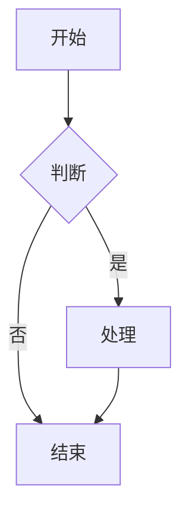
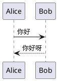

## 数学公式

行内公式：$E = mc^2$ 和 $e^{i\pi} + 1 = 0$。

行间公式：

$$
\frac{\partial f}{\partial x} = \lim_{h \to 0} \frac{f(x+h) - f(x)}{h}
$$

## mermaid 流程图



## plantuml 时序图



## 代码块

```javascript
function hello(name) {
  console.log('Hello, ' + name + '!');
}
hello('World');
```
