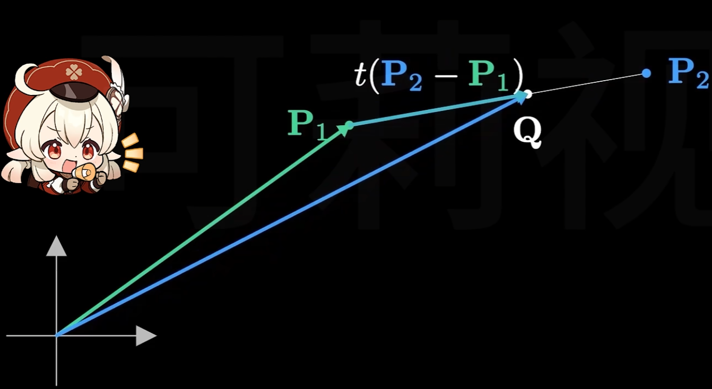
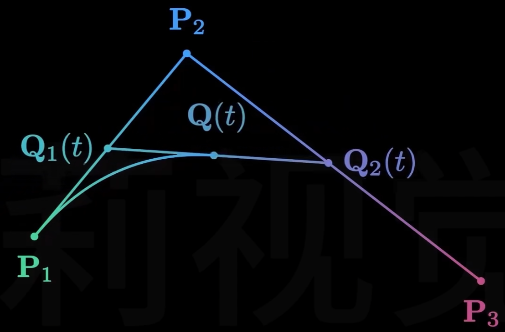
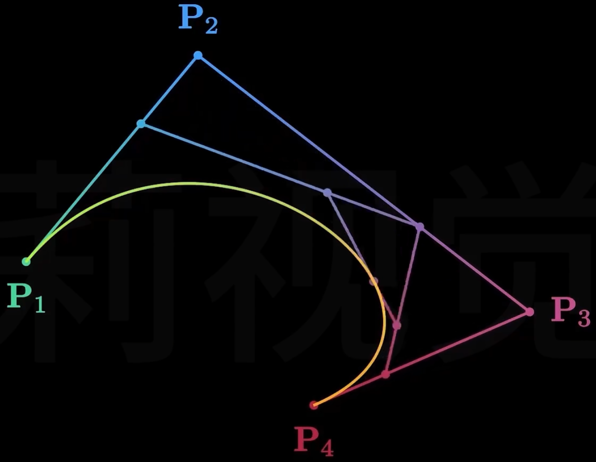

# 几何表示-基础表示方法

## 点云（Point Cloud） 

- 无序点集合，每个点包含三维坐标（x,y,z），可附加颜色、法向量、纹理坐标等属性  
- 适用于扫描数据建模，如LiDAR点云、三维重建结果  
- 缺点：缺乏拓扑信息，需额外处理连接关系  

## 多边形网格（Polygon Mesh）  

- **基础结构**：由顶点（Vertices）、边（Edges）、面（Faces）组成，常见类型包括三角形网格（最基础，易于渲染）、四边形网格（适合细分与曲面建模）  
- **顶点属性**：存储位置、法线、切线、纹理坐标、颜色等几何与渲染相关数据  
- **数据组织**：索引缓冲区（Index Buffer）优化存储，减少顶点重复  
- **网格特性**：流形/非流形网格、闭合/开放网格、网格连通性  

## 参数化曲线与曲面（Parametric Curves and Surfaces）  

### 连续性条件

在计算机图形学的几何表示中，连续性条件是描述曲线或曲面在连接处平滑程度的重要概念，它在参数化曲线和曲面的设计与处理中尤为关键。以下从不同类型的连续性条件及其在曲线和曲面中的应用进行详细介绍：

### 插值与逼近

#### 参数连续性（$C^n$ 连续性）
- **定义**
    - 参数连续性是基于曲线或曲面的参数方程来定义的。对于两条曲线或曲面片，若它们在连接点处的参数方程的 $n$ 阶导数相等，则称它们具有 $C^n$ 连续性。
    - **$C^0$ 连续性**：意味着两条曲线或曲面在连接点处位置连续，即它们在该点重合。例如，对于两条参数曲线 $P(t)$ 和 $Q(u)$，在连接点处有 $P(t_0)=Q(u_0)$。
    - **$C^1$ 连续性**：除了位置连续外，曲线或曲面在连接点处的一阶导数也连续。这表示曲线在该点的切线方向一致，对于曲面则表示切平面连续。以曲线为例，$P^\prime(t_0)=Q^\prime(u_0)$。
    - **$C^2$ 连续性**：要求位置、一阶导数和二阶导数都连续。二阶导数连续意味着曲线的曲率变化是平滑的，在视觉上曲线的弯曲程度过渡更加自然。

#### 几何连续性（$G^n$ 连续性）
 - **定义**
    - 几何连续性是一种更宽松的连续性定义，它不要求参数导数相等，而是关注曲线或曲面的几何性质。
    - **$G^0$ 连续性**：与 $C^0$ 连续性相同，即两条曲线或曲面在连接点处位置连续。
    - **$G^1$ 连续性**：表示两条曲线或曲面在连接点处的切线方向相同，但切线的长度可以不同。也就是说，它们在该点的切向量成比例。对于曲线 $P(t)$ 和 $Q(u)$，存在一个非零标量 $\alpha$，使得 $P^\prime(t_0)=\alpha Q^\prime(u_0)$。
    - **$G^2$ 连续性**：要求在连接点处不仅切线方向成比例，而且曲率和曲率变化率也满足一定的几何关系，使得曲线或曲面在该点的弯曲程度和弯曲变化过渡自然。

#### 3. 在不同几何表示中的体现
 - **Bezier曲线和曲面**
    - Bezier曲线和曲面可以通过调整控制点来实现不同程度的连续性。对于两条相邻的Bezier曲线，通过合理安排它们的控制点，可以使曲线在连接点处达到 $C^1$ 或 $G^1$ 连续性。例如，要实现 $G^1$ 连续性，只需保证连接点处两条曲线的控制边共线。
 - **B样条曲线和曲面**
    - B样条曲线和曲面具有良好的局部性，通过调整节点向量和控制点，可以方便地实现不同阶的参数连续性。在实际应用中，B样条曲线和曲面常用于需要精确控制连续性的场合，如机械零件的设计。

### Bezier曲线

#### 数学定义

##### 一般形式的Bezier曲线（n阶）

对于 $n + 1$ 个控制点 $P_0,P_1,\cdots,P_n$，$n$ 阶Bezier曲线的参数方程可以用伯恩斯坦多项式（Bernstein基函数）表示：
$$
B(t)=\sum_{i = 0}^{n}C_{n}^{i}(1 - t)^{n - i}t^{i}P_i, \quad t\in[0,1]
$$

其中 $C_{n}^{i}=\frac{n!}{i!(n - i)!}$ 是二项式系数。

##### 线性Bezier曲线（一阶）
给定两个控制点 $P_0$ 和 $P_1$，线性Bezier曲线是连接这两个点的直线段，其参数方程为：

$$
B(t)=(1 - t)P_0+tP_1, \quad t\in[0,1]
$$

当 $t = 0$ 时，$B(0)=P_0$；当 $t = 1$ 时，$B(1)=P_1$。随着 $t$ 从 0 变化到 1，点 $B(t)$ 从 $P_0$ 移动到 $P_1$。

$$
lerp(P_1,P_2,t)=B(t)=P_1+t(P_2-P_1)=(1-t)P_1+tP_2
$$

##### 二次Bezier曲线（二阶）
给定三个控制点 $P_0$、$P_1$ 和 $P_2$，二次Bezier曲线的参数方程为：
$$
B(t)=(1 - t)^2P_0 + 2t(1 - t)P_1+t^2P_2, \quad t\in[0,1]
$$
可以将其理解为通过线性插值的方式，先在 $P_0$ 和 $P_1$ 之间以及 $P_1$ 和 $P_2$ 之间进行线性插值，然后再对这两个插值结果进行一次线性插值得到最终的曲线上的点。

$$
Q_1(t)=lerp(P_1,P_2,t)\\
Q_2(t)=lerp(P_2,P_3,t)\\
Q(t)=lerp(Q_1(t),Q_2(t),t)
$$

##### 三次Bezier曲线（三阶）
给定四个控制点 $P_0$、$P_1$、$P_2$ 和 $P_3$，三次Bezier曲线的参数方程为：
$$
B(t)=(1 - t)^3P_0+3t(1 - t)^2P_1 + 3t^2(1 - t)P_2+t^3P_3, \quad t\in[0,1]
$$
在实际应用中，三次Bezier曲线是最常用的，因为它能够在相对简单的计算下实现丰富的曲线形状。

### 几何性质

#### 1. 端点插值
Bezier曲线始终通过起始控制点 $P_0$ 和终止控制点 $P_n$。对于 $n$ 阶Bezier曲线，其参数方程为 

当 $t = 0$ 时，除了 $i = 0$ 项，其余项 $(1 - t)^{n - i}t^{i}=0$，所以 $B(0)=C_{n}^{0}(1 - 0)^{n - 0}0^{0}P_0=P_0$；
当 $t = 1$ 时，除了 $i = n$ 项，其余项 $(1 - t)^{n - i}t^{i}=0$，所以 $B(1)=C_{n}^{n}(1 - 1)^{n - n}1^{n}P_n=P_n$。

#### 2. 端点切矢
对于 $n$ 阶Bezier曲线 $B(t)=\sum_{i = 0}^{n}C_{n}^{i}(1 - t)^{n - i}t^{i}P_i$，对其求导可得：

$$
B^\prime(t)=n\sum_{i = 0}^{n - 1}C_{n - 1}^{i}(1 - t)^{n - 1 - i}t^{i}(P_{i + 1}-P_i)
$$

在 $t = 0$ 处，$B^\prime(0)=n(P_1 - P_0)$；在 $t = 1$ 处，$B^\prime(1)=n(P_n - P_{n - 1})$。这表明Bezier曲线在起始点 $t = 0$ 处的切矢与起始控制边 $P_1 - P_0$ 共线，在终止点 $t = 1$ 处的切矢与终止控制边 $P_n - P_{n - 1}$ 共线。

#### 3. 对称性

如果将控制点的顺序颠倒，即原控制点为 $P_0,P_1,\cdots,P_n$，新的控制点为 $P_n,P_{n - 1},\cdots,P_0$，所得到的Bezier曲线形状不变，只是曲线的绘制方向相反。

设原Bezier曲线为 $B(t)=\sum_{i = 0}^{n}C_{n}^{i}(1 - t)^{n - i}t^{i}P_i$，新的Bezier曲线为 
$B^\prime(t)=\sum_{i = 0}^{n}C_{n}^{i}(1 - t)^{n - i}t^{i}P_{n - i}$。令 $u = 1 - t$，则 $B^\prime(t)=\sum_{i = 0}^{n}C_{n}^{i}u^{n - i}(1 - u)^{i}P_{n - i}$，这与 $B(u)$ 的形式是等价的，只是参数的取值顺序相反。

#### 4. 凸包性质
Bezier曲线完全位于其控制点所构成的凸包内。凸包是包含所有控制点的最小凸多边形（在二维情况下）或最小凸多面体（在三维情况下）。

从数学角度来看，由于Bezier曲线的系数 $C_{n}^{i}(1 - t)^{n - i}t^{i}$ 满足 $\sum_{i = 0}^{n}C_{n}^{i}(1 - t)^{n - i}t^{i}=1$ 且 $C_{n}^{i}(1 - t)^{n - i}t^{i}\geq0$ 对于 $t\in[0,1]$ 成立，所以 $B(t)$ 是控制点的凸组合，因此曲线必然位于控制点的凸包内。这一性质在判断曲线的大致范围和进行碰撞检测等方面非常有用。

#### 5. 仿射不变性
对Bezier曲线进行仿射变换（如平移、旋转、缩放），等同于对其控制点进行相同的仿射变换。

设仿射变换矩阵为 $A$，对于Bezier曲线$B(t)=\sum_{i = 0}^{n}C_{n}^{i}(1 - t)^{n - i}t^{i}P_i$，经过仿射变换后的曲线为 $B^\prime(t)=A(B(t))=A(\sum_{i = 0}^{n}C_{n}^{i}(1 - t)^{n - i}t^{i}P_i)=\sum_{i = 0}^{n}C_{n}^{i}(1 - t)^{n - i}t^{i}(A(P_i))$。这表明可以先对控制点进行仿射变换，然后再根据变换后的控制点构造Bezier曲线，结果是相同的，这使得在进行图形变换时可以直接对控制点操作，简化了计算。

#### 6. 几何不变性
Bezier曲线的形状只取决于控制点的相对位置，而与坐标系的选择无关。

无论坐标系如何平移、旋转或缩放，只要控制点的相对位置保持不变，Bezier曲线的形状就不会改变。这是因为Bezier曲线的参数方程是基于控制点之间的相对关系定义的，不依赖于具体的坐标值。

#### 7. 导数性质
Bezier曲线在端点处的切线方向与相邻的控制边方向一致。

对于 $n$ 阶Bezier曲线，如求导结果所示，在 $t = 0$ 处，$B^\prime(0)=n(P_1 - P_0)$，这意味着曲线在起始点的切线方向与控制边 $P_1 - P_0$ 平行；在 $t = 1$ 处，$B^\prime(1)=n(P_n - P_{n - 1})$，即曲线在终止点的切线方向与控制边 $P_n - P_{n - 1}$ 平行。以三次Bezier曲线为例，在 $t = 0$ 处的切线方向为 $P_1 - P_0$，在 $t = 1$ 处的切线方向为 $P_3 - P_2$。

#### 8. 变差缩减性
在平面上，任意一条直线与Bezier曲线的交点个数不多于该直线与控制多边形的交点个数。

这一性质反映了Bezier曲线比其控制多边形更加光滑和简单，它不会出现比控制多边形更复杂的振荡情况。从直观上理解，Bezier曲线会尽量“平滑地跟随”控制多边形的形状，而不会产生额外的波动。在实际应用中，变差缩减性有助于预测曲线的大致走向和进行曲线的分析与处理。 

### 构造与计算方法
#### 德卡斯特里奥（De Casteljau）算法
德卡斯特里奥算法是一种递归的方法，用于计算Bezier曲线上的点。以三次Bezier曲线为例，给定控制点 $P_0$、$P_1$、$P_2$ 和 $P_3$，计算步骤如下：

1. 对于给定的参数 $t\in[0,1]$，首先在相邻的控制点之间进行线性插值：
   - $P_{0}^1=(1 - t)P_0+tP_1$
   - $P_{1}^1=(1 - t)P_1+tP_2$
   - $P_{2}^1=(1 - t)P_2+tP_3$
2. 然后对得到的中间点再次进行线性插值：
   - $P_{0}^2=(1 - t)P_{0}^1+tP_{1}^1$
   - $P_{1}^2=(1 - t)P_{1}^1+tP_{2}^1$
3. 最后进行一次线性插值得到曲线上的点：
   - $B(t)=(1 - t)P_{0}^2+tP_{1}^2$

这种算法的优点是数值稳定性好，并且可以很容易地推广到任意阶的Bezier曲线。

### B样条曲线

### 非均匀有理B样条（NURBS）

### Bezier曲面

### B样条曲面

### 非均匀有理B样条曲面（NURBS曲面）

### 拼接

## 隐式曲面（Implicit Surfaces）  

- **数学定义**：通过函数f(x,y,z)=0隐式表示曲面，如距离场（Signed Distance Field, SDF）、水平集（Level Set）  
- **典型应用**：构造复杂有机形状（如水滴、生物模型），支持布尔运算（交/并/差）  
- **优缺点**：自然支持光滑过渡，但渲染时需曲面提取（如Marching Cubes算法）  

## 体素与网格（Voxel & Volumetric Representation）  

- **体素（Voxel）**：三维空间离散化的立方体单元，每个体素存储密度、颜色等属性，适用于体积渲染、医学图像（如CT扫描）  
- **八叉树（Octree）**：层次化体素表示，通过空间递归分割优化存储与查询效率  