# 卡通渲染-以遐蝶为例

## 卡通渲染步骤

1. 基础颜色与纹理

## 资源解析

### 模型

### 贴图

Diffuse贴图

#### Lightmap贴图

- R通道：高光范围

- G通道：AO

- B通道：高光强度

- A通道：Ramp分层（配合Shadow_Ramp使用）

#### Shadow_Ramp贴图

上下半分别控制白天和晚上的阴影

### 遐蝶贴图

#### 上半身

Avatar_Girl_Xiadie_Tex_Upper_Body_Diffuse

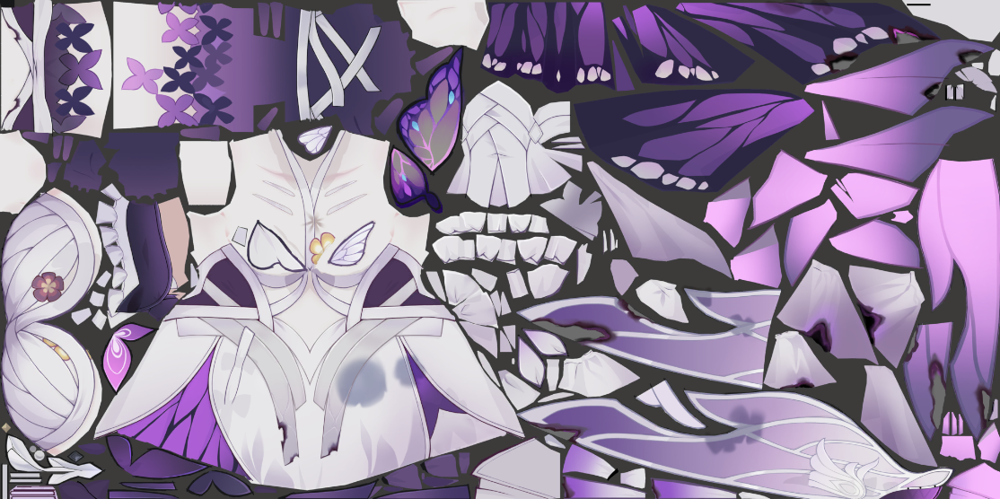

Avatar_Girl_Xiadie_Tex_Upper_Body_Lightmap

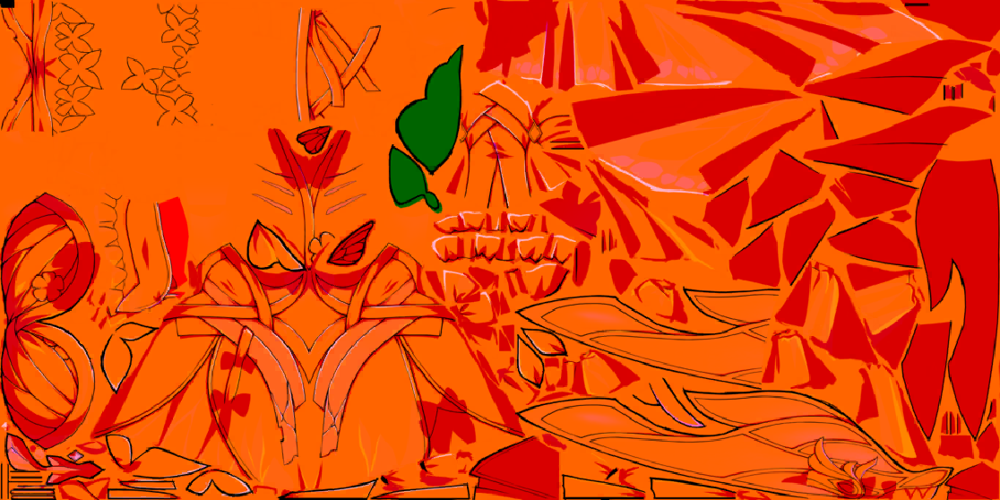

Avatar_Girl_Xiadie_Tex_Upper_Body_Shadow_Ramp

Avatar_Girl_Xiadie_Tex_Upper_Body_Material_Values_Pack_LUT

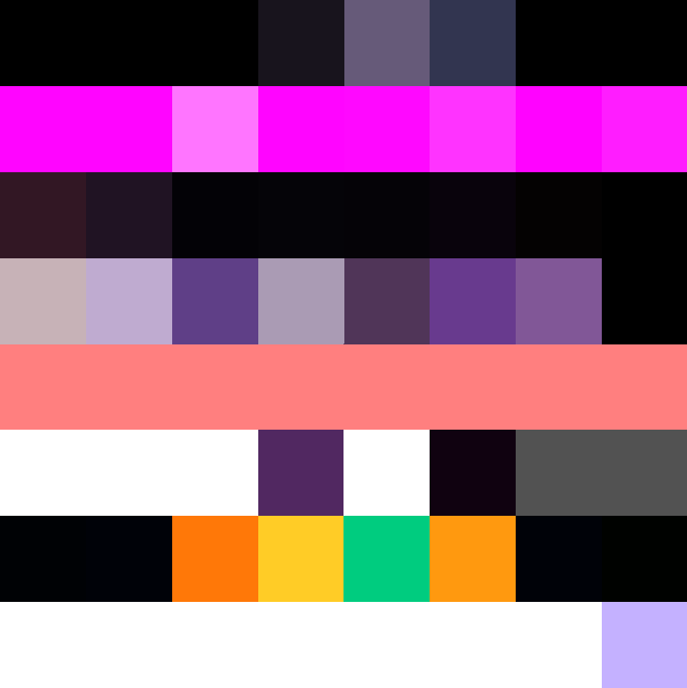

#### 下半身

Avatar_Girl_Xiadie_Tex_Lower_Body_Diffuse

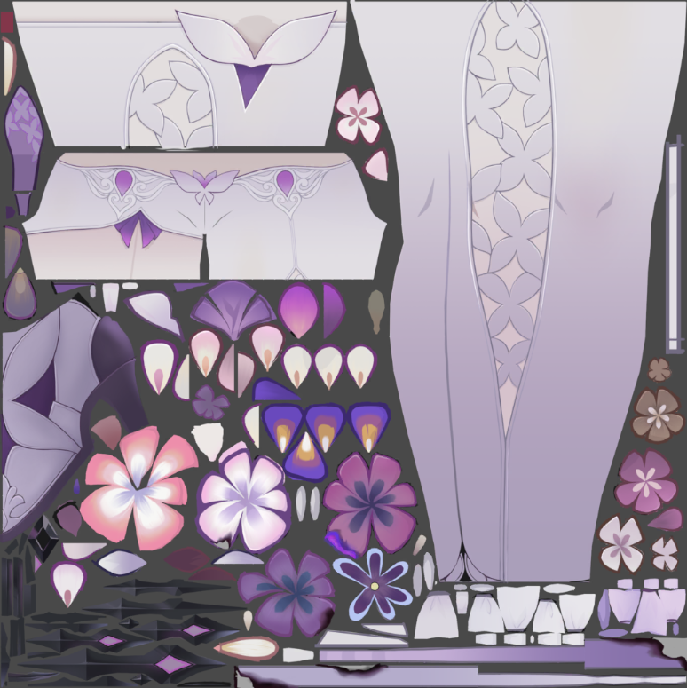

Avatar_Girl_Xiadie_Tex_Lower_Lightmap

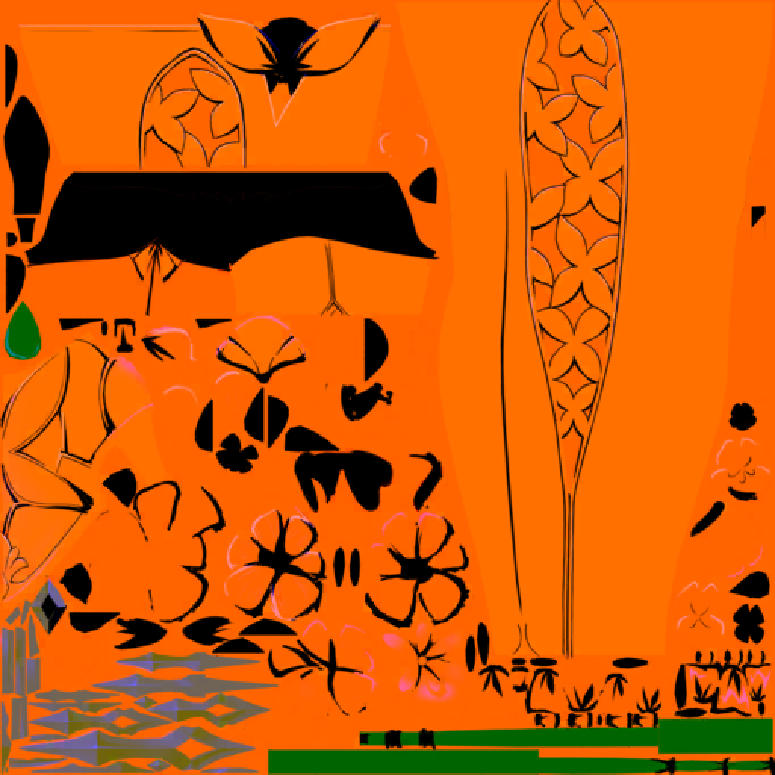

Avatar_Girl_Xiadie_Tex_Lower_Shadow_Ramp

Avatar_Girl_Xiadie_Tex_Lower_Body_Material_Values_Pack_LUT

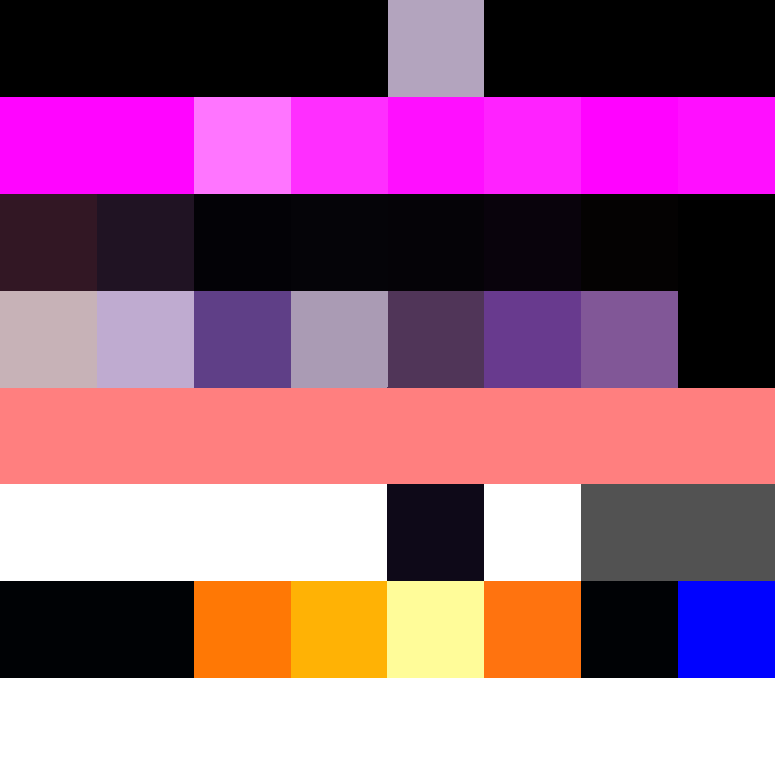

#### 头发

Avatar_Girl_Xiadie_Tex_Hair_Diffuse

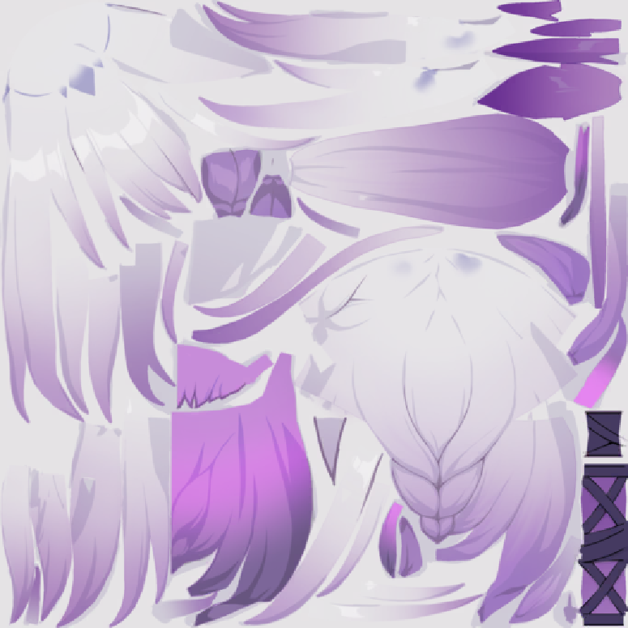

Avatar_Girl_Xiadie_Tex_Hair_Lightmap

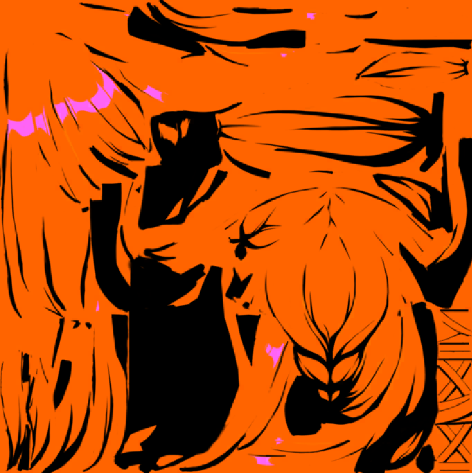

Avatar_Girl_Xiadie_Tex_Hair_Shadow_Ramp

#### 脸

Avatar_Girl_Xiadie_Tex_Face_Diffuse

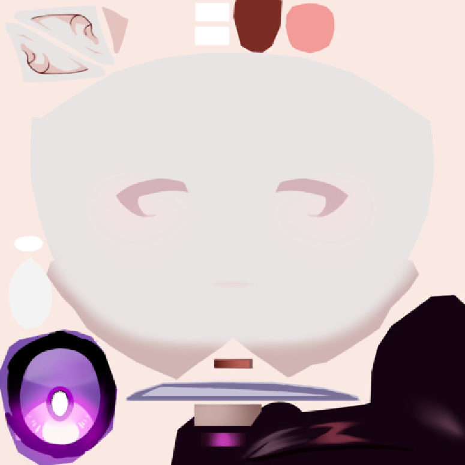

Avatar_Girl_Xiadie_Tex_Face_Lightmap

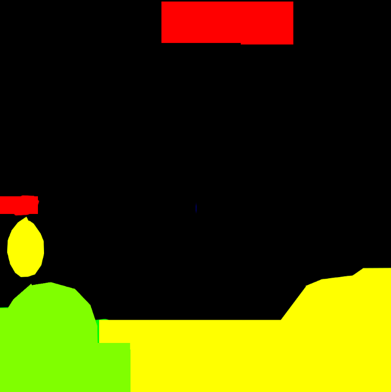

#### 其他

Avatar_Tex_MetalMap

Avatar_Tex_Specular_Ramp

Avatar_Girl_Xiadie_Tex_Expression

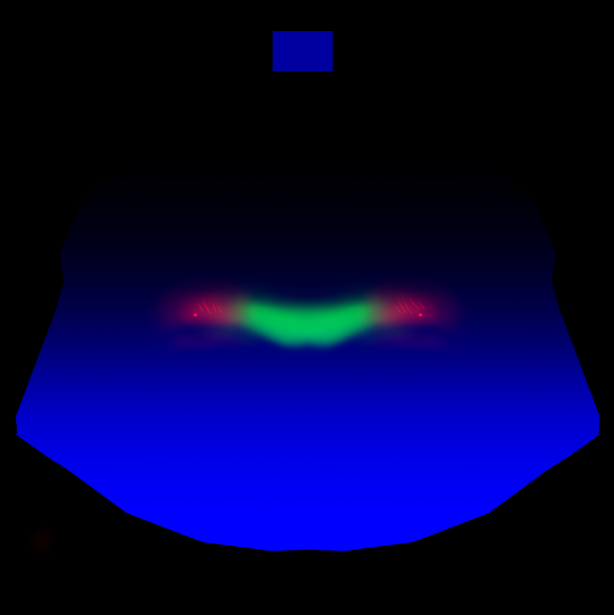

Avatar_Girl_Xiadie_Tex_Expression_Atlas

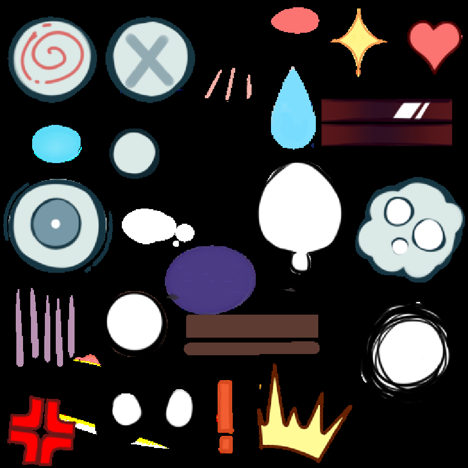

