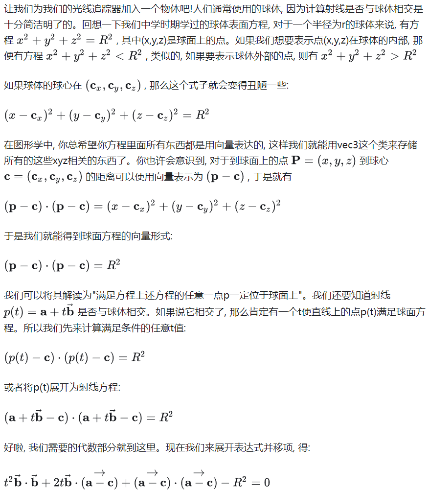
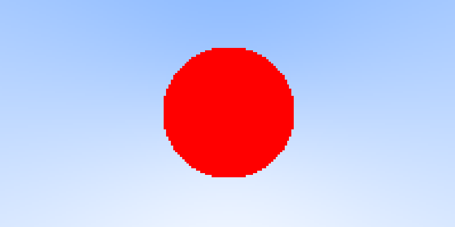
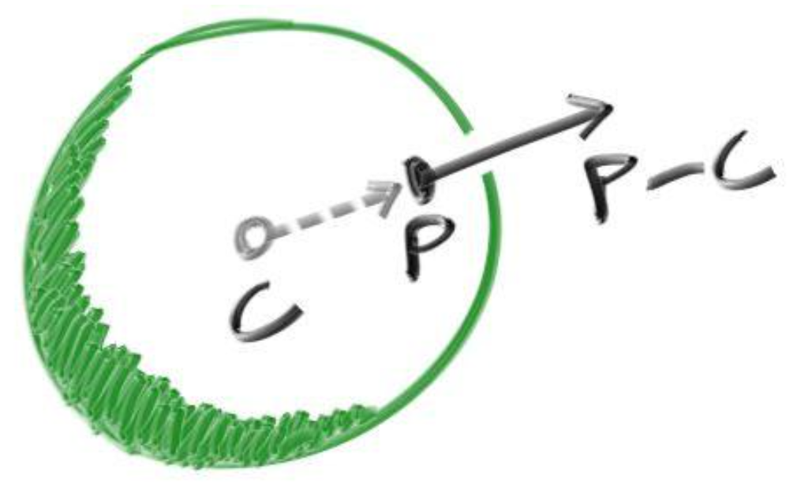
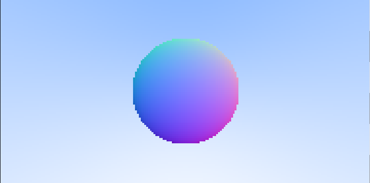

# Ray Tracing In One Weekend

## 光线, 简单摄像机, 以及背景

### Ray类

#### 光线公式：

$$
\vec P(t)=\vec a+t\vec b
$$

- $\vec a$是射线的原点
- $\vec b$是射线的方向

#### 代码

```c++
class Ray
{
public:
	Ray() {};
	Ray(const vec3& origin,const vec3& direction)
		:orig(origin),dir(direction)
	{}

	vec3 origin()const { return orig; }
	vec3 direction() const { return dir; }

	vec3 at(float t)const
	{
		return orig + t * dir;
	}

private:
	vec3 orig;
	vec3 dir;
};
```

光线追踪器的核心是从像素发射射线，并计算这些射线得到的颜色。这包括如下的步骤:

1. 将射线从视点转化为像素坐标
2. 计算光线是否与场景中的物体相交
3. 如果有，计算交点的颜色。

### 背景

```c++
vec3 ray_color1(const Ray& r)
{
	glm::vec3 unit_direction = glm::normalize(r.direction());
	auto t = 0.5f * (unit_direction.y + 1.0f);
	//color = (1 - t) * white + t * light_blue(lerp)
	return (1.0f - t) * glm::vec3(1.0, 1.0, 1.0) + t * glm::vec3(0.5, 0.7, 1.0);
}
void render_Background(TGAImage& image)
{
	vec3 lower_left_corner(-2.0, -1.0, -1.0);//平面左下角
	vec3 horizontal(4.0, 0.0, 0.0);//水平方向上
	vec3 vertical(0.0, 2.0, 0.0);//垂直方向上
	vec3 origin(0.0, 0.0, 0.0);//相机的位置

	for (int j = 0; j < height; ++j)
	{
		for (int i = 0; i < width; ++i)
		{
			auto u = float(i) / width;
			auto v = float(j) / height;
			Ray r(origin, lower_left_corner + u * horizontal + v * vertical);
			vec3 color = ray_color3(r);
			image.set(i, j, TGAColor(255 * color.r, 255 * color.g, 255 * color.b, 255));
		}
	}
}
```

## 球



可以用求根公式来判别交点个数

```c++
bool hit_sphere1(const vec3& center, float radius, const Ray& r)
{
	//p(t)=a+tb
	//a=r.origin()
	//b=r.direction()
	//(p-c)(p-c)=R*R
	//c=center
	vec3 oc = r.origin() - center;
	auto a = glm::dot(r.direction(), r.direction());
	auto b = 2.0f * glm::dot(oc, r.direction());
	auto c = glm::dot(oc, oc) - radius * radius;
	auto delta = b * b - 4 * a * c;
	return (delta > 0);
}

vec3 ray_color2(const Ray& r)
{
	if (hit_sphere1(vec3(0, 0, -1), 0.5, r))
	{
		return vec3(1, 0, 0);
	}
	
	return ray_color1(r);
}
```



## 面法相

面法相是垂直于交点所在平面的三维向量，对于球体来说，朝外的法相是直线与球的交点减去球心。



直接将法相值作为颜色输出。

对于法相可视化来说，常常将xyz分量的值先映射到0到1的范围（假定$vecN$是一个单位向量，它的取值范围是-1到1的），再把它赋值给rgb。对于法相来说，只判断射线是否与球体相交是不够的，还需求出交点的坐标。

```c++
float hit_sphere2(const vec3& center, float radius, const Ray& r)
{
	vec3 oc = r.origin() - center;
	auto a = glm::dot(r.direction(), r.direction());
	auto b = 2.0f * glm::dot(oc, r.direction());
	auto c = glm::dot(oc, oc) - radius * radius;
	auto delta = b * b - 4 * a * c;
	if (delta < 0) 
	{
		return -1.0f;
	}
	else
	{
		return (-b - sqrt(delta)) / (2.0f * a);
	}
}

vec3 ray_color3(const Ray& r)
{
	auto t = hit_sphere2(vec3(0, 0, -1), 0.5f, r);
	if (t > 0.0) 
	{
		vec3 N = glm::normalize(r.at(t) - vec3(0, 0, -1));
		return 0.5f * vec3(N.x + 1.0f, N.y + 1.0f, N.z + 1.0f);
	}
	return ray_color1(r);
}
```



## 可被击中的对象类

使用一个抽象类，任何可能与光线求交的东西实现时都继承这个类，并且让球以及球列表也都继承这个类。

```c++
struct hit_record {
    vec3 p;
    vec3 normal;
    double t;
};
class Hittable
{
public:
	virtual bool hit(const Ray& r, float t_min, float t_max, hit_record& rec)const = 0;
};
```

### 继承自它的Sphere球体类

```c++
class Sphere :public Hittable
{
public:
	Sphere() {}
	Sphere(vec3 c, float r) :center(c), radius(r) {}

	virtual bool hit(const Ray& r, float t_min, float t_max, hit_record& rec)const
	{
		vec3 oc = r.origin() - center;
		auto a = glm::dot(r.direction(), r.direction());
		auto half_b = dot(oc, r.direction());
		auto c = glm::dot(oc, oc) - radius * radius;
		auto delta = half_b * half_b - a * c;
		if (delta > 0)
		{
			auto root = sqrt(delta);
			auto temp = (-half_b - root) / a;
			if (temp > t_max || temp < t_min)
			{
				temp = (-half_b + root) / a;
			}
			if (temp < t_max && temp > t_min)
			{
				rec.t = temp;
				rec.p = r.at(rec.t);
				rec.normal = (rec.p - center) / radius;
				return true;
			}
		}
		return false;
	}

public:
	vec3 center;
	float radius;
};
```


