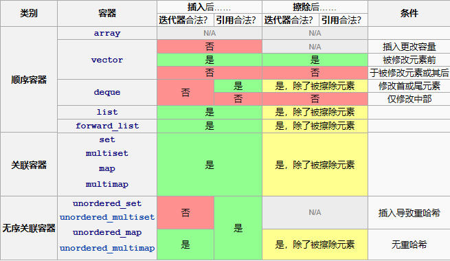

# 容器库

## 顺序容器

顺序容器实现能按顺序访问的数据结构。

| 容器名称                                 | 数据结构     |
| :--------------------------------------- | :----------- |
| [`std::array`](./array.md)               | 静态连续数组 |
| [`std::vector`](./vector.md)             | 动态连续数组 |
| [`std::deque`](./deque.md)               | 双端队列     |
| [`std::forward_list`](./forward_list.md) | 单链表       |
| [`std::list`](./list.md)                 | 双链表       |

## 关联容器

关联容器实现能快速查找（ O(log n) 复杂度）的数据结构。

| 容器名称 | 描述                                 |
| -------- | ------------------------------------ |
| set      | 唯一键的集合，按照键排序             |
| map      | 键值对的集合，按照键排序，键是唯一的 |
| multiset | 键的集合，按照键排序                 |
| multimap | 键值对的集合，按照键排序             |

## 无序关联容器

无序关联容器提供能快速查找（均摊 O(1) ，最坏情况 O(n) 的复杂度）的无序（哈希）数据结构。

| 容器名称           | 描述                                     |
| ------------------ | ---------------------------------------- |
| unordered_set      | 唯一键的集合，按照键生成散列             |
| unordered_map      | 键值对的集合，按照键生成散列，键是唯一的 |
| unordered_multiset | 键的集合，按照键生成散列                 |
| unordered_multimap | 键值对的集合，按照键生成散列             |

## 容器适配器

容器适配器提供顺序容器的不同接口。

| 容器名称       | 描述                                    |
| -------------- | --------------------------------------- |
| stack          | 适配一个容器以提供栈（LIFO 数据结构）   |
| queue          | 适配一个容器以提供队列（FIFO 数据结构） |
| priority_queue | 适配一个容器以提供优先级队列            |

## `span`

`span` 是相接的对象序列上的非占有视图，某个其他对象占有序列的存储。

| 容器名称 | 描述                           |
| -------- | ------------------------------ |
| span     | 对象的连续序列上的无所有权视图 |

### 迭代器非法化

## 线程安全

1. 多个线程可**并发调用不同容器**的任意成员函数，标准库函数仅通过参数（含 this 指针）访问对象，不会非法访问其他线程的对象。
2. 多个线程可**并发调用同一容器的 const 成员函数**，以及 begin、end、find、at 等具有只读语义的非 const 成员函数，此类操作不会引发数据竞争。
3. 多个线程可**并发修改同一容器内的不同元素**，`std::vector<bool>` 除外。
4. 迭代器的只读操作（如自增、解引用）可与其他只读操作并发执行；**任何导致迭代器失效的修改操作**，均不可与现存迭代器操作并发执行。
5. 标准库函数仅访问其参数直接指向的对象，不会间接访问容器内其他无关元素，不同函数可安全修改各自对应的元素。
6. 标准库容器、算法及函数可在内部实现并行化处理，前提是不改变用户可见的执行结果。