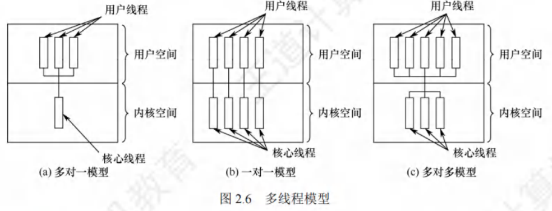

# 线程与多线程模型

[toc]

## 线程的概念

### 线程的基本概念
引入线程的**核心目的**是：减小程序并发执行时的时空开销，提高操作系统的并发性能。

- **本质定义**：线程是**轻量级进程（Lightweight Process, LWP）**，是基本的CPU执行单元，也是程序执行流的最小单元。
- **组成要素**：线程由**线程ID、程序计数器（PC）、寄存器集合、堆栈**四部分构成（仅包含运行必需的少量资源）。
- **进程内角色**：线程是进程中的实体，是系统**独立调度和分派的基本单位**。线程自身不拥有系统资源，仅持有运行必需的少量资源，但可与同属一个进程的其他线程**共享进程的全部资源**（如地址空间、全局变量、I/O设备等）。
- **运行特性**：
  1. 线程可创建/撤销其他线程；
  2. 同一进程内的多个线程可**并发执行**；
  3. 线程间存在相互制约，运行呈现间断性，拥有**就绪、阻塞、运行**三种基本状态（与进程一致）。
- **进程内涵变化**：引入线程后，进程仅作为**除CPU外的系统资源分配单元**（如内存、I/O），而线程成为**CPU的分配单元**。同一进程内的线程切换，时空开销远小于进程切换。

## 进程与线程的比较
（考研高频考点，需重点掌握核心差异，下表为优化后的对比逻辑）

1. **调度层面**  
   - 传统OS：进程是**拥有资源+独立调度**的基本单位，调度需完整上下文切换，开销大。  
   - 引入线程的OS：线程是**独立调度**的基本单位，切换开销远低于进程。  
     - 同一进程内线程切换：**不引起进程切换**；  
     - 不同进程内线程切换：**会引起进程切换**。

2. **并发性层面**  
   - 传统OS：仅进程间可并发。  
   - 引入线程的OS：**进程间、同一进程内线程间、不同进程内线程间**均可并发，系统并发性更强，资源利用率和吞吐量更高。

3. **资源拥有层面**  
   - 进程：**系统资源的基本拥有单位**（如地址空间、文件句柄）。  
   - 线程：**不拥有系统资源**，仅持有运行必需的少量资源（线程ID、寄存器、堆栈），但可共享所属进程的全部资源。  
     > 注：若线程拥有资源，切换开销会增大，线程“轻量级”的意义将丧失。

4. **独立性层面**  
   - 进程：拥有独立地址空间和资源，除全局变量外，其他进程不可访问。  
   - 线程：同一进程内的线程共享地址空间和资源，对其他进程不可见；一个线程可访问（读/写/清除）同一进程内另一个线程的堆栈。

5. **系统开销层面**  
   | 操作                | 进程（开销大）                          | 线程（开销小）                          |
   |---------------------|-----------------------------------------|-----------------------------------------|
   | 创建/撤销           | 需分配/回收PCB、内存、I/O等资源         | 仅需分配/回收TCB（线程控制块）和堆栈    |
   | 切换                | 需切换完整进程上下文                    | 仅需保存/设置少量寄存器内容              |
   | 同步与通信          | 需借助OS提供的进程间通信机制（如管道）  | 可直接访问共享的进程地址空间，无需OS干预 |

6. **多处理器支持层面**  
   - 单线程进程：无论多少CPU，仅能在一个CPU上运行。  
   - 多线程进程：可将多个线程分配到不同CPU上并行执行，缩短进程总处理时间。

## 线程的属性
多线程OS中，进程不再是基本执行实体（“执行态”实际是进程内线程在执行），线程的核心属性如下：

1. **轻型实体**：不拥有系统资源，但需配置**唯一标识符**和**线程控制块（TCB）**，TCB记录线程的寄存器、栈等现场状态。  
2. **程序共享性**：不同线程可执行相同程序（如同一服务程序被不同用户调用时，OS为其创建不同线程）。  
3. **资源共享性**：同一进程内的所有线程共享该进程的地址空间、全局变量、I/O资源等。  
4. **独立调度单位**：线程是CPU的独立调度单位，可并发执行：  
   - 单CPU系统：线程交替占用CPU；  
   - 多CPU系统：线程可同时占用不同CPU，提升进程处理效率。  
5. **生命周期与状态**：线程有完整生命周期（创建→执行→终止），运行中会经历**就绪、阻塞、运行**三种状态的转换。  

### 线程对系统并发性的提升逻辑
线程切换时，仅需判断是否跨进程：  
- 若为**同一进程内切换**：无需切换进程上下文，开销极小；  
- 若为**跨进程切换**：才需切换进程上下文，开销与进程切换一致。  
平均来看，线程切换的总开销远低于进程切换，因此OS可支持更多线程并发，且不显著影响响应时间，从而提升系统并发性。

## 线程的状态与转换
线程的状态及转换逻辑与进程基本一致，核心源于线程间的资源共享与合作制约，导致运行具有间断性。

### 三种基本状态
1. **执行态**：线程已获得CPU，正在执行指令。  
2. **就绪态**：线程已满足所有执行条件（如资源就绪），仅需分配CPU即可立即执行。  
3. **阻塞态**：线程在执行中因某事件（如等待I/O完成、等待信号量）受阻，暂时无法执行，放弃CPU。

### 状态转换规则（与进程完全一致）
- 就绪态 → 执行态：OS调度，为线程分配CPU；  
- 执行态 → 就绪态：线程时间片用完，或有更高优先级线程进入就绪队列，被迫放弃CPU；  
- 执行态 → 阻塞态：线程触发阻塞事件（如调用阻塞I/O）；  
- 阻塞态 → 就绪态：线程等待的事件完成（如I/O结束），由OS唤醒并移入就绪队列。  

> 考研提示：可与“进程状态转换”关联记忆，无需重复背诵，重点区分“线程状态的主体是线程，进程状态的主体是进程”。

## 线程的组织与控制
线程的组织与控制依赖**线程控制块（TCB）**，核心操作包括线程创建与终止。

### 线程控制块（TCB）
OS为每个线程配置TCB，是线程存在的唯一标志，用于记录线程的控制和管理信息（类比进程的PCB）。

#### 线程控制块（TCB）的组成
1. **线程标识符**：唯一标识线程的ID（系统级/进程级）；  
2. **寄存器集合**：包括程序计数器（PC，记录下一条执行指令地址）、状态寄存器（记录CPU状态）、通用寄存器（存放临时数据）；  
3. **运行状态**：描述线程当前所处的状态（就绪/执行/阻塞）；  
4. **优先级**：决定线程被调度的先后顺序；  
5. **线程专有存储区**：线程切换时保存现场数据的临时区域；  
6. **堆栈指针**：指向线程的私有堆栈，用于保存过程调用的局部变量、返回地址等。  

> 关键细节：同一进程内的线程共享进程地址空间，因此一个线程可直接访问另一个线程的堆栈（可能导致数据安全问题，但OS不限制）。

### 线程的创建
1. **启动触发**：用户程序启动时，仅有1个“初始化线程”执行，其核心功能是创建新线程。  
2. **创建过程**：  
   - 调用线程创建函数（或系统调用），传入关键参数：线程主程序入口指针、堆栈大小、线程优先级等；  
   - OS为新线程分配TCB和私有堆栈，初始化TCB信息；  
   - 将新线程置为就绪态，移入就绪队列；  
   - 返回新线程的标识符。

### 线程的终止
1. **终止触发条件**：  
   - 线程完成任务，主动调用终止函数；  
   - 线程运行中出现异常（如访问非法内存），被OS强制终止；  
   - 系统线程（如OS核心线程）通常一旦创建，会持续运行，不被终止。  

2. **终止后的资源处理**：  
   - 线程终止后**不立即释放资源**（如TCB、堆栈）；  
   - 需由进程内其他线程调用“分离函数”，被终止线程才与资源分离，资源方可被其他线程复用；  
   - 未释放资源的被终止线程，可被其他线程调用恢复运行（类似“暂停-重启”机制）。

## 线程的实现方式

线程作为进程内的基本执行单元，其实现依赖于操作系统的架构设计，主要分为**用户级线程（ULT）**、**内核级线程（KLT）** 两大类，此外还存在结合两者优势的**组合实现方式**。不同实现方式在调度、开销、兼容性等方面存在显著差异，具体细节如下：

### 用户级线程（User-Level Thread, ULT）

用户级线程是“从用户视角可见的线程”，其核心特征是**线程管理完全在用户空间（用户态）完成**，操作系统内核无法感知线程的存在，仅将进程作为调度单位。

- 实现原理

  - **管理主体**：线程的创建、撤销、切换、调度等所有管理工作，均由应用程序通过**线程库**（如POSIX Pthreads的用户态实现）自主完成，无需内核干预。

  - **内核感知**：内核仅知晓进程的存在，对进程内部的多个用户级线程无感知，仍以进程为单位分配CPU时间片和系统资源。

  - **启动方式**：应用程序默认从单用户级线程开始运行，可通过调用线程库的派生例程（如`pthread_create`），在同一进程内创建新的用户级线程。

- 调度特点（潜在不公平性）

  - 内核以进程为单位进行调度，每个进程轮流占用一个时间片。若不同进程包含的用户级线程数量差异较大，会导致线程级的调度不公平：

  - 示例：进程A含1个用户级线程，进程B含100个用户级线程。内核分配给A、B的时间片相同，因此进程A的线程可独占整个时间片，而进程B的100个线程需分时共享该时间片——进程A线程的实际运行时间是进程B单个线程的100倍。

- 优缺点
| 优点 | 缺点 |
|------|------|
| 线程切换无需切换到内核空间，省去模式切换的开销，效率高 | 系统调用阻塞问题：若某线程执行系统调用（如I/O），整个进程会被阻塞（内核感知不到线程，仅将进程标记为阻塞），进程内所有其他线程也无法运行 |
| 调度算法可“进程专用”：不同进程可根据自身需求（如实时性、吞吐量），为内部线程选择自定义调度算法 | 无法利用多CPU优势：内核仅为一个进程分配一个CPU，即使系统有多个CPU，进程内也仅有一个用户级线程能执行，其余线程需等待 |
| 与操作系统平台无关：线程管理代码属于用户程序的一部分，不依赖内核接口，可在不同操作系统上移植 | - |

### 内核级线程（Kernel-Level Thread, KLT）

内核级线程是**在内核支持下实现的线程**，线程的所有管理工作（创建、调度、切换等）均在 kernel 空间（核心态）完成，内核通过“线程控制块（TCB）”感知每个线程的存在并进行控制。

- 实现原理

  - **管理主体**：操作系统内核直接负责线程管理，为每个内核级线程维护一个 TCB（记录线程的ID、状态、寄存器值、堆栈指针等信息）。

  - **进程与线程的关系**：进程是“资源分配的基本单位”（内核为进程分配内存、文件句柄等资源），线程是“CPU调度的基本单位”（内核直接调度线程，而非进程）。

  - **启动方式**：应用程序需通过内核提供的系统调用（如`clone`、`CreateThread`）创建内核级线程，线程的生命周期由内核全程管理。

- 优缺点
| 优点 | 缺点 |
|------|------|
| 支持多CPU并行：内核可将同一进程的多个内核级线程调度到不同CPU上执行，充分利用多CPU资源 | 线程切换开销大：同一进程内的线程切换需从用户态切换到核心态（需修改内核TCB、保存/恢复线程上下文），系统开销比用户级线程高 |
| 线程阻塞不影响进程：若某线程因系统调用阻塞，内核可调度该进程内的其他内核级线程继续运行（仅阻塞单个线程，而非整个进程） | - |
| 线程轻量：内核级线程的数据结构（TCB）和堆栈较小，线程创建、销毁的开销比进程小 | - |
| 内核可多线程化：内核自身可采用多线程技术（如中断处理线程、I/O线程），提升系统整体执行速度和效率 | - |

### 组合实现方式（混合线程）

组合实现方式是**用户级线程与内核级线程的结合**，核心思路是：内核支持少量内核级线程的调度与管理，用户程序可在进程内创建大量用户级线程，通过“时分多路复用”将多个用户级线程映射到少量内核级线程上运行。

- 实现原理

  - **映射关系**：采用“多对多（M:N）”映射——M个用户级线程（ULT）映射到N个内核级线程（KLT）上（N通常小于M，且N由系统CPU数量或内核配置决定）。

  - **调度层级**：
    1. 内核层面：调度N个内核级线程（与KLT调度逻辑一致，可利用多CPU）；
    2. 用户层面：用户程序通过线程库，将M个用户级线程分时调度到N个内核级线程上运行（用户级线程切换无需内核干预，开销低）。

- 核心优势（克服ULT与KLT的不足）

  - **支持多CPU并行**：内核级线程可调度到多CPU，映射到KLT的用户级线程也能在多CPU上并行执行，解决ULT无法利用多CPU的问题。
  - **避免进程整体阻塞**：若某用户级线程执行系统调用，仅需将其绑定的内核级线程标记为阻塞，进程内其他用户级线程可切换到其他空闲的内核级线程继续运行，解决ULT的“系统调用阻塞整个进程”问题。

  - **兼顾效率与灵活性**：用户级线程切换无需内核干预（开销低），同时可通过内核级线程利用多CPU资源，平衡了ULT的高效和KLT的扩展性。

### 线程库（Thread Library）

线程库是为程序员提供的**创建、管理线程的API集合**，其实现方式决定了线程与内核的交互方式，主要分为两类：

- 用户空间线程库（无内核支持）

  - **实现位置**：所有代码和数据结构（如线程控制块、调度算法）均位于用户空间，不依赖内核。

  - **调用方式**：调用线程库函数（如`pthread_create`）仅触发用户空间的本地函数调用，无需执行系统调用。

  - **对应线程类型**：主要用于实现用户级线程（ULT），典型示例是早期的POSIX Pthreads库（部分实现）。

- 内核支持线程库

  - **实现位置**：线程库的核心代码和数据结构（如TCB）位于内核空间，依赖内核提供的系统调用。

  - **调用方式**：调用线程库API（如Windows的`CreateThread`、Linux的`pthread_create`（现代实现））会触发系统调用，由内核完成线程的实际创建和管理。

  - **对应线程类型**：用于实现内核级线程（KLT）或组合方式中的内核级线程，是当前主流的线程库实现方式。

- 主流线程库示例

  - **POSIX Pthreads**：跨平台线程库（支持Linux、Unix、macOS），现代实现多为“内核支持型”（映射到内核级线程），也可配置为用户空间型。

  - **Windows API**：Windows系统专用线程库，基于内核级线程实现（通过`CreateThread`、`ResumeThread`等API操作线程）。

  - **Java线程库**：Java的`java.lang.Thread`类底层依赖操作系统的线程库——在Linux上映射到Pthreads，在Windows上映射到Windows API，本质是“内核支持型”线程库。

## 多线程模型

在同时支持用户级线程（ULT）和内核级线程（KLT）的系统中，用户级线程与内核级线程的连接方式不同，形成了三种核心的多线程模型，每种模型在并发能力、开销、灵活性上各有特点。

### 多对一模型

多对一模型的核心是**将多个用户级线程（ULT）映射到单个内核级线程（KLT）**。每个进程仅被分配一个内核级线程，线程的调度、创建、销毁等管理工作均在用户空间完成，无需内核干预；仅当用户线程需要访问内核资源（如执行系统调用、I/O操作）时，才会临时将其映射到该进程唯一的内核级线程上，且同一时刻仅允许一个用户线程完成这种映射。

- 核心特点

  - 映射关系：**M个用户级线程 → 1个内核级线程**（M≥1）；

  - 管理主体：用户空间的线程库负责线程管理，内核仅感知内核级线程，不直接管理用户级线程；

  - 资源占用：每个进程仅占用1个内核级线程资源，对内核资源消耗低。

- 优缺点

| 优点 | 缺点 |
|------|------|
| 线程管理在用户空间完成，无需切换到核心态，线程切换、调度的开销小，执行效率高 | 若某用户线程因访问内核（如I/O调用）发生阻塞，会导致对应的内核级线程阻塞，进而使整个进程内所有用户线程均被阻塞（内核无法区分用户线程，仅将进程标记为阻塞） |
| 对内核资源需求低，适合用户线程数量较多的场景 | 并发能力弱：同一时刻仅一个用户线程能通过内核级线程访问CPU，即使系统有多个CPU，也无法利用多CPU实现并行执行 |

### 一对一模型

一对一模型的核心是**将每个用户级线程（ULT）单独映射到一个内核级线程（KLT）**。每个进程拥有的内核级线程数量与用户级线程数量相等，线程的切换、调度由内核通过管理线程控制块（TCB）完成，因此每次线程切换都需要从用户态切换到核心态。

- 核心特点

  - 映射关系：**1个用户级线程 → 1个内核级线程**；

  - 管理主体：内核直接管理所有内核级线程（包括创建、调度、阻塞），用户空间线程库仅负责将用户线程的操作（如创建）转化为内核调用；

  - 资源占用：每个用户线程对应一个内核级线程，对内核资源（如TCB、内核栈）的消耗随用户线程数量增加而增加。

- 优缺点
| 优点 | 缺点 |
|------|------|
| 并发能力强：若某用户线程阻塞（如I/O调用），内核仅阻塞对应的内核级线程，可调度同一进程内其他内核级线程（及关联的用户线程）继续执行，不影响整个进程 | 线程创建、切换开销大：每创建一个用户线程，需同步创建一个内核级线程（内核需分配TCB、初始化内核栈）；线程切换需切换到核心态，系统开销高于多对一模型 |
| 支持多CPU并行：内核可将不同内核级线程调度到多个CPU上，实现同一进程内多个用户线程的并行执行，充分利用多CPU资源 | 内核资源消耗高：若进程内用户线程数量过多，会导致内核级线程数量激增，增加内核管理负担，甚至影响系统整体调度效率 |

### 多对多模型

多对多模型（又称混合模型）的核心是**将n个用户级线程（ULT）灵活映射到m个内核级线程（KLT）**，其中n≥m（通常m由系统CPU数量或内核配置决定，如等于CPU核心数）。该模型结合了多对一模型的低开销和一对一模型的高并发优势，通过“时分多路复用”让多个用户线程共享少量内核线程资源。

- 核心特点

  - 映射关系：**n个用户级线程 → m个内核级线程**（n≥m，m可动态调整）；

  - 管理主体：用户空间线程库负责用户级线程的调度（如将用户线程分配到空闲的“内核线程映射名额”），内核负责内核级线程的调度和CPU分配；

  - 灵活性：可根据系统负载、CPU数量动态调整m的大小，平衡开销与并发能力。

- 核心优势（克服前两种模型的不足）

  - **兼顾低开销与高并发**：用户级线程的切换在用户空间完成（开销小，类似多对一模型）；内核级线程可调度到多CPU（支持并行，类似一对一模型），解决了多对一模型无法利用多CPU的问题。

  - **避免进程整体阻塞**：若某用户线程因内核操作阻塞，仅阻塞其映射的内核级线程，用户线程库可将其他用户线程重新映射到空闲的内核级线程上继续执行，解决了多对一模型“一阻全阻”的问题。

  - **控制内核资源消耗**：无需为每个用户线程创建内核线程，m的数量远小于n，避免了一对一模型“内核资源消耗过高”的问题，支持进程内创建大量用户线程。

