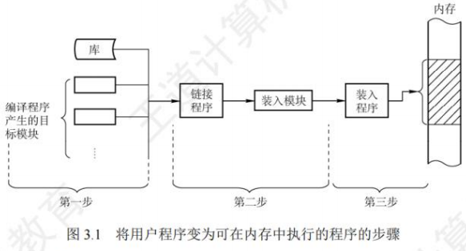
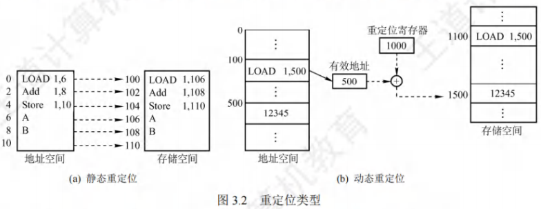
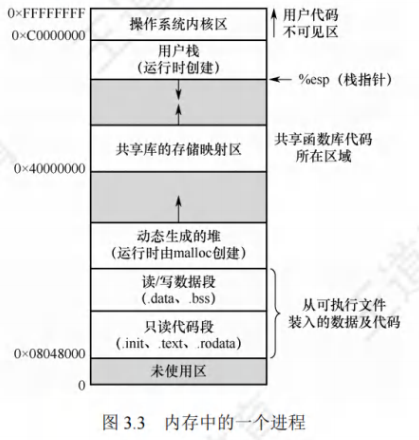
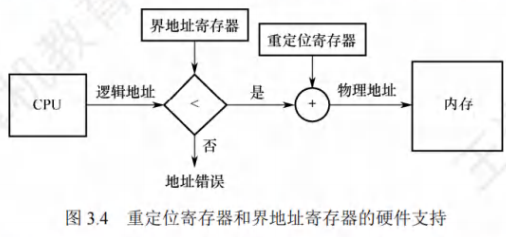

# 内存管理

[toc]

## 内存管理的概念

### 引入内存管理

内存容量也在不断增大，但仍然不可能将所有用户进程和系统所需要的全部程序与数据放入主存。

### 内存管理的概念

内存管理的概念：操作系统必须对内存空间进行合理的划分和有效的动态分配。

### 内存管理的主要功能

- **内存空间的分配与回收**。由操作系统负责内存空间的分配和管理，记录内存的空闲空间、内存的分配情况，并回收已结束进程所占用的内存空间。

- **地址转换**。由于程序的逻辑地址与内存中的物理地址不可能一致，因此存储管理必须提供地址变换功能，将逻辑地址转换成相应的物理地址。

- **内存空间的扩充**。利用虚拟存储技术从逻辑上扩充内存。内存共享。指允许多个进程访问内存的同一部分。例如，多个合作进程可能需要访问同一块数据，因此必须支持对内存共享区域进行受控访问。

- **存储保护**。保证各个进程在各自的存储空间内运行，互不干扰。

## 进程运行的基本原理和要求

### 逻辑地址与物理地址
逻辑地址与物理地址是内存管理中的核心概念，前者面向进程编程与执行，后者对应内存硬件的实际存储单元，二者通过地址重定位机制关联。

#### 逻辑地址
逻辑地址是进程视角下的地址空间，与物理内存的实际布局无关，仅用于进程内部的指令和数据访问。

- **生成过程**

  - 编译阶段：单个目标模块（如一个.c文件编译后的.o文件）从**0号单元**开始独立编址，形成该模块的相对地址。

  - 链接阶段：链接程序将多个目标模块整合为完整的可执行程序时，会统一调整所有模块的相对地址，形成一个从**0号单元**开始的连续地址空间，即**逻辑地址空间（或虚拟地址空间）**。

- **关键特性**

  - 与物理内存无关：进程运行时仅感知逻辑地址，无需了解物理内存的实际地址分布，内存管理机制对用户程序和程序员完全**透明**。

  - 地址范围固定：取决于CPU的地址位数，例如32位系统的逻辑地址空间范围为$[0,2^{32}-1]$（即4GB），64位系统则为$[0,2^{64}-1]$。

  - 地址可重复：不同进程可拥有相同的逻辑地址（如进程A和进程B的逻辑地址0x1234），但这些地址会通过映射指向物理内存的不同位置，互不干扰。

#### 物理地址
物理地址是内存硬件实际存在的存储单元地址，是数据最终存取的硬件地址，直接对应主存中的具体单元。

- **核心作用**

  - 物理地址空间是主存中所有物理单元的集合，每个物理地址唯一对应一个内存单元（如1B、4B等，取决于内存编址粒度）。

  - 进程执行时，指令和数据的最终存取必须通过物理地址完成——只有通过物理地址，CPU才能与主存硬件交互，读取或写入数据。

#### 地址重定位
当装入程序将可执行代码加载到物理内存时，需要将进程的逻辑地址转换为对应的物理地址，这一过程称为**地址重定位**，是连接逻辑地址与物理地址的关键环节。

- **转换机制**

  - 依赖硬件与软件协同：由操作系统和**内存管理部件（MMU，Memory Management Unit）** 共同实现。
    - 硬件层面：MMU是CPU中的专用硬件模块，负责执行地址转换的具体计算（如逻辑地址与基地址的加减、页表查询等）。
    - 软件层面：操作系统负责维护地址转换所需的关键数据结构（如页表、段表），并配置MMU的相关寄存器（如重定位寄存器、界地址寄存器）。

  - 以页式管理为例：逻辑地址通过**页表**映射到物理地址。页表由操作系统维护，记录逻辑页号与物理页号的对应关系；CPU访问逻辑地址时，MMU会自动查询页表，将逻辑页号转换为物理页号，再结合页内偏移量得到最终物理地址。

### 程序的链接与装入
创建进程的首要步骤是将程序和数据装入内存。用户源程序需经过“编译→链接→装入”三个核心阶段，才能转换为可在内存中执行的程序，具体流程与关键机制如下。

#### 程序从源文件到可执行程序的核心流程
将用户源程序变为内存中可执行的程序，需依次完成以下三步，各阶段功能明确且相互衔接：
1. **编译**：由编译程序（如C语言的gcc编译器）将用户编写的源代码（如`.c`文件）转换为若干独立的**目标模块**（如`.o`文件），目标模块内部采用相对地址编址。
2. **链接**：由链接程序（如ld链接器）将多个目标模块，以及程序运行所需的库函数（如标准库、自定义库）整合，形成一个完整的**装入模块**（可执行文件，如Linux下的`.out`、Windows下的`.exe`）。
3. **装入**：由装入程序（如操作系统的加载器）将上述完整的装入模块加载到内存的指定区域，为进程运行做好准备。

#### 装入模块的三种装入方式
根据地址转换的时机和内存分配特性，装入模块装入内存的方式分为三类，适用于不同的操作系统环境和需求：

- 绝对装入

  - **适用场景**：仅用于**单道程序环境**（如早期DOS系统），此时内存中仅运行一个程序，无需考虑地址冲突。

  - **核心逻辑**：编译阶段已明确程序在内存中的最终物理地址，编译程序直接生成含**绝对地址**的目标代码；装入程序只需按照装入模块中预设的绝对地址，将程序和数据“原样”装入内存即可。

  - **地址特性**：程序的逻辑地址与物理地址完全相同，无需在装入或运行时修改地址。

  - **地址来源**：程序中的绝对地址可由编译/汇编程序自动转换（从符号地址转为绝对地址），也可由程序员直接在代码中指定。

- 可重定位装入（静态重定位）

  - **适用场景**：多道程序环境中，程序装入内存的物理地址不固定（需根据内存空闲情况分配）。

    - **核心逻辑**：
      - 编译、链接后的装入模块仍从**0号地址**开始编址，内部地址均为相对地址；
      - 装入时，根据内存实际空闲区域的起始地址，一次性修改装入模块中所有指令和数据的相对地址（将相对地址加上内存起始地址，转为物理地址），这一过程称为**静态重定位**（地址转换仅在装入时完成一次）。

    - **关键限制**：
      - 装入前需为程序分配**连续且足够大**的内存空间，若内存无匹配空闲区则无法装入；
      - 程序一旦装入内存，运行期间**不能移动**（地址已固定），也无法再申请额外内存。

  - **参考图示**：如图3.2(a)所示（对应静态重定位的地址转换过程）。

- 动态运行时装入（动态重定位）

  - **适用场景**：多道程序环境中，需支持程序在内存中移动、离散分配内存或动态申请内存的场景。

    - **核心逻辑**：
      - 装入程序仅将装入模块加载到内存，**不立即转换地址**，程序运行时仍使用相对地址；
      - 地址转换推迟到**指令真正执行时**：CPU中需配置**重定位寄存器**（存放程序在内存中的起始物理地址），执行指令前，内存管理部件（MMU）自动将指令中的相对地址与重定位寄存器值相加，实时生成物理地址。

    - **核心优势**：
      - 支持程序分配到**不连续**的存储区（通过重定位寄存器实时调整地址）；
      - 程序运行前无需装入全部代码，可按需动态申请内存；
      - 便于实现程序段的共享（多个进程可共享同一代码段，仅需调整各自的重定位寄存器）。

  - **参考图示**：如图3.2(b)所示（对应动态重定位的地址转换过程）。

#### 目标模块的三种链接方式
根据链接操作执行的时间（编译后、装入时、运行时），目标模块的链接方式分为三类，核心差异在于“何时将目标模块与库函数整合为完整模块”：

- 静态链接

  - **链接时机**：程序**运行之前**（编译、汇编之后，装入之前）。

  - **核心操作**：链接程序将所有目标模块、所需库函数一次性链接成一个不可拆分的完整装入模块，后续装入和运行过程中不再修改。
  - **需解决的关键问题**：
    - **修改相对地址**：各目标模块原本从0开始编址，链接时需统一调整为以“完整装入模块起始地址”为基准的相对地址；
    - **变换外部调用符号**：将模块中调用其他模块或库函数的“符号地址”（如函数名），转换为完整模块中的相对地址。

  - **缺点**：装入模块体积大，若库函数更新，需重新编译、链接所有依赖该库的程序。

- 装入时动态链接

  - **链接时机**：程序**装入内存的过程中**（边装入边链接）。

  - **核心操作**：先将主目标模块装入内存，装入过程中若发现需调用其他目标模块或库函数，再动态加载并链接这些模块；未用到的模块暂不装入和链接。

  - **核心优势**：
    - 便于模块的修改和更新（更新某模块后，无需重新链接所有程序，仅需在下次装入时加载新模块）；
    - 便于实现模块共享（多个程序可共享同一已装入内存的模块，无需重复加载）。

- 运行时动态链接

  - **链接时机**：程序**执行过程中**（仅在需要某模块时才链接）。

  - **核心操作**：程序启动时仅装入主模块并开始执行，当执行到调用某未链接模块的指令时，才触发操作系统加载该模块并完成链接；未被调用的模块始终不装入内存、不链接。

  - **核心优势**：
    - 加快程序**装入速度**（无需在启动时加载所有模块）；
    - 节省内存空间（仅保留运行必需的模块，未用模块不占用内存）。

### 进程的内存映像
进程的内存映像是程序被调入内存运行后，在内存中形成的完整地址空间布局，与存放在硬盘上的静态可执行程序文件（如`.exe`、`.out`）存在本质区别——前者是动态运行的内存结构，包含程序执行所需的所有数据和控制信息。

#### 进程内存映像的核心组成要素
进程内存映像由多个功能独立的段组成，各段承担不同角色，共同支撑进程的运行，具体如下：

| 组成要素       | 核心功能                                                                 | 关键特性                                                                 |
|----------------|--------------------------------------------------------------------------|--------------------------------------------------------------------------|
| **代码段（Code Segment）** | 存储程序的二进制机器指令，是进程执行的逻辑依据                           | 1. **只读属性**：防止程序执行时意外修改指令（避免逻辑混乱）； 2. **可共享性**：多个进程可共享同一代码段（如多个进程运行同一程序时，无需重复加载代码） |
| **数据段（Data Segment）** | 存储进程运行时需加工处理的静态数据，包括**全局变量**和**静态变量**       | 1. **可读可写**：允许进程在运行中修改数据； 2. **大小固定**：在程序装入内存时，数据段的大小已由编译链接阶段确定，运行中不动态变化 |
| **进程控制块（PCB）**       | 存储进程的管理和控制信息（如进程ID、状态、优先级、内存地址边界等）       | 1. **存放位置**：位于操作系统的**系统区**（而非用户进程地址空间）； 2. **核心作用**：操作系统通过PCB识别和管理进程，是进程存在的唯一标志 |
| **堆（Heap）**              | 存储进程运行中**动态分配**的变量（如通过`malloc`、`new`等函数申请的空间） | 1. **动态伸缩**：通过`malloc`申请空间时堆向**高地址**扩展，通过`free`、`delete`释放空间时堆收缩； 2. **手动管理**：需程序员手动申请和释放，若管理不当易产生内存泄漏 |
| **栈（Stack）**             | 支撑函数调用，存储函数的局部变量、参数、返回地址等临时信息               | 1. **自动伸缩**：调用函数时栈向**低地址**扩展（压栈），函数返回时栈收缩（出栈）； 2. **自动管理**：局部变量的创建和销毁由编译器自动控制，无需程序员干预 |

#### 内存映像的动态特性
进程内存映像中的各段，按大小是否可动态变化，可分为“固定大小段”和“动态大小段”两类，核心差异体现在运行时的灵活性：

1. **固定大小段**：代码段和数据段  
   - 大小在**程序编译链接阶段**已确定，装入内存后，整个运行期间大小保持不变；  
   - 例如，一个程序的代码段大小由源代码的指令数量决定，数据段大小由全局变量和静态变量的数量及类型决定，均不会在运行时增减。

2. **动态大小段**：堆和栈  
   - 大小在**进程运行期间**动态变化，随程序执行逻辑灵活调整：  
     - 堆：通过`malloc`/`free`（C语言）、`new`/`delete`（C++）等函数手动控制伸缩，用于动态存储不确定数量的数据（如动态数组、链表节点）；  
     - 栈：随函数调用/返回自动伸缩，每次调用函数时，栈会为函数的局部变量、参数分配空间（栈扩展），函数返回时释放这些空间（栈收缩）。

#### 进程内存映像的详细布局
结合图3.3的内存布局，进程用户地址空间（不含系统区的PCB）可进一步细分为以下区域，各区域功能更具体：

| 区域分类       | 包含子段               | 子段功能                                                                 |
|----------------|------------------------|--------------------------------------------------------------------------|
| **只读代码段** | `.init`段              | 存储程序初始化时自动调用的`_init`函数（如全局对象的构造函数、初始化代码） |
|                | `.text`段              | 存储用户程序的核心机器指令，是进程执行逻辑的主要载体                     |
|                | `.rodata`段            | 存储只读数据（如字符串常量、`const`修饰的全局变量），防止运行时被修改     |
| **读写数据段** | `.data`段              | 存储已初始化的全局变量和静态变量（如`int g_var = 10;`、`static int s_var = 20;`） |
|                | `.bss`段               | 存储未初始化的全局变量、静态变量，以及所有初始化为0的全局/静态变量； （注：`.bss`段在磁盘可执行文件中不占用空间，仅在装入内存时分配零初始化空间） |
| **共享库区域** | -                      | 存储进程运行时依赖的共享函数库代码（如`printf()`、`scanf()`等标准库函数），多个进程可共享该区域，节省内存 |
| **堆区域**     | -                      | 动态分配内存的区域，向高地址扩展                                         |
| **栈区域**     | -                      | 函数调用的临时存储区域，向低地址扩展                                     |

### 内存保护
内存保护的核心目标是**确保每个进程拥有独立的内存空间**，避免用户进程破坏操作系统内存或其他用户进程内存，主要通过硬件寄存器实现地址越界检查。

| 方法分类 | 核心寄存器 | 工作原理 | 特点 |
|----------|------------|----------|------|
| 上下限寄存器法 | 下限寄存器（存进程内存起始地址）、上限寄存器（存进程内存结束地址） | CPU每次访问地址时，将该地址分别与下限、上限寄存器的值对比： - 若地址 < 下限 → 越界 - 若地址 > 上限 → 越界 - 两者均不满足 → 允许访问 | 逻辑简单，直接对比地址范围，但需同时维护两个寄存器的地址边界 |
| 重定位+界地址寄存器法 | 重定位寄存器（基地址寄存器，存进程起始物理地址）、界地址寄存器（限长寄存器，存进程最大逻辑地址） | 1. 地址检查：内存管理部件先将**逻辑地址**与界地址寄存器的值对比，若逻辑地址 > 界地址 → 越界中断 2. 地址转换：若未越界，将逻辑地址 + 重定位寄存器的值 → 最终物理地址，再访问内存 | 兼顾“地址转换”与“越界检查”，是现代系统常用方式，需明确两个寄存器的功能分工 |

- **寄存器功能区分**：
  - 重定位寄存器：核心是“加”，用于将进程的逻辑地址映射为物理地址（解决“地址转换”问题）；
  - 界地址寄存器：核心是“比”，用于判断逻辑地址是否超出进程允许的范围（解决“越界检查”问题）。

- **特权级控制**：加载重定位寄存器和界地址寄存器必须使用**特权指令**，仅操作系统内核可修改这两个寄存器的值，用户程序无权限操作，从根本上防止用户篡改保护规则。

### 内存共享
内存共享仅允许**只读区域**共享，核心是通过“可重入代码（纯代码）”实现多进程复用，减少内存冗余。

- 可重入代码（纯代码）特性

  - 允许多个进程同时访问，但**不允许任何进程修改**；

  - 进程执行时，需为每个进程分配**私有局部数据区**：将执行中可能修改的内容（如变量、临时数据）复制到私有数据区，仅修改私有数据，不改变共享代码本身。

- 内存共享实例分析
  - 假设场景：40个用户同时执行某文本编辑程序，程序包含160KB代码区 + 40KB数据区。

- 无共享时的内存开销
  - 总内存需求 = （代码区大小 + 数据区大小）× 用户数 = （160KB + 40KB）× 40 = 8000KB，内存冗余极大。

- 有共享时的内存开销

  - 由于代码区是可重入代码（纯代码），系统仅需保留1份代码副本，数据区为每个用户私有：

  - 总内存需求 = （数据区大小 × 用户数） + 1份代码区大小 = （40KB × 40） + 160KB = 1760KB，内存利用率大幅提升。

| 存储管理方式 | 共享代码区实现逻辑 | 特点 |
|--------------|--------------------|------|
| 分页系统 | 1. 代码区（160KB）按页大小（4KB）分为40个页面； 2. 每个进程的页表中，均建立40个页表项，且所有页表项均指向共享代码区的对应物理页号； 3. 每个进程的私有数据区（40KB，10个页面），页表项指向私有物理页号 | 需为每个进程的页表重复配置共享页面的页表项，配置稍繁琐 |
| 分段系统 | 1. 以“段”为分配单位，共享代码作为1个独立段（段长160KB）； 2. 每个进程的段表中，仅需添加1个段表项，指向共享代码段的物理起始地址和段长 | 仅需1个段表项即可实现共享，配置简单、高效 |

### 内存分配与回收

内存分配方式的演进，核心驱动力是**适应多道程序环境、提高内存利用率、满足用户编程需求**，整体发展路径如下：

1. **单一连续分配**：

   - 适用于**单道程序系统**，内存分为“操作系统区”和“用户进程区”，仅允许1个用户进程占用用户区
   - 缺点：无法支持多道程序，内存利用率低。

2. **固定分区分配**：

   - 为**多道程序系统**设计，将用户区预先划分为多个固定大小的分区，每个分区可分配给1个用户进程  

   - 缺点：分区大小固定，若进程大小与分区不匹配，会产生“内碎片”，内存利用率仍较低。

3. **动态分区分配**：

   - 按需分配：根据进程的实际大小，动态划分内存分区，分区大小与进程大小完全匹配
   - 优点：解决固定分区的“内碎片”问题；
   - 缺点：频繁分配与回收后，会产生“外碎片”（多个不连续的小空闲区，无法满足大进程需求）。

4. **离散分配方式**：

   - 核心思路：将进程离散地分配到多个不连续的内存块中，彻底解决外碎片问题，分为两类
   - **页式存储管理**：将进程和内存均按“页”（固定大小）划分，进程的页可离散分配到内存的空闲页中，核心目标是**提高内存利用率**；
   - **分段存储管理**：将进程按“逻辑段”（如代码段、数据段、堆栈段）划分，内存按段分配，核心目标是**满足用户编程需求**（如模块化编程、动态链接、段共享等），解决页式管理中“逻辑地址与物理地址割裂”的问题。

