# 连续分配管理

[toc]

## 连续分配方式
连续分配是最早的内存管理方式，为进程分配连续的内存空间，主要包括单一连续分配、固定分区分配和动态分区分配三种，核心差异在于分区的“固定性”与“灵活性”。

### 单一连续分配
#### 核心原理
将内存划分为**系统区**（低地址，供操作系统使用）和**用户区**（高地址），**用户区仅容纳一道用户程序**，即进程独占整个用户区。

#### 特点
- **优点**：实现简单，无外部碎片（内存中仅一道进程，无分散空闲区）；无需内存保护（仅一道进程，无越界风险）。  
- **缺点**：仅适用于单用户、单任务操作系统（如早期DOS）；存在内部碎片（进程大小小于用户区时，剩余空间无法利用）；内存利用率极低。

### 固定分区分配
#### 核心原理
多道程序环境下的基础分配方式：将**用户内存空间划分为若干固定大小的分区**，每个分区仅装入一道作业；通过“分区使用表”管理分区（记录分区始址、大小、状态），分配时检索表找到空闲分区，回收时标记分区为“未分配”。

#### 分区划分方式
- **大小相等的分区**：实现简单，但灵活性差（小进程浪费空间，大进程无法装入）。  
- **大小不等的分区**：划分少量大分区、适量中等分区、多个小分区，适配不同大小的进程，提升利用率。

#### 结构示意图
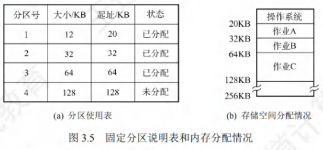

#### 特点
- **优点**：实现简单，无外部碎片（分区大小固定，空闲分区完整）。  
- **缺点**：存在内部碎片（进程大小小于分区大小时，剩余空间浪费）；大进程可能因无匹配分区无法装入；内存利用率仍较低。

### 动态分区分配
#### 核心原理
又称**可变分区分配**，进程装入时**根据实际需求动态分配内存**，分区大小与进程大小完全匹配，因此系统中分区的大小和数量随进程创建/退出动态变化。

#### 结构示意图
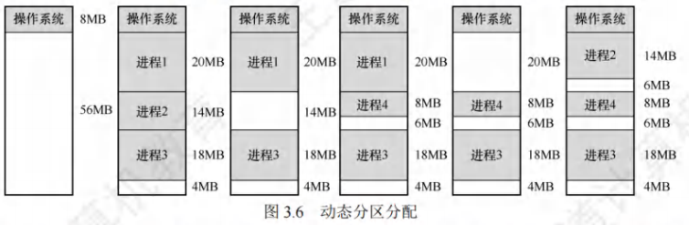

#### 核心数据结构
用于记录空闲分区的位置和大小，两种常用形式：
- **空闲分区表**：表格形式，每一行记录一个空闲分区的“始址、大小、状态”。  
- **空闲分区链**：链表形式，每个空闲分区的头部/尾部存储“前一分区指针、后一分区指针、分区大小”，便于动态插入/删除。

#### 内存回收方法
回收分区时，需判断其与相邻空闲分区的关系，合并碎片以提升利用率，具体场景如下：
1. **仅与前一空闲分区相邻**：合并回收区与前一分区，更新前一分区的“大小”（原大小+回收区大小）。  
2. **仅与后一空闲分区相邻**：合并回收区与后一分区，更新后一分区的“始址”（回收区始址）和“大小”（原大小+回收区大小）。  
3. **与前、后空闲分区均相邻**：合并三个分区，更新前一分区的“大小”（三者之和），删除后一分区的表项/节点。  
4. **无相邻空闲分区**：为回收区新建表项/节点，插入空闲分区表/链的对应位置。

#### 内存分配算法
根据检索空闲分区的方式，分为“基于顺序搜索”和“基于索引搜索”两类，前者适用于小规模系统，后者适用于大规模系统。

##### 基于顺序搜索的分配算法

| 算法名称 | 核心逻辑 | 优点 | 缺点 |
|----------|----------|------|------|
| **首次适应（First Fit）** | 空闲分区按地址递增排序，顺序查找**第一个能容纳进程的空闲分区**，分割后分配。 | 保留高地址的大空闲分区，适配后续大进程；查找速度较快（优先低地址）。 | 低地址产生大量小碎片，后续查找需频繁跳过碎片，增加开销。 |
| **最佳适应（Best Fit）** | 顺序查找**最小且能容纳进程的空闲分区**，分割后分配（空闲分区需按大小递增排序）。 | 最小化碎片大小，提升内存利用率。 | 产生大量无法利用的极小碎片；查找速度慢（需遍历所有小分区）。 |
| **最坏适应（Worst Fit）** | 空闲分区按大小递减排序，优先分配**最大的空闲分区**，分割后剩余部分仍为大分区。 | 剩余碎片较大，可被后续进程利用；查找速度快（仅需取首分区）。 | 大分区快速被分割，后续大进程无分区可用，易产生“饥饿”。 |
| **邻近适应（Next Fit）** | 又称循环首次适应，从**上次分配的分区位置开始查找**，找到第一个能容纳的分区。 | 避免低地址碎片积累，查找开销更均匀。 | 高地址大分区易被分割，后续大进程适配难度增加。 |

##### 基于索引搜索的分配算法
适用于大规模系统（空闲分区多，顺序搜索慢），核心是“按分区大小分类建立索引”，常见三种算法：
- **快速适应算法**：按进程常用大小分类（如1KB、2KB、4KB），每类对应一个空闲分区链，索引表记录各链的头指针；分配时直接查找对应大小的链，效率高，但回收时合并分区复杂。  
- **伙伴系统**：所有分区大小为2的k次幂；分配时若无匹配大小的分区，将更大分区“对半分割”（产生一对“伙伴分区”），直至得到匹配分区；回收时合并伙伴分区，减少碎片。  
- **哈希算法**：以空闲分区大小为关键字构建哈希表，每个表项对应一个空闲分区链；分配时通过哈希函数快速定位链，检索效率高，适配任意大小分区。

## 基本分页存储管理
连续分配存在“外部碎片”（动态分区）或“内部碎片+利用率低”（固定分区）的问题，分页管理通过“离散分配+小分区”解决，是现代操作系统的基础存储方式。

### 核心概念

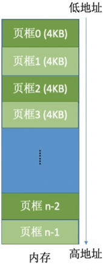

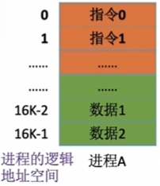

#### 页框与页面

- **页框（物理块）**：将**内存空间**划分为大小相等的分区（如4KB、8KB），每个分区称为页框，编号从0开始（页框号=物理块号）。  
- **页面（逻辑页）**：将**进程的逻辑地址空间**划分为与页框大小相等的部分，每个部分称为页面，编号从0开始（页号）。  
- 分配原则：操作系统以“页框”为单位为进程分配内存，进程的每个页面对应一个页框，页面可分散存于不相邻的页框中，无外部碎片（仅最后一个页面可能产生**页内碎片**，平均为半个页框大小）。

#### 地址结构
逻辑地址分为“页号”和“页内偏移量”两部分，页面大小需为2的整数次幂（确保页内偏移量可通过“取余”计算）：
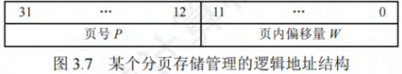

- 若页号占M位：进程最多有$2^M$个页面。  
- 若页内偏移量占K位：页面大小为$2^K$字节（如K=12，页面大小=4KB）。  
- 计算方式：  
  页号 $P = \text{逻辑地址} \div \text{页面长度}$（取整数部分）  
  页内偏移量 $W = \text{逻辑地址} \% \text{页面长度}$（取余数部分）  

#### 页表
为记录“页面→页框”的映射关系，系统为每个进程建立**页表**，每个页面对应一个页表项（PTE）：
- 页表项内容：页号（可隐含，因页表项连续存放）、物理块号（页面对应的页框号）、访问权限（读/写/执行）、存在位（页面是否在内存）等。  
- 页表作用：实现从“逻辑页号”到“物理块号”的地址映射，是分页管理的核心。

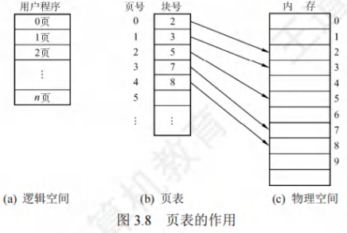

### 基本地址变换机构
地址变换机构的任务是将“逻辑地址”转换为“物理地址”，依赖**页表寄存器（PTR）** 和页表实现，步骤如下：

1. **获取页表信息**：页表寄存器存储“页表始址F”（页表在内存的起始地址）和“页表长度M”（进程的总页面数）。  
2. **计算页号与页内偏移**：根据逻辑地址A，计算页号P = A ÷ 页面长度L，页内偏移W = A % L。  
3. **越界检查**：若P ≥ M（页号超过总页面数），触发“越界中断”；否则继续。  
4. **查找页表项**：页表项地址 = F + P × 页表项长度，从该地址取出物理块号b。  
5. **计算物理地址**：物理地址E = b × L + W，用E访问内存（读取数据/指令）。

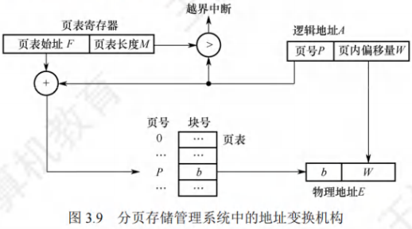

#### 问题
每次访存需两次内存访问：第一次访问页表（获取物理块号），第二次访问目标内存单元，导致访存速度下降。

### 具有快表的地址变换机构
为解决“两次访存”问题，增设**快表（TLB，相联存储器）** ——高速缓存，存放当前频繁访问的页表项，实现“并行查找”。

#### 地址变换流程
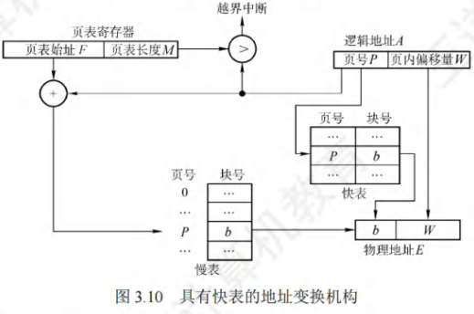

1. CPU给出逻辑地址后，硬件自动提取页号P，与快表中的所有页号并行比较。  
2. **命中（找到匹配页号）**：直接从快表取出物理块号b，与W拼接为物理地址E，仅需一次访存（访问目标内存）。  
3. **未命中（未找到匹配页号）**：访问内存中的页表，取出页表项（获取b）；同时将该页表项存入快表（若快表已满，按LRU等算法淘汰旧项），后续访问可命中快表。

#### 效果
快表命中率通常很高（90%以上），可大幅减少访存次数，接近无快表时的理论速度。

### 两级页表
当进程逻辑地址空间大（如32位地址，页面大小4KB，页表项4B）时，页表需占用大量内存（如$2^{20}$个页表项，共4MB），且需连续存放，导致内存浪费。两级页表通过“对页表再分页”解决该问题。

#### 核心逻辑
1. **一级页表（页目录）**：将页表（二级页表）划分为多个“页表页”（大小=页面大小），一级页表记录每个“页表页”的始址和状态。  
2. **二级页表**：每个“页表页”存放部分页面的映射关系（如4KB页面可存1024个页表项）。  
3. **地址结构**：逻辑地址分为“一级页号（页目录号）、二级页号、页内偏移量”三部分。

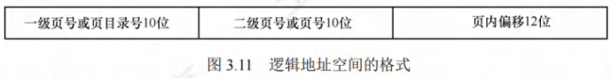
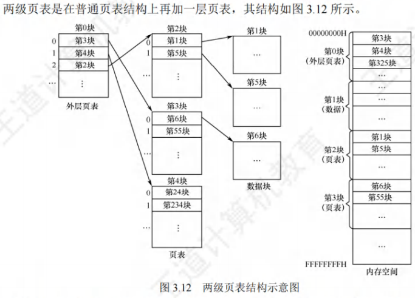

#### 地址变换步骤
1. 一级页号索引“页目录”，获取二级页表的始址。  
2. 二级页号索引“二级页表”，获取物理块号b。  
3. 物理块号b与页内偏移量W拼接，得到物理地址E。  

#### 特点
- 仅需将“页目录”和“当前访问的二级页表页”装入内存，大幅减少内存占用。  
- 访存次数增加至3次（页目录→二级页表→目标内存），可通过快表优化为1次。

## 基本分段存储管理
分页管理从“计算机视角”优化内存利用率，分段管理从“用户视角”满足逻辑需求（如代码段、数据段、堆栈段），支持共享与保护。

### 核心概念
#### 分段
将进程的逻辑地址空间划分为**大小不等的段**（如代码段、数据段、堆栈段），每个段有明确的逻辑意义；段间不连续，段内连续，地址空间为**二维**（需显式给出“段号”和“段内偏移量”）。

#### 地址结构
逻辑地址分为“段号S”和“段内偏移量W”，段长不固定（由进程逻辑需求决定）：
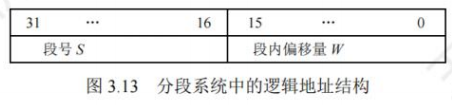

- 若段号占16位：进程最多有$2^{16}=65536$个段。  
- 若段内偏移量占16位：最大段长为$2^{16}=64KB$。  

#### 段表
每个进程对应一张**段表**，记录“段→内存区”的映射关系，每个段对应一个段表项：
- 段表项内容：段号、段始址（段在内存的起始地址）、段长（段的总字节数）、访问权限、存在位等。  

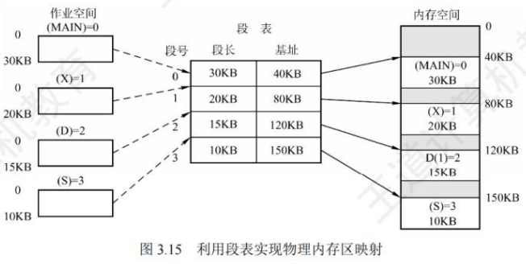

### 地址变换机构
依赖**段表寄存器**（存储段表始址F和段表长度M），步骤如下：

1. 从逻辑地址A中提取段号S和段内偏移量W。  
2. **越界检查1**：若S ≥ M（段号超过总段数），触发越界中断。  
3. 查找段表项：段表项地址 = F + S × 段表项长度，取出段始址b和段长C。  
4. **越界检查2**：若W ≥ C（段内偏移超过段长），触发越界中断；否则继续。  
5. 计算物理地址：E = b + W，用E访问内存。

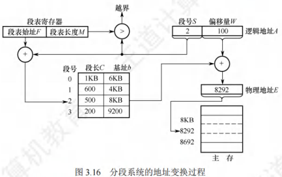

### 分页与分段的核心对比
分页与分段均为离散分配方式，但设计目标和特性差异显著，是考研高频考点：

| 对比维度 | 分页管理 | 分段管理 |
|----------|----------|----------|
| **划分目的** | 提高内存利用率（计算机视角） | 满足逻辑需求（用户视角，如代码/数据分离） |
| **划分单位** | 页（大小固定，系统决定） | 段（大小可变，用户/编译器决定） |
| **地址空间** | 一维（仅需逻辑地址，自动拆分页号/偏移） | 二维（需显式给出段号和段内偏移） |
| **碎片类型** | 页内碎片（平均半个页框，可接受） | 外部碎片（段间空闲区，需合并） |
| **共享与保护** | 困难（共享需映射多个页表项，无逻辑意义） | 容易（共享一个段表项，段有明确逻辑意义，便于权限控制） |
| **越界检查** | 仅需检查页号（页内偏移恒小于页面大小） | 需检查段号和段内偏移（段长不固定） |

### 段的共享与保护
#### 段的共享
通过“多个进程的段表项指向同一物理段”实现，例如共享库代码段：
- 每个进程的段表中，共享段对应的段表项均指向内存中同一物理段。  
- 共享段需为“可重入代码”（纯代码，无修改操作），进程仅能读取，避免数据竞争。

#### 段的保护
- **地址越界保护**：通过段号（≤段表长度）和段内偏移（≤段长）双重检查，防止访问非法段。  
- **存取控制保护**：段表项中增设“访问权限”字段（读/写/执行），仅允许进程按权限操作（如代码段设为“只读/执行”，数据段设为“读/写”）。

## 段页式存储管理
结合分页管理（高内存利用率）和分段管理（逻辑清晰、支持共享）的优势，是现代操作系统（如Linux、Windows）的主流存储方式。

### 核心原理
1. **逻辑地址空间划分**：进程先按逻辑意义划分为**段**，每个段再划分为**大小固定的页**（与内存页框大小一致）。  
2. **物理地址空间划分**：内存仍划分为大小相等的页框，以页框为单位分配。  
3. **地址结构**：逻辑地址分为“段号S、页号P、页内偏移量W”三部分。

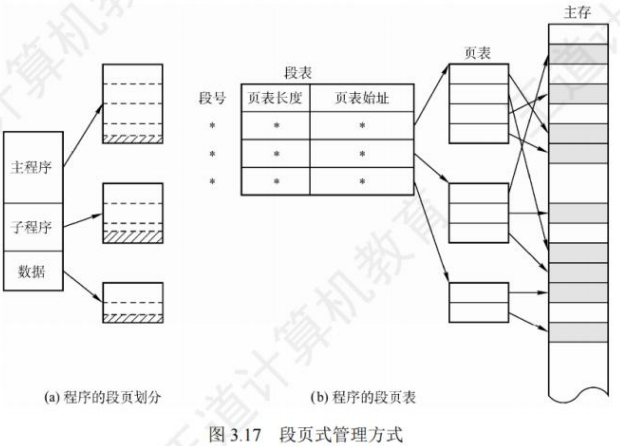

### 核心数据结构
- **段表**：每个进程一张，每个段对应一个段表项，记录“段号、页表始址（该段对应的页表在内存的地址）、页表长度（该段的总页数）”。  
- **页表**：每个段一张，每个页对应一个页表项，记录“页号、物理块号”。  
- **段表寄存器**：存储“段表始址”和“段表长度”，用于地址变换的起始检索。

### 地址变换步骤
1. **段表检索**：用段号S索引段表，获取该段的页表始址和页表长度；检查S是否越界（S ≥ 段表长度）。  
2. **页表检索**：用页号P索引该段的页表，获取物理块号b；检查P是否越界（P ≥ 页表长度）。  
3. **物理地址计算**：物理地址E = b × 页框大小 + W；检查W是否合法（恒小于页框大小，无需额外检查）。  
4. **访存**：用E访问内存单元。

#### 访存次数
- 无快表时：3次访存（段表→页表→目标内存）。  
- 有快表时：快表关键字为“段号+页号”，命中则仅需1次访存（目标内存），大幅提升速度。

### 特点
- **优点**：兼具分页的“无外部碎片、高内存利用率”和分段的“逻辑清晰、支持共享与保护”，适配现代多任务操作系统。  
- **缺点**：实现复杂（需维护段表和多页表）；无快表时访存次数多（3次），依赖快表优化性能。

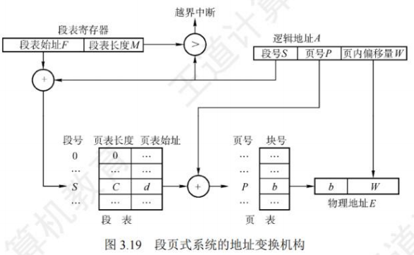
