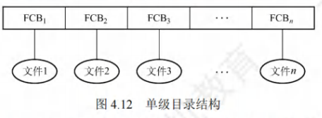
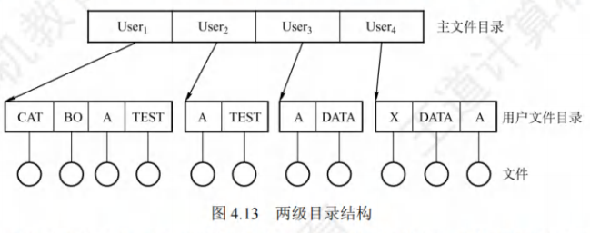
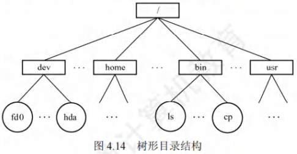
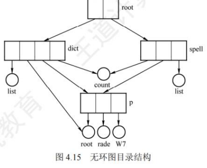
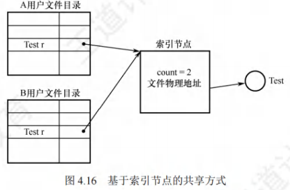
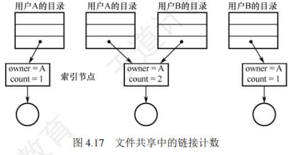
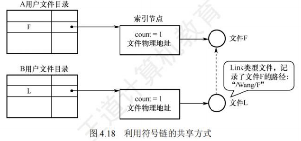

# 目录

[toc]

## 目录的基本概念
文件目录是**FCB（文件控制块）的有序集合**，每个FCB对应一个文件目录项。目录与文件管理系统、文件集合紧密关联，核心作用是存储文件的**属性（如类型、大小）、位置（存储路径）、所有权（所属用户）** 等关键信息。

### 目录管理的4个核心要求
目录管理需满足用户与系统的双重需求，是后续目录结构设计的核心依据：
1. **按名存取**：从用户视角，实现“文件名→文件实体”的映射（最基础需求）；
2. **提高检索速度**：目录检索效率直接影响系统性能，需尽量减少查找耗时；
3. **支持文件共享**：多用户系统中，允许不同用户访问同一文件，需提供访问控制信息；
4. **允许文件重名**：支持不同用户对不同文件使用相同名称（通过层级结构实现）。

## 目录结构
目录结构的演进是为了解决前一种结构的缺陷，核心差异体现在**重名、检索速度、共享能力、灵活性**四个维度。

### 单级目录结构
#### 定义
整个文件系统中仅建立**一张全局目录表**，所有文件的FCB都存储在这张表中，每个文件占一个目录项。

#### 核心操作流程
- **建立新文件**：先检索全表确认无重名→在表中新增目录项→填入文件属性；
- **访问文件**：按文件名检索目录表→找到对应FCB→合法性检查（如权限）→执行操作；
- **删除文件**：找到目标FCB→回收文件占用的存储空间→删除目录项。

#### 优缺点
| 优点 | 缺点 |
|------|------|
| 结构简单，实现“按名存取” | 查找速度慢（文件越多，检索耗时越长） |
| 实现成本低 | 不允许重名（全表唯一） |
| - | 不便于文件共享（无访问控制细分） |
| - | 不适用于多用户系统 |

### 两级目录结构
#### 定义
将目录分为两级，解决多用户重名问题：
- **一级：主文件目录（MFD）**：存储“用户名→用户文件目录（UFD）存储位置”的映射；
- **二级：用户文件目录（UFD）**：每个用户对应一张UFD，存储该用户所有文件的FCB。

#### 核心操作逻辑
用户访问文件时，仅需检索**自身对应的UFD**（无需检索全局目录），既解决重名问题，又通过UFD隔离实现基础安全。

#### 优缺点
| 优点 | 缺点 |
|------|------|
| 提高检索速度（仅查用户自身UFD） | 缺乏灵活性（无法对文件分类） |
| 解决多用户重名问题 | 共享能力弱（仅能通过MFD间接共享） |
| 支持基础访问控制（UFD隔离） | - |

### 树形目录结构
#### 定义
对两级目录结构的推广，形成**层次化的树状结构**（根目录→子目录→文件），是目前UNIX、Linux、Windows的默认目录结构。

#### 核心概念
- **路径名**：标识文件的唯一字符串，由“目录名/文件名”按层级用`/`连接而成；
  - **绝对路径**：从根目录（`/`）出发的完整路径（如Linux中的`/dev/hda`），系统中每个文件的绝对路径唯一；
  - **相对路径**：从**当前目录（工作目录）** 出发的路径（如当前目录为`/bin`时，`./ls`表示该目录下的`ls`文件），需依赖当前目录。
- **当前目录**：为减少根目录检索耗时，系统为每个进程设置的“默认访问目录”，可通过系统调用（如Linux的`cd`命令）修改；
- **用户默认目录**：用户登录时自动进入的目录，存储在`/etc/passwd`（UNIX/Linux）等配置文件中。

#### 优缺点
| 优点 | 缺点 |
|------|------|
| 层次清晰，便于文件分类（如`/home`存用户文件，`/bin`存命令） | 查找需逐级访问中间节点，增加磁盘I/O次数，影响速度 |
| 支持精细访问控制（不同子树设置不同权限） | - |
| 解决重名（不同子目录下可重名） | - |
| 适用于多用户、大系统 | - |

### 无环图目录结构
#### 定义
在树形目录结构基础上，增加**指向同一节点的有向边**，形成“有向无环图（DAG）”，核心目的是实现文件/子目录的共享（树形结构无法共享）。

#### 核心机制：共享计数器
由于文件/子目录可被多个目录引用，需通过计数器管理节点生命周期：
1. 当新增一条共享链（如A目录引用B目录的文件）时，共享计数器**+1**；
2. 当用户删除共享节点时，共享计数器**-1**；
3. 仅当共享计数器为**0**时，才真正删除节点（释放存储空间）；否则仅删除当前用户的共享链。

#### 优缺点
| 优点 | 缺点 |
|------|------|
| 灵活实现文件/子目录共享 | 系统管理复杂（需维护共享计数器、处理循环引用风险） |
| 继承树形结构的层次清晰性 | 检索路径可能更长，需避免环结构（否则会导致死循环） |

### 目录结构对比

| 目录结构 | 核心优势 | 核心缺陷 | 适用场景 |
|----------|----------|----------|----------|
| 单级目录 | 结构简单 | 慢、无重名、无共享 | 单用户小系统（如早期DOS） |
| 两级目录 | 解决重名、提速 | 无分类 | 简单多用户系统 |
| 树形目录 | 分类、精细控制 | 逐级检索慢 | 主流OS（UNIX、Linux、Windows） |
| 无环图目录 | 支持共享 | 管理复杂 | 需文件共享的多用户系统 |

## 目录的操作

在理解一个文件系统的需求前，我们首先考虑在目录这个层次上所需要执行的操作，这有助于后面文件系统的整体理解。

1. 搜索。当用户使用一个文件时，需要搜索目录，以找到该文件的对应目录项。
2. 创建文件。当创建一个新文件时，需要在目录中增加一个目录项。
3. 删除文件。当删除一个文件时，需要在目录中删除相应的目录项。
4. 创建目录。在树形目录结构中，用户可创建自己的用户文件目录，并可再创建子目录。
5. 删除目录。有两种方式： 
   1. 不删除非空目录，删除时要先删除目录中的所有文件，并递归式地删除子目录。
   2. 可删除非空目录，目录中的文件和子目录同时被删除。
6. 移动目录。将文件或子目录在不同的父目录之间移动，文件的路径名也会随之改变。
7. 显示目录。用户可以请求显示目录的内容，如显示该用户目录中的所有文件及属性。
8. 修改目录。某些文件属性保存在目录中，因而这些属性的变化需要改变相应的目录项。

## 目录的操作
目录操作是文件系统管理的基础，所有操作均围绕“目录项（FCB）”或“目录结构”展开，直接影响文件访问效率与系统安全性，需明确各操作的核心逻辑：

1. **搜索**：用户访问文件的前置步骤——根据文件名检索目录，找到对应目录项（FCB），获取文件存储位置等关键信息。  
2. **创建文件**：需先检查目录中是否存在同名文件（避免重名），确认无冲突后，在目录中新增一条目录项，填入文件属性（类型、大小等）与存储位置。  
3. **删除文件**：按文件名找到目标目录项，先回收文件占用的磁盘空间（释放数据块），再删除目录中对应的目录项。  
4. **创建目录**：仅在树形/无环图目录结构中支持——用户可创建自身的用户目录，或在已有目录下创建子目录（本质是新增“目录类型”的目录项）。  
5. **删除目录**：两种核心方式，需注意“非空目录”的处理逻辑：  
   - 方式1：禁止删除非空目录——需先递归删除目录内所有文件及子目录（确保目录为空），再删除当前目录项；  
   - 方式2：允许删除非空目录——删除目录时，自动同步删除目录内所有文件与子目录（简化操作，但需谨慎避免误删）。  
6. **移动目录**：将文件/子目录从一个父目录迁移到另一个父目录，核心变化是“文件路径名更新”，目录项本身的属性（如文件大小、权限）不变。  
7. **显示目录**：用户请求查看目录内容，需列出目录下所有文件/子目录的名称，及关键属性（大小、创建时间、权限等）。  
8. **修改目录**：当文件的某些属性（如权限、所有者）保存在目录项中时，需直接修改对应目录项的字段（无需改动文件数据块）。

## 目录实现
目录实现的核心目标是**减少目录检索的磁盘I/O开销**，两种基础实现方法的差异直接影响检索效率，需重点对比：

### 线性列表
#### 实现逻辑
将所有目录项（文件名+数据块指针+属性）按顺序存储在一张线性列表中，本质是“数组或链表结构”：  
- **创建文件**：先遍历全表确认无重名→在列表末尾（或空闲位置）新增目录项；  
- **删除文件**：遍历列表找到目标项→释放文件磁盘空间→标记该目录项为“空闲”（或移至空闲列表，或用最后一项覆盖空闲项以缩短列表）；  
- **优化**：采用链表结构可减少删除操作的时间（无需移动后续项）。

#### 优缺点
| 优点 | 缺点 |
|------|------|
| 实现简单，开发成本低 | 检索效率低（线性查找，文件越多耗时越长） |
| 兼容性强，适用于小规模目录 | 新增/删除时需遍历全表，开销随目录规模增长 |

### 哈希表
#### 实现逻辑
- 先通过**哈希函数**将“文件名”转换为一个哈希值，该值对应哈希表中的一个索引位置；  
- 索引位置直接指向线性列表中该文件的目录项（哈希表仅存储“哈希值→目录项指针”的映射）；  
- 核心解决“冲突问题”：当两个文件名哈希到同一位置时，需通过“拉链法”“线性探测法”等方式处理（如在冲突位置链接所有相关目录项）。

#### 优缺点
| 优点 | 缺点 |
|------|------|
| 检索速度极快（平均O(1)时间复杂度） | 需额外处理哈希冲突，实现复杂度高于线性列表 |
| 新增/删除操作简单（直接定位哈希位置） | 哈希函数设计难度高（需尽量避免冲突） |
| - | 不支持“范围查询”（如按文件名前缀查找） |

### 关键优化：目录缓存
目录检索本质是**磁盘I/O操作**（需反复读取磁盘上的目录项），开销较高。因此系统会将“当前频繁访问的目录项”复制到**内存缓存**中：  
- 后续访问该目录时，直接读取内存缓存，无需访问磁盘；  
- 核心作用：大幅减少磁盘I/O次数，提升目录检索速度（考研高频考点，需结合“内存与磁盘的速度差异”理解）。

## 文件共享
文件共享的核心是“一份文件副本供多用户访问”，避免存储空间浪费，三种实现方式的差异是高频考点，需重点区分：

### 基于无环图目录的共享
#### 实现逻辑
在树形目录结构中增加“有向边”，让一个文件/子目录可被多个父目录引用（如目录A和目录B的目录项都指向同一个文件F）。  
#### 核心问题与解决
- 问题：删除共享文件时易导致“悬空指针”（如用户A删除文件F，用户B的目录项仍指向已释放的磁盘空间）；  
- 解决：为每个共享节点设置**共享计数器**——新增引用时计数器+1，删除引用时计数器-1，仅当计数器=0时才真正删除文件。

### 基于索引节点的共享（硬链接，Hard Link）
#### 核心设计：索引节点（`inode`）分离
将文件的“属性+物理地址”从目录项中剥离，单独存储在**索引节点**中；目录项仅保留“文件名+索引节点指针”（指向`inode`）。  

#### 引用计数（count）机制（核心考点）
- `inode`中维护一个“引用计数count”，表示当前指向该`inode`的目录项数量；  
- **创建与共享流程**：  
  1. 用户A创建文件F：生成F的`inode`（count=1），A的目录项添加“F→`inode`指针”；  
  2. 用户B共享F：在B的目录项中添加“F→同一`inode`的指针”，`inode`的count增至2；  
- **删除流程**：  
  1. 用户A删除自己的目录项：仅将`inode`的count减1（count=1），不删除`inode`和文件数据；  
  2. 用户B删除自己的目录项：count减至0，此时才删除`inode`和文件数据，释放磁盘空间。  

#### 结构示意图

### 利用符号链实现共享（软链接，Symbolic Link）
#### 实现逻辑
本质是“创建一个特殊的LINK类型文件”，而非直接引用`inode`：  
- 用户B要共享用户A的文件F时，系统为B创建一个新文件L（LINK类型）；  
- 文件L的内容仅存储“文件F的绝对路径名”（如`/home/A/F`），B的目录项仅指向文件L；  
- **访问流程**：B访问L时，系统识别其为LINK类型，按L中存储的路径名检索文件F，再对F进行读写。  

#### 结构示意图

### 硬链接与软链接的核心对比
| 对比维度 | 硬链接（Hard Link） | 软链接（Symbolic Link） |
|----------|---------------------|-------------------------|
| 存储内容 | 指向`inode`的指针 | 被共享文件的绝对路径名 |
| 引用计数 | 依赖`inode`的count，删除时需减1 | 不影响原文件的count（软链接自身是独立文件，有自己的`inode`） |
| 访问速度 | 快（直接指向`inode`，无需二次检索） | 慢（需按路径名逐级检索目录，多次磁盘I/O） |
| 跨文件系统 | 不支持（`inode`编号在不同文件系统中不唯一） | 支持（路径名可跨系统指向文件） |
| 悬空指针风险 | 无（count=0才删除`inode`，避免指针悬空） | 有（原文件删除后，软链接路径失效，成为“死链接”） |
| 磁盘占用 | 仅占用目录项空间（无独立`inode`） | 占用独立`inode`和磁盘块（存储路径名） |

### 关键提醒
1. 硬链接的本质是“多个目录项共享一个`inode`”，软链接的本质是“一个独立文件存储另一个文件的路径”；  
2. Linux中创建硬链接用`ln 源文件 链接文件`，创建软链接用`ln -s 源文件 链接文件`（结合命令记忆更易理解）；  
3. 软链接可用于网络文件共享（只需存储“网络地址+文件路径”），硬链接不支持。