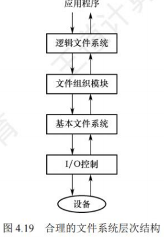
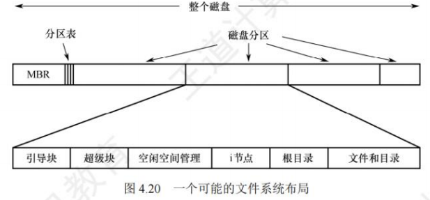
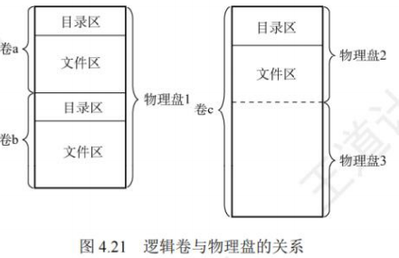
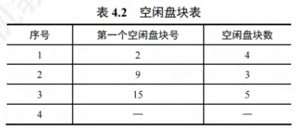
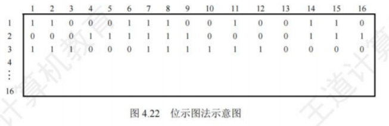
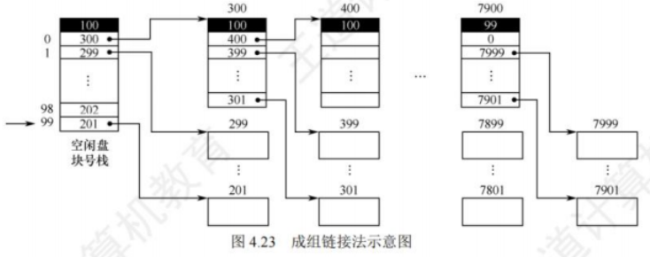
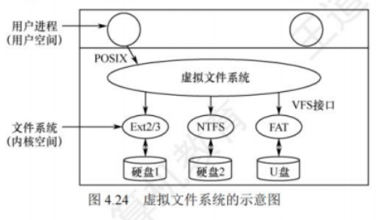
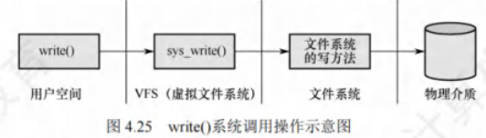

# 文件系统

[toc]


## 文件系统结构
文件系统的核心是实现“逻辑文件→物理外存”的映射，同时提供统一的用户接口。现代文件系统多采用层次化结构，各层分工明确，协同完成磁盘访问与文件管理。



### I/O控制层
- **核心功能**：作为文件系统与硬件的交互层，负责在内存和磁盘间传输数据，包含**设备驱动程序**和**中断处理程序**。  
- **工作逻辑**：  
  1. 设备驱动程序将上层的通用命令（如“读块”）翻译成硬件可识别的指令（如磁盘扇区地址、读写模式）；  
  2. 硬件控制器执行指令，完成数据传输后触发中断，中断处理程序响应并通知上层完成操作；  
  3. 驱动程序需明确“操作位置”（如磁盘的哪个扇区）和“操作类型”（读/写），确保硬件动作精准。


### 基本文件系统
- **核心功能**：向上层提供“读写磁盘物理块”的通用接口，管理内存缓冲区，优化I/O性能。  
- **关键操作**：  
  1. 以“物理块”为单位（如512B、4KB）与I/O控制层通信，通过磁盘地址（如“磁道号-扇区号”）定位物理块；  
  2. 维护内存缓冲区：将频繁访问的目录项、数据块暂存于内存，减少磁盘I/O次数（缓冲区管理直接影响系统性能）；  
  3. 磁盘块传输前，分配合适的缓冲区，并处理缓冲区的“脏块”（已修改但未写回磁盘的块）与“空闲块”。


### 文件组织模块
- **核心功能**：实现“文件逻辑块→物理块”的地址转换，管理文件存储结构与外存空闲空间。  
- **关键职责**：  
  1. 逻辑块与物理块映射：文件的逻辑块从0开始编号（如逻辑块0、1、2），与磁盘物理块无直接对应关系，需通过该模块转换为实际物理地址（如FAT表、`inode`映射）；  
  2. 空闲空间管理：通过“空闲空间管理器”跟踪未分配的物理块，当文件创建/扩展时，分配空闲块并更新管理信息；当文件删除时，回收物理块并标记为空闲。


### 逻辑文件系统
- **核心功能**：管理文件系统的**元数据**（非文件内容的数据），维护目录结构与文件保护机制。  
- **元数据范围**：包含目录结构、文件控制块（FCB）、文件权限、所有者信息等（不包含文件实际数据）。  
- **关键操作**：  
  1. 目录管理：通过目录结构（如树形）实现“按名存取”，根据文件名查找对应的FCB，将FCB中的物理块信息传递给文件组织模块；  
  2. 文件保护：检查用户对文件的操作权限（如读/写/执行），仅当权限匹配时允许后续操作；  
  3. FCB维护：创建文件时生成FCB，删除文件时回收FCB，修改文件属性时更新FCB字段。


## 文件系统布局
文件系统需在“磁盘”和“内存”中分别存储数据结构，前者用于持久化保存，后者用于临时管理与性能优化。

### 文件系统在磁盘中的结构
磁盘通常划分为多个**分区**，每个分区对应一个独立的文件系统（称为“卷”）。典型的磁盘布局包含以下关键部分：

1. **主引导记录（MBR）**  
   - 位置：磁盘0号扇区（最开始的512B）；  
   - 功能：引导计算机启动，包含**分区表**（记录各分区的起始/结束扇区地址）和引导程序；  
   - 启动逻辑：BIOS读取MBR→执行引导程序→识别“活动分区”（分区表中标记为可启动的分区）→读取活动分区的引导块。

2. **引导块（Boot Block）**  
   - 位置：每个分区的第一个块（紧跟MBR的分区之后）；  
   - 功能：存储启动该分区操作系统的程序（即使分区无操作系统，也保留引导块结构，便于后续安装）；  
   -  Windows中称为“分区引导扇区”，UNIX/Linux中称为“超级块前导块”。

3. **超级块（Super Block）**  
   - 功能：存储文件系统的“全局关键信息”，是文件系统的“目录”；  
   - 核心内容：分区总块数、块大小、空闲块数量/指针、空闲FCB数量/指针、文件系统类型、创建时间等；  
   - 加载逻辑：系统启动或文件系统首次使用时，超级块会被读入内存，后续操作基于内存中的副本（需定期同步回磁盘，防止数据丢失）。



4. **其他关键区域**  
   - 空闲块信息：以“位示图”“空闲链表”等形式存储未分配的物理块；  
   - 索引节点（`inode`）区：每个文件对应一个`inode`，存储文件的物理块地址、属性、权限等（FCB的精简版，常见于UNIX/Linux）；  
   - 根目录区：存储文件系统目录树的根部，包含根目录下所有文件/子目录的入口；  
   - 文件与目录数据区：磁盘的剩余空间，存储所有文件的实际数据和非根目录的目录项。


### 文件系统在内存中的结构
内存中的数据结构用于临时管理文件系统，提升操作效率，在文件系统“挂载”时加载，“卸载”时丢弃，主要包含四类表：

1. **安装表（Mount Table）**：记录所有已挂载文件系统的信息，如分区设备号、挂载点（目录路径）、文件系统类型、超级块在内存中的地址等；  
2. **目录缓存**：暂存最近访问的目录项（如用户刚打开的目录），避免重复读取磁盘目录区，加速文件名查找；  
3. **系统级打开文件表**：全局唯一，记录所有已打开文件的信息，包括FCB副本、打开计数（多少进程打开该文件）、当前读写指针位置、文件状态（如只读/可写）；  
4. **进程级打开文件表**：每个进程独立拥有，记录该进程打开的文件描述符（如Linux的fd、Windows的句柄），以及指向“系统级打开文件表”对应表项的指针（实现进程间文件共享）。


## 外存空闲空间管理
外存空闲空间管理的核心是“高效分配与回收物理块”，避免空间碎片化，四种主流方法各有适用场景，需明确其实现逻辑与优缺点。



### 空闲表法
- **本质**：属于“连续分配方式”，与内存动态分区分配逻辑一致，为文件分配连续的物理块。  
- **数据结构**：空闲表——每个表项对应一个连续的空闲区，包含“表项序号、空闲区起始盘块号、空闲块数”，按起始盘块号递增排序。



#### 盘块的分配
采用与内存动态分区相同的算法，如**首次适应算法**（顺序找第一个满足大小的空闲区）、**最佳适应算法**（找最小且满足大小的空闲区）：  
1. 按算法检索空闲表，找到合适的空闲区；  
2. 若空闲区大小等于需求，直接分配；若大于需求，分割空闲区（分配所需块数，剩余部分仍为空闲区，更新空闲表）。

#### 盘块的回收
需检查回收区与空闲表中相邻空闲区的合并（避免碎片化）：  
1. 若回收区与“前空闲区”（起始块号小于回收区）相邻，合并为一个大空闲区，更新前空闲区的块数；  
2. 若回收区与“后空闲区”（起始块号大于回收区）相邻，合并为一个大空闲区，删除后空闲区表项，更新回收区的块数；  
3. 若与前后均不相邻，直接在空闲表中新增一个表项。

#### 特点
- 优点：分配速度快，减少磁盘I/O频率，适合小文件（1~5个盘块）的连续分配；  
- 缺点：易产生“外部碎片”（零散的小空闲区无法利用），不适合大文件或频繁创建/删除文件的场景。


### 空闲链表法
- **本质**：将所有空闲块/空闲区以链表形式串联，按“盘块”或“盘区”为单位管理，分为两种类型：

#### 空闲盘块链
- **数据结构**：以“单个盘块”为节点，每个盘块的末尾存储下一个空闲盘块的地址（指针），形成链表。  
- **分配逻辑**：根据文件所需块数，从链首依次摘下对应数量的盘块，更新链表头指针；  
- **回收逻辑**：将回收的盘块依次插入链尾，更新链尾指针。  
- **特点**：  
  - 优点：分配/回收单个盘块的操作简单；  
  - 缺点：分配多块时需多次遍历链表（效率低），链表长度随磁盘容量增长而急剧增加（如4TB磁盘、4KB块，链表含1000万+节点）。

#### 空闲盘区链
- **数据结构**：以“连续空闲区”为节点，每个节点存储“下一个空闲区指针、本区域块数、起始块号”，形成链表。  
- **分配逻辑**：类似空闲表法，采用首次适应等算法找到满足大小的空闲区，分割后更新链表；  
- **回收逻辑**：合并相邻空闲区后插入链表，减少碎片化；  
- **特点**：  
  - 优点：链表长度短（节点数远少于空闲盘块链），分配/回收多块效率高；  
  - 缺点：实现逻辑复杂（需处理区域分割与合并）。


### 位示图法
- **本质**：用二进制位表示盘块的使用状态，是“空间效率高、检索快”的管理方式。  
- **数据结构**：位示图——一个$m \times n$的二进制矩阵，每个位对应一个盘块：  
  - 位值=0：盘块空闲；  
  - 位值=1：盘块已分配。



#### 盘块的分配
1. 顺序扫描位示图，找到一个或一组值为0的位；  
2. 将找到的位转换为对应的盘块号（假设位示图每行有$n$位，目标位在第$i$行、第$j$列）：  
   $$\text{盘块号} = n \times (i-1) + j$$  
3. 将这些位的值设为1，完成分配。

#### 盘块的回收
1. 将回收的盘块号转换为位示图中的行号$i$和列号$j$：  
   $$i = \lfloor (b-1)/n \rfloor + 1$$  
   $$j = (b-1) \mod n + 1$$  
   （其中$b$为回收的盘块号）  
2. 将对应位的值设为0，完成回收。

#### 特点
- 优点：位示图体积小（如4TB磁盘、4KB块，位示图仅512KB），可常驻内存；易找到相邻空闲块，适合连续分配；  
- 缺点：位示图大小随磁盘容量增长而增大（如10TB磁盘、4KB块，位示图需1.25MB），更适合中小型磁盘。


### 成组链接法
- **本质**：结合空闲表法与空闲链表法的优点，解决“表/链过长”的问题，是UNIX系统采用的核心方法。  
- **核心思想**：将空闲盘块分成若干“组”（如每组100个块），每组的第一个块（索引块）存储“下一组的空闲块数+下一组块号”，各组通过索引块链接成链；内存中维护一个“空闲盘块号栈”，存储当前组的空闲块信息。



#### 盘块的分配
1. 从内存栈中弹出栈顶的空闲盘块号，分配给文件；  
2. 若弹出的是“栈底块号”（该块是当前组的索引块，存储下一组信息）：  
   - 将该索引块中的“下一组块数+块号”读入内存栈，更新栈内容；  
   - 将原栈底块号对应的盘块分配出去（其索引信息已读入内存，不影响后续使用）；  
3. 栈中空闲块数减1。

#### 盘块的回收
1. 将回收的盘块号压入内存栈顶，栈中空闲块数加1；  
2. 若栈中块数达到“组大小”（如100个）：  
   - 将当前栈中的100个块号存入新回收的盘块（作为新的索引块）；  
   - 将新回收的盘块号设为栈底，栈中仅保留该索引块号，块数重置为1。

#### 特点
- 优点：内存栈大小固定（仅存储一组块号），不随磁盘容量增长；分配/回收效率高，适合大型文件系统；  
- 缺点：实现逻辑复杂（需处理组的拆分与合并），依赖超级块存储初始组信息（需定期同步，防止数据丢失）。


## 虚拟文件系统
虚拟文件系统（VFS）的核心是“屏蔽不同文件系统的差异”，为用户和应用程序提供**统一的文件操作接口**（如`open()`、`read()`、`write()`），无需关心底层存储介质或文件系统类型（如ext4、NTFS、FAT32）。



### 四种对象类型
VFS通过抽象“超级块、索引节点、目录项、文件”四种对象，定义通用接口，不同文件系统只需实现这些接口即可接入系统。每种对象包含“数据”和“函数指针”（指向具体文件系统的实现函数）。

#### 超级块对象
- **对应实体**：一个已挂载的文件系统（如磁盘分区中的ext4文件系统）；  
- **数据内容**：文件系统的全局元信息（如块大小、空闲块数、`inode`总数），对应磁盘超级块的内存副本；  
- **操作函数**：分配`inode`、销毁`inode`、读`inode`、写`inode`等（由具体文件系统实现，如ext4的超级块操作函数）。

#### 索引节点对象（`inode`对象）
- **对应实体**：一个具体的文件（或目录）；  
- **数据内容**：文件的属性（大小、权限、创建时间）、物理块地址映射（如ext4的`inode`包含15个物理块指针），仅当文件被访问时创建于内存；  
- **操作函数**：创建硬链接、删除文件、修改文件属性等（不同文件系统的`inode`操作逻辑不同，但接口统一）。

#### 目录项对象（`dentry`对象）
- **对应实体**：路径的一个组成部分（如`/home/user/file.txt`中的`home`、`user`、`file.txt`）；  
- **数据内容**：指向关联`inode`的指针、父目录项指针、子目录项指针（形成目录树）；  
- **特殊点**：磁盘中无对应的持久化结构，仅在VFS解析路径时动态创建（如访问`/home/user`时，依次解析`/`→`home`→`user`，生成三个目录项对象）。

#### 文件对象
- **对应实体**：一个与进程关联的“已打开文件”；  
- **数据内容**：文件描述符（进程内唯一标识）、当前读写指针位置、文件打开模式（只读/可写）、指向对应`inode`对象的指针；  
- **操作函数**：读文件、写文件、关闭文件等（如ext4的文件读函数、NTFS的文件写函数）；  
- **关系类比**：文件对象与物理文件的关系，类似进程与程序的关系——前者是“动态使用实例”，后者是“静态存储实体”。


### 典型调用流程（以`write()`为例）
1. 用户空间调用`write(fd, buf, len)`（`fd`为文件描述符）；  
2. 内核将`fd`映射到进程级打开文件表的表项，找到指向“系统级打开文件表”的指针；  
3. 系统级打开文件表指向对应的“文件对象”，VFS调用文件对象的`write`函数指针；  
4. 该指针指向具体文件系统（如ext4）的`write`实现函数，将数据写入磁盘；  
5. 操作完成后，返回写入字节数给用户。



### 关键特性
- 无持久化存储：VFS仅存在于内存，系统启动时创建，关闭时消亡；  
- 兼容性强：新文件系统只需实现四大对象的接口，即可挂载使用；  
- 透明性：用户无需区分ext4、NTFS等类型，操作接口完全统一。


## 文件系统挂载
文件系统在被访问前，必须先“挂载”（Mount）——将存储设备（如磁盘分区、U盘）中的文件系统关联到系统目录树的某个节点（称为“挂载点”），后续通过该目录即可访问设备中的文件。

### 不同系统的挂载逻辑
#### Windows系统
- **目录结构**：采用“驱动器号+目录树”的两级结构，驱动器号（如C:、D:）直接关联存储设备（分区）；  
- **挂载特点**：  
  1. 系统启动时自动发现所有设备，自动挂载已有的文件系统（如C:对应系统分区，D:对应数据分区）；  
  2. 文件路径格式为`驱动器号:\路径\文件名`（如`C:\Windows\notepad.exe`）；  
  3. 新版Windows支持“目录挂载”（如将D盘的`Data`目录挂载到C盘的`C:\Data`），兼容UNIX的挂载逻辑。

#### UNIX/Linux系统
- **目录结构**：采用单一根目录树（`/`为根），所有文件系统均挂载到根目录下的某个子目录（挂载点）；  
- **挂载特点**：  
  1. 根文件系统（`/`）在系统启动时直接挂载，是内核映像所在的文件系统；  
  2. 其他文件系统（如U盘、额外分区）需手动或自动挂载到现有目录（如将U盘挂载到`/mnt/usb`）；  
  3. 挂载点需是“空目录”，同一挂载点同时只能挂载一个设备；同一设备可挂载到多个挂载点（实现文件共享）。


### 挂载示例（UNIX/Linux）
将`/dev/fd0`（软盘设备）中的ext2文件系统挂载到`/flp`目录，命令如下：  
```bash
mount -t ext2 /dev/fd0 /flp
```
- `-t ext2`：指定文件系统类型为ext2；  
- `/dev/fd0`：待挂载的存储设备（软盘）；  
- `/flp`：挂载点目录（需提前创建且为空）。  

挂载后，访问`/flp`目录等同于访问软盘的根目录，如`/flp/doc.txt`对应软盘根目录下的`doc.txt`文件。卸载时使用`umount /flp`命令，断开设备与目录的关联。
