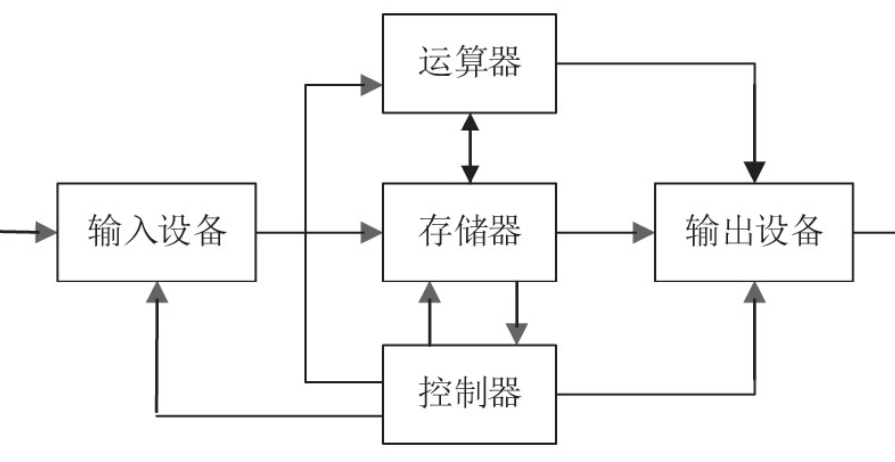
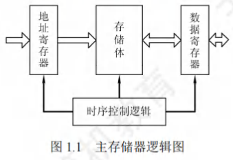
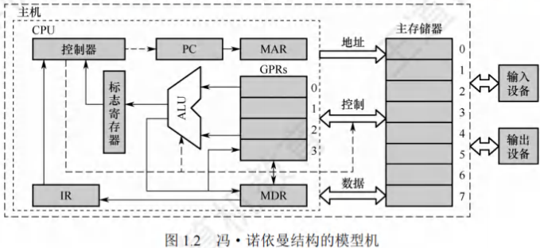
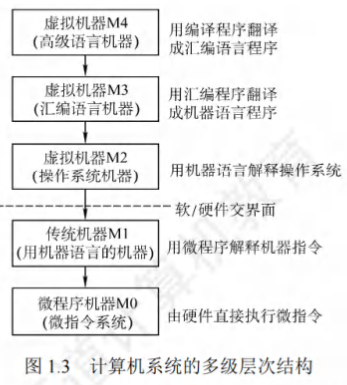
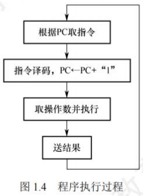
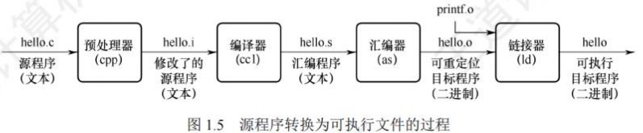

# 计算机系统的层次结构

[toc]

## 计算机系统的组成

- 硬件系统和软件系统共同构成了一个完整的计算机系统。

  - **硬件**：指有形的物理设备，是计算机系统中实际物理装置的总称。

  - **软件**：指在硬件上运行的程序和相关的数据及文档。

- 计算机系统性能的好坏，很大程度上由软件的效率和作用来表征，而软件性能的发挥离不开硬件的支持。
  - 对某一功能来说，若其既可用软件实现，又可用硬件实现，则称为软/硬件在逻辑功能上是等价的。
  - 在设计计算机系统时，要进行软/硬件的功能分配。
  - 一个功能若使用频繁且硬件实现成本理想，用硬件解决可提高效率。

## 计算机硬件

### 冯·诺依曼机基本思想

冯·诺依曼在研究EDVAC机时提出了"存储程序"的概念，“存储程序”的思想奠定了现代计算机的基本结构，以此概念为基础的各类计算机统称冯·诺依曼机，其特点如下：
1. 采用**“存储程序”的工作方式**。
2. 计算机硬件系统由**运算器、存储器、控制器、输入设备和输出设备**5大部件组成。
3. **指令和数据以同等地位存储在存储器中，可按地址寻访**，形式上没有区别，但计算机应能区分它们。
4. 指令和数据均用**二进制代码表示**。
5. 指令由**操作码和地址码**组成，操作码指出操作的类型，地址码指出操作数的地址。
6. **以运算器为中心**，输入输出设备与存储器间的数据传送通过运算器完成。

“存储程序”的基本思想是：将事先编制好的程序和原始数据送入主存储器后才能执行，一旦程序被启动执行，就无须操作人员的干预，计算机会自动逐条执行指令，直至程序执行结束。

### 计算机的功能部件

#### 输入设备

输入设备的主要功能是将程序和数据以机器所能识别和接受的信息形式输入计算机。

#### 输出设备

输出设备的任务是将计算机处理的结果以人们所能接受的形式或其他系统所要求的信息形式输出。输入/输出设备(简称I/O设备)是计算机与外界联系的桥梁，是计算机中不可缺少的重要组成部分。

#### 存储器

- 存储器分为**主存储器(也称内存储器或主存)和辅助存储器(也称外存储器或外存)**。
  - CPU能够直接访问的存储器是主存储器。
  - 辅助存储器用于帮助主存储器记忆更多的信息，辅助存储器中的信息必须调入主存储器后，才能为CPU所访问。
  - 主存储器的工作方式是按存储单元的地址进行存取，这种存取方式称为按地址存取方式。

- **主存储器的最基本组成**：
  - **存储体**存放二进制信息。
    - 存储体由许多存储单元组成，每个存储单元包含若干存储元件，每个存储元件存储一位二进制代码“0”或“1”。因此存储单元可存储一串二进制代码，称这串代码为存储字，称这串代码的位数为存储字长，存储字长可以是1B(8bit)或是字节的偶数倍。
  - **存储器地址寄存器(MAR)**存放访存地址，经过地址译码后找到所选的存储单元。
    - MAR用于寻址，其位数反映最多可寻址的存储单元的个数，如MAR为10位，则最多有$2^{10}=1024$个存储单元，记为1K。MAR的长度与PC的长度相等。
  - **存储器数据寄存器(MDR)**用于暂存要从存储器中读或写的信息，时序控制逻辑用于产生存储器操作所需的各种时序信号。
    - MDR的位数通常等于存储字长，一般为字节的2次幂的整数倍。
  - 注意：MAR与MDR虽然是存储器的一部分，但在现代计算机中却是存在于CPU中的；另外，后文提到的高速缓存(Cache)也存在于CPU中。

#### 运算器

- 运算器是计算机的执行部件，用于进行**算术运算和逻辑运算**。算术运算是按算术运算规则进行的运算，如加、减、乘、除；逻辑运算包括与、或、非、异或、比较、移位等运算。

- 运算器的核心是**算术逻辑单元(Arithmetic and Logic Unit, ALU)**。运算器包含若干通用寄存器，用于暂存操作数和中间结果，如累加器(ACC)、乘商寄存器(MQ)、操作数寄存器(X)、变址寄存器(IX)、基址寄存器(BR)等，其中前三个寄存器是必须具备的。

- 运算器内有**程序状态寄存器(PSW)，也称标志寄存器**，用于存放ALU运算得到的一些标志信息或处理机的状态信息，如结果是否溢出、有无产生进位或借位、结果是否为负等。

#### 控制器

- 控制器是计算机的指挥中心，指挥各部件自动协调地进行工作。控制器由**程序计数器(PC)、指令寄存器(IR)和控制单元(CU)**组成。

- **程序计数器(PC)**用来存放当前欲执行指令的地址，具有自动加1的功能(这里的“1”指一条指令的长度)，即可自动形成下一条指令的地址，它与主存储器的MAR之间有一条直接通路。
- **指令寄存器(IR)**用来存放当前的指令，其内容来自主存储器的MDR。
  - 指令中的操作码OP(IR)送至**控制单元(CU)**，用以分析指令并发出各种微操作命令序列；
  - 而地址码Ad(IR)送往MAR，用以取操作数。

- 一般将运算器和控制器集成到同一个芯片上，称为**中央处理器(CPU)**。**CPU和主存储器共同构成主机**，而除主机外的其他硬件装置(外存、I/O设备等)统称外部设备，简称外设。

- 图12所示为冯·诺依曼结构的模型机。
  - CPU包含ALU、通用寄存器组GPRS、标志寄存器、控制器、指令寄存器IR、程序计数器PC、存储器地址寄存器MAR和存储器数据寄存器MDR。
  - 图中从控制器送出的虚线就是控制信号，可以控制如何修改PC以得到下一条指令的地址，可以控制ALU执行运算，可以控制主存储器是进行读操作、写操作(读/写控制信号)。
  - CPU和主存储器之间通过一组**总线**相连，总线中有地址、控制和数据3组信号线。
    - MAR中的地址信息会直接送到地址线上，用于指向读/写操作的主存储器存储单元；
    - 控制线中有读/写信号线，指出数据是从CPU写入主存储器还是从主存储器读出到CPU，根据是读操作还是写操作来控制将MDR中的数据是直接送到数据线上或是将数据线上的数据接收到MDR中。 
  

## 计算机软件

### 系统软件和应用软件

软件按其功能分类，可分为**系统软件和应用软件**。
- **系统软件**：是一组保证计算机系统高效、正确运行的基础软件，通常作为系统资源提供给用户使用。主要有操作系统(OS)、数据库管理系统(DBMS)、语言处理程序、分布式软件系统、网络软件系统、标准库程序、服务性程序等。
- **应用软件**：指用户为解决某个应用领域中的各类问题而编制的程序，如各种科学计算类程序、工程设计类程序、数据统计与处理程序等。

在本学科范畴内，编写诸如操作系统、编译程序等各种系统软件的人员称为系统程序员；利用计算机及所支持的系统软件来编写解决具体应用问题的人员称为应用程序员。

### 三个级别的语言

1. **机器语言**：也称二进制代码语言，需要编程人员记忆每条指令的二进制编码。是计算机唯一可以直接识别和执行的语言。
2. **汇编语言**：用英文单词或其缩写代替二进制的指令代码，更容易为人们记忆和理解。使用汇编语言编辑的程序，必须经过一个称为汇编程序的系统软件的翻译，将其转换为机器语言程序后，才能在计算机的硬件系统上执行。
3. **高级语言**：（如C、C++、Java等）为方便程序设计人员写出解决问题的处理方案和解题过程的程序。通常高级语言需要经过编译程序编译成汇编语言程序，然后经过汇编操作得到机器语言程序，或直接由高级语言程序翻译成机器语言程序。

因此计算机无法直接理解和执行高级语言程序，所以需要将高级语言程序转换为机器语言程序，通常把进行这种转换的软件系统称翻译程序。翻译程序有以下三类：
1. **汇编程序(汇编器)**：将汇编语言程序翻译成机器语言程序。
2. **解释程序(解释器)**：将源程序中的语句按执行顺序逐条翻译成机器指令并立即执行。
3. **编译程序(编译器)**：将高级语言程序翻译成汇编语言或机器语言程序。

### 软件和硬件的逻辑功能等价性

- 硬件实现的往往是最基本的算术和逻辑运算功能，而其他功能大多通过软件的扩充得以实现。
  - **软/硬件逻辑功能的等价性**：对某一功能来说，既可以由硬件实现，又可以由软件实现，从用户的角度来看，它们在功能上是等价的。
  - 例如，浮点数运算既可以用专门的浮点运算器硬件实现，又可以通过一段子程序实现，这两种方法在功能上完全等效，不同的只是执行时间的长短而已，显然硬件实现的性能要优于软件实现的性能。
- 软件和硬件逻辑功能的等价性是计算机系统设计的重要依据，软件和硬件的功能分配及其界面的确定是计算机系统结构研究的重要内容。
  - 当研制一台计算机时，设计者必须明确分配每一级的任务，确定哪些功能使用硬件实现，哪些功能使用软件实现。
  - 软件和硬件功能界面的划分是由设计目标、性能价格比、技术水平等综合因素决定的。

## 计算机系统的层次结构

计算机是一个硬软件组成的综合体。因为面对的应用范围越来越广，所以必须有复杂的系统软件和硬件的支持。由于软/硬件的设计者和使用者从不同的角度、用不同的语言来对待同一个计算机系统，因此他们看到的计算机系统的属性对计算机系统提出的要求也就各不相同。

计算机系统的多级层次结构的作用，就是针对上述情况，根据从各种角度所看到的机器之间的有机联系，来分清彼此之间的界面，明确各自的功能，以便构成合理、高效的计算机系统。

1. **第1级是微程序机器层**：这是一个实在的硬件层，它由机器硬件直接执行微指令。
2. **第2级是传统机器语言层**：它也是一个实际的机器层，由微程序字解释机器指令系统。
3. **第3级是操作系统层**：它由操作系统程序实现。操作系统程序是由机器指令和广义指令组成的，这些广义指令是为了扩展机器功能而设置的，是由操作系统定义和解释的软件指令，所以这一层也称混合层。
4. **第4级是汇编语言层**：这一层由汇编程序支持和执行，借此可编写汇编语言源程序。
5. **第5级是高级语言层**：它是面向用户的，是为方便用户编写应用程序而设置的。该层由各种高级语言编译程序支持和执行。在高级语言层之上，还可以有应用程序层，它由解决实际问题的处理程序组成，如文字处理软件、多媒体处理软件和办公自动化软件等。

没有配备软件的纯硬件系统称**裸机**。第3层~第5层称为**虚拟机**，简单来说就是软件实现的机器。虚拟机器只对该层的观察者存在，这里的分层和计算机网络的分层类似，对于某层的观察者来说，只能通过该层的语言来了解和使用计算机，而不必关心下层是如何工作的。

层次之间的关系紧密，**下层是上层的基础，上层是下层的扩展**。

软件和硬件之间的界面就是**指令集体系结构(ISA)**，ISA定义了一台计算机可以执行的所有指令的集合，每条指令规定了计算机执行什么操作，以及所处理的操作数存放的地址空间和操作数类型。可以看出，ISA是指软件能感知到的部分，也称软件可见部分。

## 计算机系统的工作原理

### "存储程序"工作方式

**“存储程序”工作方式**规定，程序执行前，需要将程序所含的指令和数据送入主存储器，一旦程序被启动执行，就无须操作人员的干预，自动逐条完成指令的取出和执行任务。

如图1.4所示，一个程序的执行就是周而复始地执行一条一条指令的过程。每条指令的执行过程包括：从主存储器中取指令、对指令进行译码、计算下条指令地址、取操作数并执行、将结果送回存储器。

1. 程序执行前，先将程序第一条指令的地址存放到PC中，取指令时，将PC的内容作为地址访问主存储器。
2. 在每条指令执行过程中，都需要计算下条将执行指令的地址，并送至PC。
3. 若当前指令为顺序型指令，则下条指令地址为PC的内容加上当前指令的长度；
4. 若当前指令为跳转型指令，则下条指令地址为指令中指定的目标地址。
5. 当前指令执行完后，根据PC的内容到主存储器中取出的是下一条将要执行的指令，因而计算机能周而复始地自动取出并执行一条一条的指令。

### 从源程序到可执行文件

在计算机中编写的C语言程序，都必须被转换为一系列的低级机器指令，这些指令按照一种称为可执行目标文件的格式打好包，并以二进制磁盘文件的形式存放起来。

以UNIX系统中的GCC编译器程序为例，读取源程序文件`hello.c`，并把它翻译成一个可执行目标文件hello，整个翻译过程可分为四个阶段完成：
1. **预处理阶段**：
   - 预处理器(`cpp`)对源程序中以字符#开头的命令进行处理
   - 例如将`#include`命令后面的`.h`文件内容插入程序文件。输出结果是一个以.i为扩展名的源文件`hello.i`。
2. **编译阶段**：
   - 编译器(`ccl`)对预处理后的源程序进行编译，生成一个汇编语言源程序`hello.s`。
   - 汇编语言源程序中的每条语句都以一种文本格式描述了一条低级机器语言指令。
3. **汇编阶段**：
   - 汇编器(`as`)将`hello.s`翻译成机器语言指令，把这些指令打包成一个称为可重定位目标文件`hello.o`
   - 它是一种二进制文件，因此用文本编辑器打开会显示乱码。
4. **链接阶段**：
   - 链接器(`ld`)将多个可重定位目标文件和标准库函数合并为一个可执行目标文件，简称可执行文件。
   - 本例中，链接器将`hello.o`和标准库函数`printf`所在的可重定位目标模块`printf.o`合并，生成可执行文件`hello`。最终生成的可执行文件被保存在磁盘上。

### 指令执行过程的描述

可执行文件代码段是由一条一条机器指令构成的，指令是用0和1表示的一串0/1序列，用来指示CPU完成一个特定的原子操作。

例如，取数指令从存储单元中取出一个数据送到CPU的寄存器中，存数指令将CPU寄存器的内容写入一个存储单元，ALU指令将两个寄存器的内容进行某种算术或逻辑运算后送到一个CPU寄存器中，等等。

下面以取数指令(送至运算器的ACC中)为例来说明，其信息流程如下：
1. **取指令**：`(PC)→MAR→MDR→IR`根据PC取指令到IR。
    - 将PC的内容送MAR，MAR中的内容直接送地址线，同时控制器将读信号送读/写信号线，主存储器根据地址线上的地址和读信号，从指定存储单元读出指令，送到数据线上，MDR从数据线接收指令信息，并传送到IR中。
2. **分析指令**：`OP(IR)→CU`指令译码并送出控制信号。
    - 控制器根据IR中指令的操作码，生成相应的控制信号，送到不同的执行部件。
    - 在本例中，IR中是取数指令，因此读控制信号被送到总线的控制线上。
3. **执行指令**：`Ad(IR)→MAR→MDR→MDR→ACC`取数操作。
    - 将IR中指令的地址码送MAR，MAR中的内容送地址线，同时控制器将读信号送读/写信号线，从主存储器中读出操作数，并通过数据线送至MDR，再传送到ACC中。
4. 每取完一条指令，还须为取下条指令做准备，计算下条指令的地址，即`(PC)+1→PC`。

