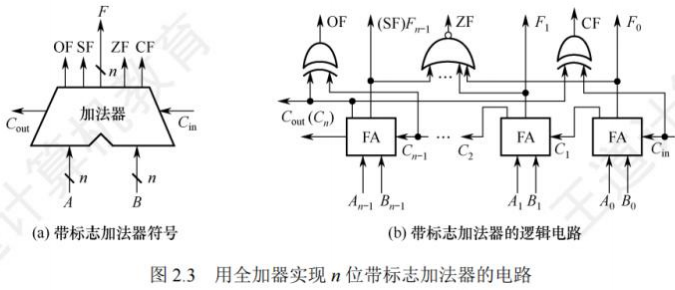
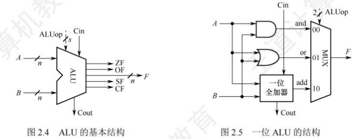
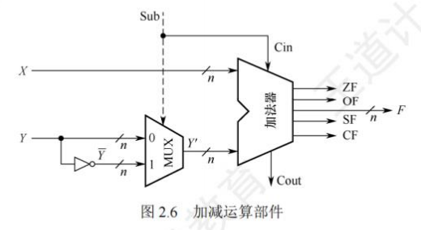
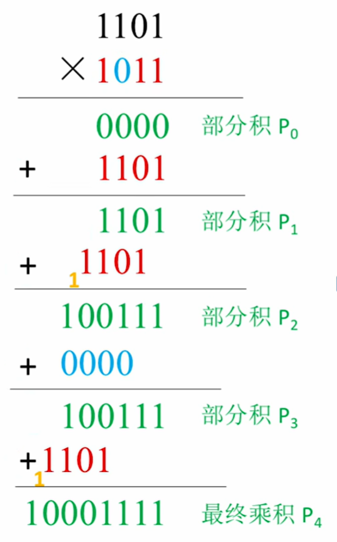
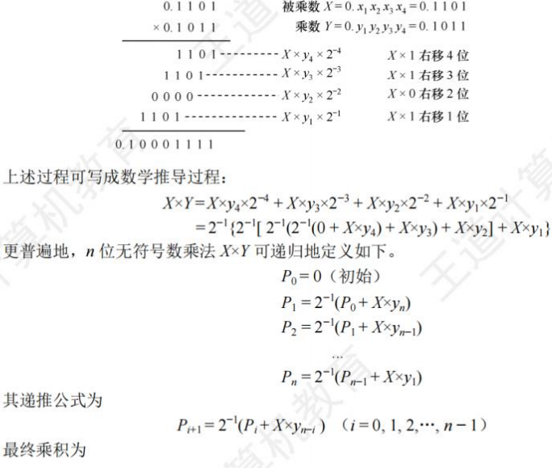
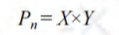
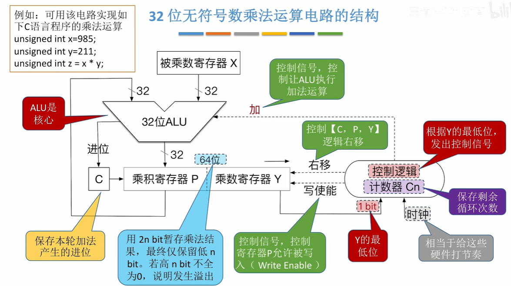
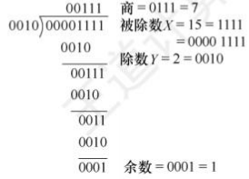
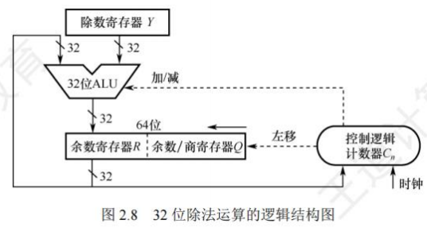

# 运算方法与运算电路

[toc]

## 基本运算部件

在计算机中，**运算器**由**算术逻辑单元(Arithmetic Logic Unit, ALU)、移位器、状态寄存器(PSW)和通用寄存器组**等组成。

**运算器的基本功能**包括加、减、乘、除四则运算，与、或、非、异或等逻辑运算，以及移位、求补等操作。其中，**ALU的核心部件是加法器**。

### 带标志加法器

无符号数加法器只能用于两个无符号数相加，无法进行有符号整数的加/减运算。为了实现有符号整数的加/减运算，需要在无符号数加法器的基础上增加相应的逻辑门电路，使加法器不仅能计算和/差，还能生成相应的标志信息。图2.3是带标志加法器的实现电路。

在图2.3中：
- **溢出标志**：其逻辑表达式为$OF = C_{n} \oplus C_{n - 1}$。
- **符号标志**：就是和的符号，即$SF = F_{n - 1}$。
- **零标志**：$ZF = 1$当且仅当$F = 0$。
- **进位/借位标志**：$CF = C_{out} \oplus C_{in}$ 。

### 算术逻辑单元(ALU)

ALU是一种功能较强的组合逻辑电路，能进行多种算术运算和逻辑运算。由于加、减、乘、除运算最终都可归结为加法运算，所以**ALU的核心是带标志加法器**，同时它也能执行“与”“或”“非”等逻辑运算。

- ALU的基本结构如图2.4所示
  - $A$和$B$是两个$n$位操作数输入端
  - $C_{in}$是进位输入端
  - $ALUop$是操作控制端（发出控制信号），用于决定ALU所执行的处理功能
  - 例如，当$ALUop$选择$Add$运算时，ALU就执行加法运算，输出的结果就是$A$加$B$之和。$ALUop$的位数决定了操作的种类，例如，当位数为$3$时，ALU最多只有$8$种操作。
- 图2.5给出了能够完成3种运算“与”“或”和“加法”的一位ALU结构图。
  - 其中，一位加法用一个全加器实现，在$ALUOp$的控制下，由一个多路选择器(MUX)选择输出3种操作结果之一。
  - 这里有3种操作，所以$ALUOp$至少要有两位。同时，ALU也可以实现左移或右移的移位操作。

 

## 定点数的移位运算
当计算机中没有乘/除法运算电路时，可通过加法和移位相结合实现乘/除法运算。

对于任意二进制整数，**左移一位（不产生溢出）相当于乘以2**；**右移一位（不考虑移出的末位尾数）相当于除以2**。

根据操作数类型，移位运算分为逻辑移位和算术移位。

### 逻辑移位
逻辑移位将操作数**视为无符号整数**。

- 其规则为：
  - **左移时，高位移出，低位补0；**
  - **右移时，低位移出，高位补0**。
  - 对于无符号整数的逻辑左移，**若高位的1移出，则发生溢出**。

### 算术移位
算术移位需考虑符号位，将操作数**视为有符号整数**。

计算机中有符号整数用补码表示，采用补码算术移位方式。

- 规则为：
  - **左移时，高位移出，低位补0，若移出的高位不同于移位后的符号位（左移前后符号位不同），则发生溢出；**
  - **右移时，低位移出，高位补符号位，若低位的1移出，则影响精度**。

例如，补码1001和01左移时会发生溢出，右移时会丢失精度。

## 定点数的加法运算

### 补码的加减法运算
补码加减运算规则简单，易于实现。补码加减运算公式（设机器字长为$n + 1$）：

$ [A + B]_补 = [A]_补 + [B]_补 \ (mod \ 2^{n + 1}) $
$ [A - B]_补 = [A]_补 + [-B]_补 \ (mod \ 2^{n + 1}) $

#### 补码运算特点

1. 按二进制运算规则运算，逢二进一。
2. 若做加法，两个数的补码直接相加；若做减法，则将被减数与减数的负数补码相加。
3. 符号位与数值位一起参与运算，加、减运算结果的符号位也在运算中直接得出。
4. 最终运算结果的高位丢弃，保留$n + 1$位，运算结果亦为补码。

---

【例2.3】设字长为8位（含1位符号位），$A = 15$，$B = 24$，求$[A + B] _补$和$[A - B]_补$

解：

$A = +15 = +0001111$，$B = +24 = +0011000$；得$[A]_补 = 00001111$，$[B]_补 = 00011000$。
求得$[-B]_补 = 11101000$。所以
$[A + B]_补 = 00001111 + 00011000 = 00100111$，符号位为0，对应真值为$+39$
$[A - B]_补 = [A]_补 + [-B]_补 = 00001111 + 11101000 = 11110111$，符号位为1，对应真值为$-9$。

---

### 溢出判别方法

仅当两个符号相同的数相加或两个符号相异的数相减才可能产生溢出。

补码定点数加减运算溢出判断方法有3种：

#### 采用一位符号位

由于减法用加法器实现，无论是加还是减，只要参加操作的两个数符号相同，结果又与原操作数符号不同，则表示溢出。

设$A$的符号为$A_s$，$B$的符号为$B_s$，运算结果的符号为$S_s$，则溢出逻辑表达式为：
$V = A_sB_s\overline{S_s} + \overline{A_s}\overline{B_s}S_s $
若$V = 0$，表示无溢出；若$V = 1$，表示有溢出。

#### 采用双符号位

- 双符号位法也称模4补码。
  - 运算结果的两个符号位$S_{s1}S_{s2}$相同，表示未溢出；
  - 两个符号位$S_{s1}S_{s2}$不同，表示溢出，此时最高位符号位代表真正的符号。

- 符号位$S_{s1}S_{s2}$的各种情况：

   - $S_{s1}S_{s2} = 00$：表示结果为正数，无溢出。

   - $S_{s1}S_{s2} = 01$：表示结果正溢出。

   - $S_{s1}S_{s2} = 10$：表示结果负溢出。

   - $S_{s1}S_{s2} = 11$：表示结果为负数，无溢出。

   - 溢出逻辑判断表达式为$V = S_{s1} \oplus S_{s2}$，若$V = 0$，表示无溢出；若$V = 1$，表示有溢出。

#### 采用一位符号位根据数值位的进位情况判断溢出

若符号位（最高位）的进位$C_s$与最高数位（次高位）的进位$C_{m - 1}$相同，说明无溢出，否则说明有溢出。

溢出逻辑判断表达式为$V = C_s \oplus C_{m - 1}$，若$V = 0$，表示无溢出；$V = 1$，表示有溢出。 

### 补码加减运算电路
已知一个数的补码表示为$Y$，则其负数的补码为$\overline{Y}+1$。

在原加法器的输入端加$n$个反向器实现各位取反，加一个$2$选$1$多路选择器，用控制端$Sub$控制，选择将$Y$或$\overline{Y}$输入加法器，并将$Sub$作为低位进位送到加法器（做减法时末位加$1$）

如图2.6所示。该电路可实现模$2^n$补码加减运算。

- 当$Sub$为$1$时，做减法，实现$X + \overline{Y} + 1 = [X]_补 + [-Y]_补$。
- 当$Sub$为$0$时，做加法，实现$X + Y = [X]_补 + [Y]_补$。

无符号整数相当于正整数的补码表示，此电路也能实现无符号数的加/减运算。对于有符号数$x$和$y$，图中$X$和$Y$是$x$和$y$的补码表示；对于无符号数$x$和$y$，图中$X$和$Y$是$x$和$y$的二进制表示。补码减法和无符号数减法，都是用被减数加上减数的负数的补码（即$\overline{Y}+1$）来实现。

运算器无法识别二进制串是有符号数还是无符号数。例如$0 - 1 = 00...0 + 11...1 = 11...1$，若为有符号数，对应值为$-1$；若为无符号数，对应值为$2^n - 1$（$n$位无符号数最大值），结果出错。

可通过标志信息区分有符号整数和无符号整数运算结果：
- **零标志$ZF$**：$ZF = 1$表示结果$F$为$0$
- **溢出标志$OF$**：判断有符号数运算是否溢出，$OF = C_s \oplus C_{m - 1}$。
  - 对无符号数运算无意义，无法据此判断无符号数运算是否溢出，如无符号数加法$010 + 011 = 101$，$OF = 1$但未溢出。

- **符号标志$SF$**：表示结果的符号，即$F$的最高位。
  - 对无符号数运算无意义。

- **进/借位标志$CF$**：表示无符号数运算时的进位/借位，判断是否溢出。
  - 加法时，$CF = 1$表示结果溢出，$CF$等于进位输出$C_{out}$；
  - 减法时，$CF = 1$表示有借位（不够减），$CF$等于进位输出$C_{out}$取反，综合$CF = \overline{Sub} \cdot C_{out}$ 。
  - 如无符号数加法$110 + 011$最高位产生进位，减法$000 - 111$最高位产生借位，结果均溢出（$CF = 1$）。
  - 对有符号数运算无意义，无法据此判断有符号数运算是否溢出。

#### 无符号数大小的比较

对于无符号数运算，零标志$ZF$、进/借位标志$CF$有意义。假设有两个无符号数$A$和$B$，以$A - B$为例：

 - 若$A = B$，如$A - B = 011 - 011 = 000$，此时$ZF = 1$，$CF = 0$。
 - 若$A > B$，如$A - B = 010 - 001 = 001$，此时$ZF = 0$，$CF = 0$。
 - 若$A < B$，如$A - B = 000 - 001 = (1)000 - 001 = 111$，此时$ZF = 0$，$CF = 1$。
当$ZF = 1$时，$A = B$；当$ZF = 0$且$CF = 0$时，$A > B$；当$CF = 1$时，$A < B$。

#### 有符号数大小的比较

对于有符号数运算，零标志$ZF$、溢出标志$OF$、符号标志$SF$有意义。假设两个有符号数$A$和$B$（补码表示），以$[A]_补 - [B]_补$为例：

- 若$A = B$
  - 如$[A]_补 - [B]_补 = 011 - 011 = [A]_补 + [-B]_补 = 011 + 101 = (1)000$
    - 此时$ZF = 1$，$OF = C_3 \oplus C_2 = 0$，$SF = 0$。

- 若$A > B$
  - 如$[A]_补 - [B]_补 = 010 - 001 = 010 + 111 = (1)001$
    - 此时$ZF = 0$，$OF = 0$，$SF = 0$

  - 又如$[A]_补 - [B]_补 = 011 - 110$
    - 此时$ZF = 0$，$OF = 1$，$SF = 1$。

- 若$A < B$
  - 如$[A]_补 - [B]_补 = 000 - 001 = 000 + 111 = 111$
    - 此时$ZF = 0$，$OF = 0$，$SF = 1$

  - 又如$[A]_补 - [B]_补 = 101 - 011 = 101 + 101 = (1)010$
    - 此时$ZF = 0$，$OF = 1$，$SF = 0$。

- 当$ZF = 1$时，$A = B$
- 当$ZF = 0$且$OF = 0$时，若$SF = 0$，$A > B$
- 当$OF = 1$时，若$SF = 1$，正数减负数溢出致结果为负，当$OF = SF$（或$OF \oplus SF = 0$）且$ZF = 0$时，$A > B$
- 当$ZF = 0$且$OF = 0$时，若$SF = 1$，$A < B$
- 当$OF = 1$时，若$SF = 0$，负数减正数溢出致结果为正，当$OF \neq SF$（或$OF \oplus SF = 1$）且$ZF = 0$时，$A < B$。

## 定点数的乘除运算

### 定点乘法运算
#### 乘法运算的基本原理

原码乘法特点是符号位与数值位分开求，分两步：

 - 乘积的符号位由两个乘数的符号位“异或”得到。
 - 乘积的数值位是两个乘数的绝对值之积，两个定点数的数值部分之积可视为两个无符号数的乘积。

下面是两个无符号数相乘的手算过程

由上述分析可知，乘法运算可用加法和移位运算实现（乘以$2^{-1}$相当于做一次右移），两个$n$位无符号数相乘共需进行$n$次加法和$n$次移位运算。原码乘法运算过程归纳如下：
- 被乘数和乘数均取绝对值参加运算（视为无符号数），符号位为$x_s \oplus y_s$。
- 部分积$P_i$是乘法运算的中间结果，初值$P_0 = 0$。从乘数的最低位$y_{n - 1}$开始，将前面所得的部分积$P_i$加上$X \times y_{n - 1}$，然后右移一位，此步骤重复$n$次。

**注意**：由于参与运算的是两个数的数值位，因此运算过程中的右移操作均为逻辑右移。

#### 乘法运算电路

- 图2.7是32位无符号数乘法运算的逻辑结构图。部分积和被乘数$X$做无符号数加法时，可能产生进位，因此设置一个专门的进位位$C$。乘积寄存器$P$初始置$0$。计数器$C_n$初值为$32$，每循环一次减$1$。

   - $ALU$是乘法器的核心部件，对乘积寄存器$P$和被乘数寄存器$X$的内容做“无符号加法”运算，结果送回寄存器$P$，进位存放在$C$中。

   - 每次循环都对进位位$C$、寄存器$P$和寄存器$Y$实现同步“逻辑右移”，此时，进位位$C$移入寄存器$P$的最高位，寄存器$Y$的最低位移出。

   - 每次从寄存器$Y$移出的最低位都被送到控制逻辑，以决定被乘数是否“加”到部分积上。

- 32位带符号数乘法运算，乘数为原数的补码，修改控制信号：根据乘数**寄存器Y的最低位**和**辅助位**(上一轮右移移出的数)，决定$+[x]_{补}$，$-[x]_{补}$，$+0$。

  - $辅助位-Y的最低位 = 1，P+[x]_补$
  - $辅助位-Y的最低位 = 0，P+0$
  - $辅助位-Y的最低位 = -1，P-[x]_补$

- 溢出判断(在字长为n位的计算机中)：

  - **带符号整数乘法**，若乘积高n+1位的每一位不完全相同，表示溢出，否则表示不溢出。

  - **无符号整数乘法**，运算结果用2n bit暂存，低n位为运算结果，若乘积的**高n位全为$0$**，则**表示不溢出**，否则表示溢出。

### 除法运算
#### 除法运算的基本原理

$n$位定点数的除法运算，需统一为：一个$2n$位的数除以一个$n$位的数，得到一个$n$位的商，因此需要对被除数进行扩展。

 - 对于定点正小数（即原码小数），只需在被除数低位添$n$个$0$即可。
 - 对于定点正整数（即无符号数），只需在被除数高位添$n$个$0$即可。
做整数除法时，若除数为$0$，则发生“除数为$0$”异常，需调出操作系统相应的异常处理程序进行处理。

下面以两个无符号数为例说明手算除法步骤

上述除法运算的过程可归纳如下：

- 被除数与除数相减，够减则上商为$1$，不够减则上商为$0$。
- 每次得到的差为中间余数，将除数右移后与上次的中间余数比较。用中间余数减除数，够减则上商为$1$，不够减则上商为$0$。如此重复，直到商的位数满足要求为止。
- 若是$2n$位除以$n$位的无符号数，商的位数为$n + 1$位，当第一次试商为$1$时，则表示结果溢出（即无法用$n$位表示商），如$111111 / 1111 = 10001$。
- 若是两个$n$位的无符号数相除，则第一位商为$0$，且结果肯定不会溢出，如两个$4$位数相除的最大商为$00001111 / 0001 = 1111$。
- 对于浮点数尾数的原码小数相除，第一次试商为$1$，则说明尾数部分有溢出，可通过右规消除。

计算机内部的除法运算与手算除法一样，通过被除数（中间余数）减除数来得到每一位商，够减上商$1$，不够减上商$0$。原码除法运算也要将符号位和数值位分开处理，商的符号位是两个数的符号位的“异或”结果，商的数值位是两个数的绝对值之商。

#### 除法运算电路

- 寄存器$Y$存放除数。
- 寄存器$R$初始时存放扩展被除数的高32位，运算过程中存放中间余数的高位部分，结束时存放的是余数。
- 寄存器$Q$初始时存放扩展被除数的低32位，运算过程中部分存放中间余数的低位部分、部分存放商，结束时存放的是32位商。
- $ALU$是除法器的核心部件，对寄存器$R$和$Y$的内容做加/减运算，运算结果被送回寄存器$R$。
- 计数器$C_t$初值为$32$，每循环一次减$1$。
- 每次循环，寄存器$R$和$Q$实现同步左移，左移时，$Q$的最高位移入$R$的最低位，$Q$中空出的最低位被上商。从低位开始，逐次把商的各个数位左移到$Q$中。
- 每次由控制逻辑根据$ALU$运算结果的符号来决定上商是$0$还是$1$。

若是两个32位$int$型整数相除，则除了$-2^{31} / -1$会溢出，其余情况都不会溢出。 

