# 浮点数的表示与运算

[toc]

## 浮点数的表示
浮点数表示法是指以适当的形式将比例因子表示在数据中，让小数点的位置根据需要而浮动。这样，在位数有限的情况下，既扩大了数的表示范围，又保持了数的有效精度。例如，用定点数表示电子的质量（$9\times10^{-28}g$）或太阳的质量（$2\times10^{33}g$）是非常不方便的。

### 浮点数的表示格式

通常，浮点数表示为：
$N = (-1)^S\times M\times R^E$
式中，$S$取值$0$或$1$，用来决定浮点数的符号；**$M$是一个二进制定点小数，称为尾数，一般用定点原码小数表示**；**$E$是一个二进制定点整数，称为阶码或指数，用移码表示**。$R$是基数（隐含），可以约定为$2$、$4$、$16$等。可见浮点数由符号、尾数和阶码三部分组成。

图2.9是一个32位短浮点数格式的例子。

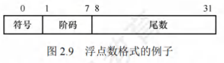

其中，第$0$位为符号$S$；第$1$～$7$位为移码表示的阶码$E$（偏置值为$64$）；第$8$～$31$位为$24$位二进制原码小数表示的尾数$M$；基数$R$为$2$。**阶码的值反映浮点数的小数点的实际位置；阶码的位数反映浮点数的表示范围；尾数的位数反映浮点数的精度**。

### 浮点数的表示范围
原码是关于原点对称的，故浮点数的范围也是关于原点对称的，如图2.10所示。

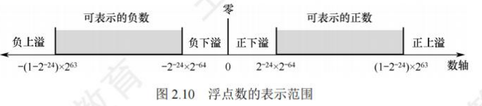

运算结果大于最大正数时称为正上溢，小于绝对值最大负数时称为负上溢，正上溢和负上溢统称上溢。数据一旦产生上溢，计算机必须中断运算操作，进行溢出处理。当运算结果在$0$至最小正数之间时称为正下溢，在$0$至绝对值最小负数之间时称为负下溢，正下溢和负下溢统称下溢。数据下溢时，浮点数值趋于零，计算机将其当作机器零处理。

### 浮点数的规格化
为了在浮点数运算过程中尽可能多地保留有效数字的位数，使有效数字尽量占满尾数数位，必须在运算过程中对浮点数进行规格化操作。所谓规格化操作，是指通过调整一个非规格化浮点数的尾数和阶码的大小，使非零浮点数在尾数的最高数位上保证是一个有效值。
- **左规**：当运算结果的尾数的最高数位不是有效位，即出现$\pm0.0\cdots0\times\cdots\times$的形式时，需要进行左规。左规时，尾数每左移一位、阶码减$1$（基数为$2$时）。左规可能要进行多次。
- **右规**：当运算结果的尾数的有效位进到小数点前面时，需要进行右规，右规只需进行一次。将尾数右移一位、阶码加$1$（基数为$2$时）。右规时，阶码增加可能导致溢出。

基数为$2$的原码规格化尾数$M$应满足$\frac{1}{2} \leq |M| < 1$，形式如下：
- 正数为$0.1\times\cdots\times$的形式，最大值为$0.11\cdots1$，最小值为$0.100\cdots0$，表示范围为$\frac{1}{2} < M < (1 - 2^{-n})$；
- 负数为$1.1\times\cdots\times$的形式，最大值为$1.10\cdots0$，最小值为$1.11\cdots1$，表示范围为$-(1 - 2^{-n}) < M < -\frac{1}{2}$。

基数不同，浮点数的规格化形式也不同。当浮点数尾数的基数为$2$时，原码规格化数的尾数的尾数最高位一定是$1$。当基数为$4$时，原码规格化数的尾数最高两位不全为$0$。

### IEEE754标准
按照IEEE 754标准，常用的浮点数的格式如图2.11所示。

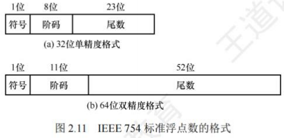

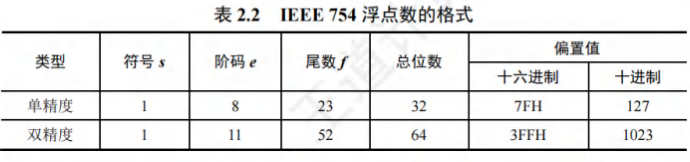

- IEEE754标准规定常用的浮点数格式有$32$位单精度浮点数（短浮点数、float型）和$64$位双精度浮点数（长浮点数、double型），其基数隐含为$2$，见表2.2。

  - 单精度格式中包含$1$位符号$s$、$8$位阶码$e$和$23$位尾数$f$；
  - 双精度格式包含$1$位符号$s$、$11$位阶码$e$和$52$位尾数$f$。基数隐含为$2$；
  - 尾数用原码表示。
  - 对于规格化的二进制浮点数，尾数的最高位总是$1$，为了能使尾数多表示一位有效位，将这个$1$隐藏，称为隐藏位，因此$23$位尾数实际表示了$24$位有效数字。
  - 在IEEE754标准中，指数用**移码**表示，但偏置值并不是通常$n$位移码所用的$2^{n - 1}$，而是$2^{n - 1} - 1$，因此，**单精度和双精度浮点数的偏置值分别为$127$和$1023$**。在存储浮点数阶码之前，偏置值要先加到阶码真值上。

  - 规格化单精度浮点数的真值为：$(-1)^s\times 1.f\times 2^{e - 127}$

  - 规格化双精度浮点数的真值为：$(-1)^s\times 1.f\times 2^{e - 1023}$


- 式中，规格化单精度浮点数的阶码$e$的取值范围为$1$～$254$（$8$位）；规格化双精度浮点数的阶码$e$的取值范围为$1$～$2046$（$11$位）。IEEE754规格化浮点数的表示范围见表2.3。
  - 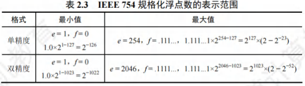

- 对于IEEE754格式的浮点数，阶码全为$0$或全为$1$时，有其特别的解释，如表2.4所示。

  - 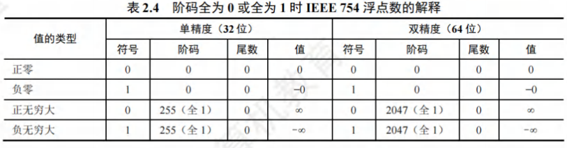

  - 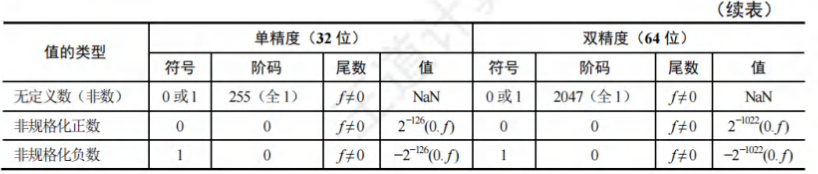

    - 全$0$阶码全$0$尾数：$+0/-0$。零的符号取决于符号$s$，一般情况下$+0$和$-0$是等效的。

    - 全$1$阶码全$0$尾数：$+\infty/-\infty$。$+\infty$在数值上大于所有有限数，$-\infty$则小于所有有限数。引入无穷大数的目的是，在计算过程出现异常的情况下使得程序能继续进行下去。

    - 全$1$阶码非$0$尾数：$NaN$（Not a Number）。表示一个没有定义的数，称为非数。
    - 全$0$阶码非$0$尾数：非规格化数。非规格化数的特点是阶码为全$0$，尾数高位有一个或几个连续的$0$，但不全为$0$。因此，非规格化数的隐藏位为$0$，且单精度和双精度浮点数的指数分别为$-126$或$-1022$。非规格化数可以用于处理阶码下溢。

  - 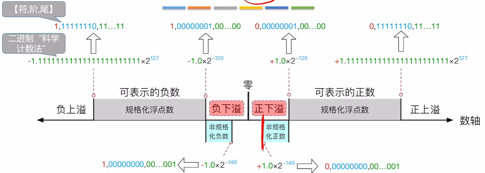

| 类型         | 符号位（S） | 阶码字段（E，8位） | 尾数字段（M，23位）       | 二进制表示范围（完整32位结构）                                                                 | 数值边界（二进制，近似值）                                                                 |
|--------------|-------------|--------------------|---------------------------|----------------------------------------------------------------------------------------------|------------------------------------------------------------------------------------------|
| **规格化浮点数（正数）** | 0           | 00000001 ~ 11111110 | 000...000 ~ 111...111     | 0 00000001 000...000 ~ 0 11111110 111...111                                                  | 最小值：1.0×2⁻¹²⁶<br>最大值：(2-2⁻²³)×2¹²⁷ |
| **规格化浮点数（负数）** | 1           | 00000001 ~ 11111110 | 000...000 ~ 111...111     | 1 11111110 111...111 ~ 1 00000001 000...000                                                  | 最小值：-(2-2⁻²³)×2¹²⁷<br>最大值：-1.0×2⁻¹²⁶ |
| **非规格化浮点数（正数）** | 0           | 00000000           | 000...001 ~ 111...111     | 0 00000000 000...001 ~ 0 00000000 111...111                                                  | 最小值：1.0×2⁻¹⁴⁹<br>最大值：(1-2⁻²³)×2⁻¹²⁶ |
| **非规格化浮点数（负数）** | 1           | 00000000           | 000...001 ~ 111...111     | 1 00000000 111...111 ~ 1 00000000 000...001                                                  | 最小值：-(1-2⁻²³)×2⁻¹²⁶<br>最大值：-1.0×2⁻¹⁴⁹ |

---

【例2.5】将十进制数$-8.25$转换为IEEE754单精度浮点数格式表示。
解：
IEEE754规定：单精度浮点数的偏置值是$127$；尾数最高位的“$1$”是被隐藏的。
先将$-8.25$转换成二进制数，即$-1000.01 = -1.00001\times2^3$，再计算阶码$E$，$E - 127 = 3$，因此$E = 130$，转换成二进制数为$10000010$。
IEEE754单精度浮点数格式：符号(1位)+阶码(8位)+尾数(23位)。因此，单精度格式表示为：
$1;1000 0010; 0000 1000 0000 0000 0000 0000$
即$1100 0001 0000 0100 0000 0000 0000 0000 = C104 0000H$

---

【例2.6】求IEEE754单精度浮点数$C6400000H$的值是多少。
解：
先将$C6400000H$按二进制展开为：
$1100 0110 0100 0000 0000 0000 0000 0000$
其对应IEEE754单精度浮点数的格式如下：

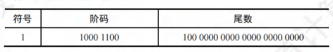

因此，符号$=1$表示负数；阶码值为$1000 1100 - 0111 1111 = 0000 1101 = 13$；尾数值为$1.5$（注意其有隐藏位，要加$1$）。因此，浮点数的值为$-1.5\times2^{13}$。

---

## 浮点数的加减运算

### 转换格式

使用补码表示阶码和尾数

$[X]_补$ $[Y]_补$ 

### 对阶
**小阶码向大阶码看齐**，尾数每右移1位，阶码+1

1. 求阶差：$[\Delta E]_补 = [EX]_补 + [-EY]_补$ ，将结果转化为十进制
   - 结果为负数：X阶数比Y阶数小
2. 对阶：阶数小的尾数算数右移

### 尾数加减
将对阶后的尾数按定点原码小数的加(减)运算规则进行运算。因为IEEE754浮点数尾数中有一个隐藏位，因此在进行尾数加减时，必须将隐藏位还原到尾数部分。运算后的尾数不一定是规格化的，因此，浮点数的加减运算需要进一步进行规格化处理。

### 尾数规格化
- **右规**：当结果尾数溢出(尾数符号位两数不同)时，需要进行右规。尾数右移一位，阶码加$1$。尾数右移时，最高位$1$被移到小数点前一位作为隐藏位，最后一位移出时，要考虑舍入。
- **左规**：当结果尾数的最高位为 0时，需要进行左规。尾数每左移一位，阶码减$1$。可能需要左规多次，直到将第一位$1$移到小数点左边。

### 舍入
在对阶和尾数右规时，可能会对尾数进行右移，为保证运算精度，一般将移出的部分低位保留下来，参加中间过程的运算，最后再将运算结果进行舍入，还原表示成IEEE754格式。
IEEE754提供了以下$4$种可选的舍入模式。

- **就近舍入**：舍入为最近的可表示数。当运算结果是两个可表示数的非中间值时，实际上是“$0$舍$1$入”方式（类似于十进制的“四舍五入”法）；当运算结果正好在两个可表示数的中间时，则选择结果为偶数。
- **正向舍入**：朝数轴$+\infty$方向舍入，即取右边最近的可表示数。
- **负向舍入**：朝数轴$-\infty$方向舍入，即取左边最近的可表示数。
- **截断法**：直接截取所需位数，丢弃后面的所有位，这种舍入处理最简单。对正数或负数来说，都是取更接近原点的那个可表示数，是一种趋向原点的舍入。

### 溢出判断
在尾数规格化和尾数舍入时，可能会对结果的阶码执行加/减运算。因此，必须考虑指数溢出问题。若一个正指数超过了最大允许值（$127$或$1023$），则发生指数上溢，产生异常。若一个负指数超过了最小允许值（$-149$或$-1074$），则发生指数下溢，通常把结果按机器零处理。
- **右规和尾数舍入**：数值很大的尾数舍入时，可能因为末位加$1$而发生尾数溢出，此时需要通过右规来调整尾数和阶码。右规时阶码加$1$，导致阶码增大，因此需要判断是否发生了指数上溢。当调整前的阶码为$11111110$时，加$1$后，会变成$11111111$而发生指数上溢。
- **左规**：左规时阶码减$1$，导致阶码减小，因此需要判断是否发生了指数下溢。其判断规则与指数上溢类似，左规一次，阶码减$1$，然后判断阶码是否为全$0$来确定指数是否下溢。

由此可见，浮点数的溢出并不是以尾数溢出来判断的，尾数溢出可以通过右规操作得到纠正。运算结果是否溢出主要看结果的指数是否发生了上溢，因此是由指数上溢来判断的。

某些题目中可能会指定尾数或阶码采用补码表示。通常可以采用双符号位，当尾数求和结果溢出（如尾数为$10.xx\cdots x$或$01.xx\cdots x$）时，需右规一次；当结果出现$00.0xx\cdots x$或$11.1xx\cdots x$时，需要左规，直到尾数变为$00.1xx\cdots x$或$11.0xx\cdots x$。

## C语言中的浮点数类型
- C语言中的`float`型和`double`型分别对应于IEEE 754单精度浮点数和双精度浮点数。

  - `long double`型对应于扩展双精度浮点数，但`long double`型的长度和格式随编译器和处理器类型的不同而有所不同。
- 在C程序中，等式的赋值和判断会导致强制类型转换，以`char→int→long→double`和`float→double`最为常见，从前到后范围和精度都从小到大，转换过程没有损失。
- 不同类型数的混合运算时，遵循的原则是“类型提升”，即较低类型转换为较高类型。

  - 所有这些转换都是系统自动进行的，这种转换称为隐式类型转换。
  - `int`型转换为`float`型时，虽然不会发生溢出，但`float`型尾数连隐藏位共$24$位，当`int`型数的第$24$～$31$位非$0$时，无法精确转换成$24$位浮点数的尾数，需舍入处理，影响精度。
  - `double`型转换为`float`型时，因`float`型的表示范围更小，因此大数转换时可能会发生溢出。此外，由于尾数有效位数变少，因此高精度数转换时会发生舍入。
- `float`型或`double`型转换为`int`型时，因`int`型没有小数部分，因此数据会向$0$方向截断（仅保留整数部分），发生舍入。另外，因`int`型的表示范围更小，因此大数转换时可能会溢出。


在不同数据类型之间转换时，往往隐藏着一些不容易察觉的错误，编程时要非常小心。 

## 数据的大小端和对其存储

### 数据的"大端方式"和"小端方式"存储
- 在存储数据时，数据从低位到高位可以有不同的排列方式，通常用最低有效字节(LSB)和最高有效字节(MSB)来分别表示数据的低位和高位。
  - 例如，在32位计算机中，一个int型变量i的机器数为01234567H，其最高有效字节MSB = 01H，最低有效字节LSB = 67H。

- 现代计算机基本都采用**字节编址**，即每个地址编号中存放1字节。不同类型的数据占用的字节数不同，如int型和float型占4字节，double型占8字节等，而程序中对每个数据只给定一个地址。

- 假设变量i的地址为0800H，字节01H、23H、45H、67H应各有一个内存地址，那么4字节在内存中应如何排列呢？根据数据中各字节在连续字节序列中的排列顺序不同，可以采用两种排列方式：大端方式(big endian)和小端方式(little endian)，如图2.12所示。

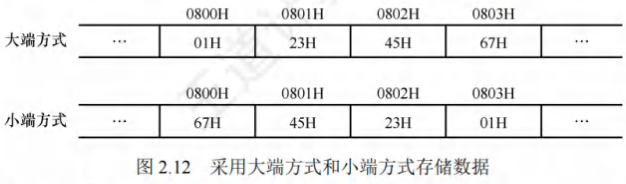

- **大端方式**：先存储高位字节，后存储低位字节。**字中的字节顺序和原序列的相同**。
- **小端方式**：先存储低位字节，后存储高位字节。**字中的字节顺序和原序列的相反**。

---

在检查底层机器级代码时，需要分清各类型数据字节序列的顺序，例如，以下是由反汇编器(汇编的逆过程，即将机器代码转换为汇编代码)生成的一行机器级代码的文本表示：

```
4004d3: 01 05 64 94 04 08
add eax, 0x8049464
```
其中，"4004d3"是十六进制数表示的地址，`01 05 64 94 04 08`是指令的机器代码，`add eax, 0x8049464`是指令的汇编形式，该指令的第二个操作数是一个立即数`0x8049464`。执行指令时，从指令代码的后4字节中取出该立即数，立即数存放的字节序列为64H、94H、04H、08H，正好与操作数的字节顺序相反，即采用的是小端方式存储，得到08049464H，去掉开头的0，得到值0x8049464，在阅读以小端方式存储的机器代码时，要注意字节是按相反顺序显示的。

---

### 数据按"边界对齐"方式存储
- 现代计算机都是按字节编址的，假设字长为32位，数据按边界对齐方式存放要求其存储地址是自身大小的整数倍，半字地址一定是2的整数倍，字地址一定是4的整数倍，这样无论所取的数据是字节、半字还是字，均可一次访存取出。
- 当所存数据不满足上述要求时，可通过填充空白字节使其符合要求。这样做虽然会浪费一些存储空间，但可以提高存取数据的速度。
- 当数据不按边界对齐方式存储时，半字长或字长的数据可能在两个存储字中，此时需要两次访存，并对高低字节的位置进行调整后才能得到所需数据，从而影响了系统的效率。

例如，按边界对齐方式和按边界不对齐方式存储时，格式分别如图2.13和图2.14所示。

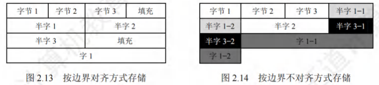

在C语言的struct类型中，"边界对齐"有两个重要要求：
- 每个成员按其类型的大小对齐，char型的对齐值为1，short型的对齐值为2，int型的对齐值为4，单位为字节；
- struct的长度必须是成员中最大对齐值的整数倍(不够就补空字节)。这样就能保证struct数组的每项都满足边界对齐的条件。

---

先来看两个例子(32位，x86环境，GCC编译器)：

```c
struct A{
    int a;
    char b;
    short c;
};
struct B{
    char b;
    int a;
    short c;
};
```
结果却是：`sizeof(A)=8`，`sizeof(B)=12`。

之所以出现上面的结果，是因为编译器要使结构体成员在空间上对齐。为此必须满足：
- 每个成员存储的"起始地址%该成员的长度 = 0"，而结构体中的成员都是按定义的先后顺序排放的。
- 结构体的长度也必须是最大成员长度的整数倍，即结构体也要对齐排放。

边界对齐方式相对边界不对齐方式是一种空间换时间的思想。精简指令系统计算机RISC通常采用边界对齐方式，因为边界对齐方式取指令时间相同，因此能适应指令流水。 

