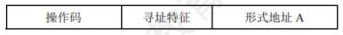
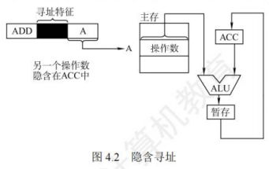
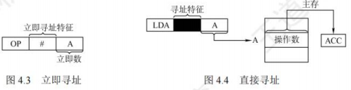
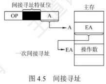
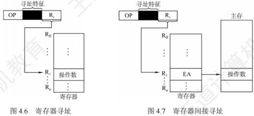
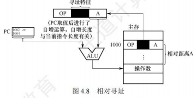
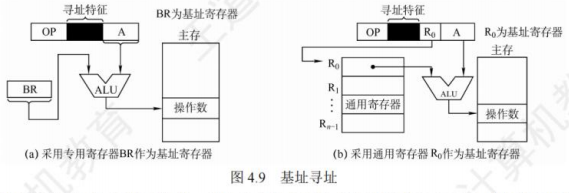
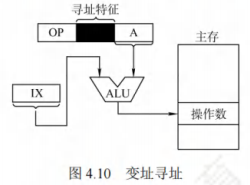
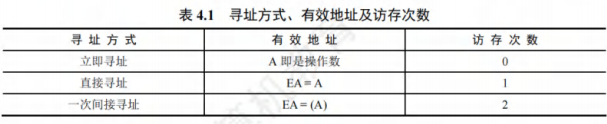
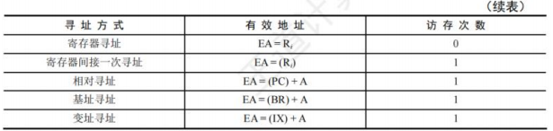

# 指令的寻址方式

[toc]

**寻址方式是指寻找指令或操作数有效地址的方式**

- 即确定本条指令的数据地址及下一条待执行指令的地址的方法。
- 寻址方式分为**指令寻址**和**数据寻址**两大类。

## 指令寻址和数据寻址
寻找下一条将要执行的指令地址称为指令寻址；寻找本条指令的数据地址称为数据寻址。

### 指令寻址
指令寻址方式有两种：一种是顺序寻址方式，另一种是跳跃寻址方式。
#### 顺序寻址

通过程序计数器PC加1（1条指令的长度），自动形成下一条指令的地址。

**注意**：PC自增的大小与编址方式、指令字长有关。现代计算机通常是按字节编址的，若指令字长为16位，则PC自增为$(PC)+2$；若指令字长为32位，则PC自增为$(PC)+4$。

#### 跳跃寻址

- 通过转移类指令实现。
  - 跳跃是指由本条指令给出下条指令地址的计算方式。
  - 而是否跳跃可能受到状态寄存器的控制，跳跃的方式分为绝对转移（地址码直接指出转移目标地址）和相对转移（地址码指出转移目的地址相对于当前PC值的偏移量），由于CPU总是根据PC的内容去主存取指令的，因此转移指令执行的结果是修改PC值，下一条指令仍然通过PC给出。

### 数据寻址
数据寻址是指如何在指令中表示一个操作数的地址，或怎样计算出操作数的地址。数据寻址的方式较多，为区别各种方式，通常在指令字中设置一个寻址特征字段，用来指明属于哪种寻址方式（其位数决定了寻址方式的种类），由此可得指令的格式如下所示:

- 指令中的地址码字段并不代表操作数的真实地址，这种地址称为形式地址(A)。
- 形式地址结合寻址方式，可以计算出操作数在存储器中的真实地址，这种地址称为有效地址(EA)。
  - 若为立即寻址，则形式地址的位数决定了操作数的范围。
  - 若为直接寻址，则形式地址的位数决定了可寻址的范围。
  - 若为寄存器寻址，则形式地址的位数决定了通用寄存器的最大数量。
  - 若为寄存器间接寻址，则寄存器的位数决定了可寻址的范围。
  - **注意**：$(A)$表示地址为$A$的数值，$A$既可以是寄存器编号，又可以是内存地址。

## 常见的数据寻址方式
### 隐含寻址
这种类型的指令不明显地给出操作数的地址，而是隐含操作数的地址。例如，单地址的指令格式就隐含约定第二个操作数由累加器(ACC)提供，指令中只明显指出第一个操作数的地址。因此，累加器(ACC)对单地址指令格式来说是隐含寻址，如图4.2所示。

优点是有利于缩短指令字长；缺点是需增加存储操作数或隐含地址的硬件。

### 立即(数)寻址
- 指令字中的地址字段指出的不是操作数的地址，而是操作数本身，也称立即数，采用补码表示。
- 图4.3所示为立即寻址示意图，图中#表示立即寻址特征，$A$就是操作数。
- 优点：指令在执行阶段不访存，指令执行速度最快
- 缺点：是$A$的位数限制了立即数的范围。 

### 直接寻址
指令字中的形式地址$A$就是操作数的真实地址$EA$，即$EA = A$，如图4.4所示。

- 优点：简单，不需要专门计算操作数的地址，指令在执行阶段仅需访存一次
- 缺点：$A$的位数限制了该指令操作数的寻址范围，操作数的地址不易修改。

### 间接寻址

间接寻址是相对于直接寻址而言的，指令的地址字段给出的不是操作数的真正地址，而是操作数有效地址所在主存单元的地址，也就是**操作数地址的地址**，即$EA=(A)$，如图4.5所示。

- 优点：可扩大寻址范围（有效地址$EA$的位数大于形式地址$A$的位数），便于编制程序（用间接寻址可方便地完成子程序返回）；
- 缺点：指令在执行阶段需要多次访存（一次间接寻址需$2$次访存）。由于执行速度较慢，一般为了扩大寻址范围时，通常采用寄存器间接寻址。

### 寄存器寻址
与直接寻址的原理一样，只是把访问主存改为访问寄存器，指令的地址字段给出的是操作数所在寄存器的编号，即$EA = R$，其操作数在由$R$所指的寄存器内，如图4.6所示。

- 优点：指令在执行阶段不用访存，只访问寄存器，执行速度快；寄存器数量远小于内存单元数，所以地址码位数较少，指令字长较短
- 缺点：寄存器价格昂贵，CPU的寄存器数量有限。

### 寄存器间接寻址
这种方式综合了间接寻址和寄存器寻址各自的特点，指令字中的$R$所指寄存器给出的不是一个操作数，而是操作数所在主存单元的地址，即$EA=(R)$，如图4.7所示。

- 相比间接寻址，这种方式既扩大了寻址范围，又减少了访存次数，在执行阶段仅需访存$1$次。
- 相比寄存器寻址，这种方式在执行阶段需要访存（因操作数在主存中）获得操作数。

### 相对寻址
相对寻址是把$PC$的内容加上指令格式中的形式地址$A$而形成操作数的有效地址，即$EA=(PC)+A$，其中$A$是相对于当前$PC$值的偏移量，可正可负，补码表示，如图4.8所示。

在图4.8中，$A$的位数决定操作数的寻址范围。

- 优点：操作数的地址不是固定的，它随$PC$值的变化而变化，且与指令地址之间总是相差一个固定的偏移量，因此便于程序浮动。相对寻址广泛应用于转移指令。

- **注意**：对于转移指令$JMP A$，若指令的地址为$X$，且占$2B$，则在取出该指令后，$PC$的值会增$2$，即$(PC)=X + 2$，这样在执行完该指令后，会自动跳转到$X + 2 + A$的地址继续执行。

### 基址寻址
基址寻址是指将**基址寄存器$(BR)$**的内容加上指令字中的形式地址$A$而形成操作数的有效地址，即$EA=(BR)+A$。

- 其中基址寄存器既可采用专用寄存器，又可指定某个通用寄存器作为基址寄存器，如图4.9所示。
- 基址寄存器是面向操作系统的，其内容由操作系统或管理程序确定，主要用于解决程序逻辑空间与存储器物理空间的无关性。
  - 在程序执行过程中，基址寄存器的内容不变（作为基地址），形式地址可变（作为偏移量）。
  - 采用通用寄存器作为基址寄存器时，可由用户决定哪个寄存器作为基址寄存器，但其内容仍由操作系统确定。
- 基址寻址的优点：
  - 可以扩大寻址范围（基址寄存器的位数大于形式地址$A$的位数）；
  - 用户不必考虑自己的程序存于主存的具体位置，因此有利于多道程序设计，并可用于编制浮动程序，但偏移量（形式地址$A$）的位数较短。

### 变址寻址

变址寻址是指将**变址寄存器$(IX)$**的内容加上指令字中的形式地址$A$而形成操作数的有效地址，即$EA=(IX)+A$，其中$IX$为变址寄存器（专用），也可用通用寄存器作为变址寄存器。图4.10所示为采用专用寄存器$IX$的变址寻址示意图。

- 变址寄存器是面向用户的，在程序执行过程中，变址寄存器的内容可由用户改变（作为偏移量），形式地址$A$不变（作为基地址）。
- 变址寻址的优点：
  - 可扩大寻址范围（变址寄存器的位数大于形式地址$A$的位数）；
  - 在数组处理过程中，可设定$A$为数组的首地址，不断改变变址寄存器$IX$的内容，便可很容易形成数组中任意一个数据的地址，特别适合编制循环程序。
  - 偏移量（变址寄存器$IX$）的位数足以表示整个存储空间。

- 变址寻址与基址寻址的有效地址形成过程极为相似。但从本质上讲，两者有较大区别。
  - 基址寻址面向系统，主要用于为多道程序或数据分配存储空间，因此基址寄存器的内容通常由操作系统或管理程序确定，在程序的执行过程中其值不可变，而指令字中的$A$是可变的。
  - 变址寻址立足于用户，主要用于处理数组问题，在变址寻址中，变址寄存器的内容由用户设定，在程序执行过程中其值可变，而指令字中的$A$是不可变的。
  - 相对寻址、基址寻址和变址寻址三种寻址方式非常类似，都将某个寄存器的内容与一个形式地址相加而生成操作数的有效地址，通常把这三种寻址方式称为偏移寻址。

### 堆栈寻址
堆栈是存储器（或寄存器组）中一块特定的、按后进先出$(LIFO)$原则管理的存储区，该存储区中读/写单元的地址是用一个特定寄存器给出的，该寄存器称为堆栈指针$(SP)$。

- 堆栈可分为硬堆栈和软堆栈两种。
  - 寄存器堆栈也称硬堆栈，硬堆栈的成本较高，不适合做大容量的堆栈。
  - 而从主存中划出一段区域来做堆栈是最合算且最常用的方法，这种堆栈称为软堆栈。
    在采用堆栈结构的计算机中，大部分指令表面上都表现为无操作数指令的形式，因为操作数地址都隐含使用了$SP$。因此在读/写
- 堆栈的前后都伴有自动完成对$SP$的加减操作。

---

下面简单总结寻址方式、有效地址及访存次数(不含取本条指令的访存)，见表4.1。 

