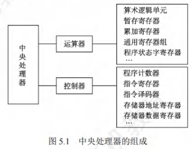

# CPU的功能和基本结构

[toc]

## CPU的功能
中央处理器(CPU)由**运算器和控制器**组成。其中，**控制器**的功能是负责协调并控制计算机各部件执行程序的指令序列；**运算器**的功能是对数据进行加工。CPU的具体功能包括：
1. **指令控制**：完成取指令(也称取指)、分析指令和执行指令的操作，即程序的顺序控制。
2. **操作控制**：产生完成一条指令所需的操作信号，把各种操作信号送到相应的部件，从而控制这些部件按指令的要求正确执行。
3. **时间控制**：严格控制各种操作信号的出现时间、持续时间及出现的时间顺序。
4. **数据加工**：对数据进行算术和逻辑运算。
5. **中断处理**：对运行过程中出现的异常情况和中断请求进行处理。

## CPU的基本结构
在计算机系统中，CPU主要由**运算器和控制器**两大部分组成[也可将CPU分为数据通路(见5.3节)和控制部件两大组成部分]，如图5.1所示。

### 运算器
- 运算器主要由**算术逻辑单元(ALU)、暂存寄存器、累加寄存存器(ACC)、通用寄存器组(GPRS)、程序状态字寄存器(PSW)、移位寄存器、计数器(CT)**等组成。

- 其主要功能是根据控制器送来的命令，对数据执行**算术运算(加、减、乘、除)、逻辑运算(与、或、非、异或、移位、求补等)或条件测试(用于设置ZF、SF、OF和CF等标志位，作为条件转移的判断条件)**。

### 控制器
- 控制器主要由**程序计数器(PC)、指令寄存器(IR)、指令译码器(ID)、存储器地址寄存器(MAR)、存储器数据寄存器(MDR)、时序电路和微操作信号发生器**等组成。

- 其主要功能是执行指令，每条指令的执行是由控制器发出的一组微操作实现的。

- 控制器的工作原理
  - 根据指令操作码、指令的执行步骤(微命令序列)和条件信号来形成当前计算机各部件要用到的控制信号。
  - 计算机整机各硬件系统在这些控制信号的控制下协同运行，产生预期的执行结果。
  - **控制器是整个系统的指挥中枢**，在控制器的控制下，运算器、存储器和输入/输出设备等功能部件构成一个有机的整体，根据指令的要求指挥全机协调工作。

## CPU的寄存器
- CPU中的寄存器按汇编语言(或机器语言)程序是否可访问，可分为两类：

  - 一类是**用户可见寄存器**，可对这类寄存器编程，以通过使用这类寄存器减少对主存储器的访问次数，如通用寄存器组(含基址/变址寄存器)、程序状态字寄存器、程序计数器、累加寄存器、移位寄存器。

  - 另一类是**用户不可见寄存器**，对用户是透明的，不可对这类寄存器编程，它们被控制部件使用，以控制CPU的操作，如存储器地址寄存器、存储器数据寄存器、指令寄存器、暂存寄存器。

### 运算器中的寄存器
1. **通用寄存器组(GPRs)**：用于存放操作数(包括源操作数、目的操作数及中间结果)和各种地址信息等，如AX、BX、CX、DX、SP等。
   - 在指令中要指定寄存器的编号，才能明确是对哪个寄存器进行访问。SP是堆栈指针，用于指示栈顶的地址。
2. **累加寄存器(ACC)**：它是一个通用寄存器，用于暂时存放ALU运算的结果。
3. **移位寄存器(SR)**：不但可用来存放操作数，而且在控制信号的作用下，寄存器中的数据可根据需要向左或向右移位。
4. **暂存寄存器**：用于暂存从数据总线或通用寄存器送来的操作数，以便在取出下一个操作数时将其同时送入ALU。
   - 暂存寄存器对应用程序员是透明的(不可见)。
5. **程序状态字寄存器(PSW)**：保留由算术/逻辑运算指令或测试指令的运行结果而建立的各种状态信息，如溢出标志(OF)、符号标志(SF)、零标志(ZF)、进位标志(CF)等。
   - 每个标志位通常由一位触发器来保存，这些标志位组合在一起称为程序状态字。

### 控制器中的寄存器
1. **程序计数器(PC)**：用于指出欲执行指令在主存储器中的存放地址。
   - 若PC和主存储器均按字节编址，则PC的位数等于主存储器地址位数
   - CPU根据PC的内容从主存储器中取指令，然后送入指令寄存器
   - 指令通常是顺序执行的，因此PC具有自动加1的功能(这里的"1"是指一条指令的字节数)
   - 当遇到转移类指令时，PC的新值由指令计算得到
2. **指令寄存器(IR)**：用于保存当前正在执行的指令，IR的位数等于指令字长。
3. **存储器地址寄存器(MAR)**：用于存放要访问的主存储器单元的的地址，MAR的位数等于主存储器地址线数，反映了最多可寻址的存储单元的个数。
4. **存储器数据寄存器(MDR)**：用于存放向主存储器写入的信息或从主存储器读出的信息，MDR的位数等于存储字长。
