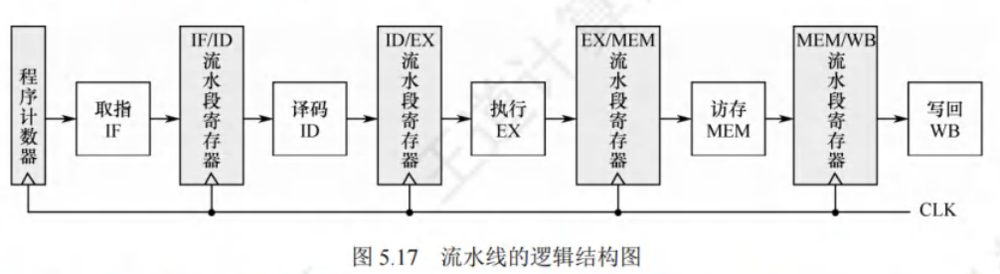
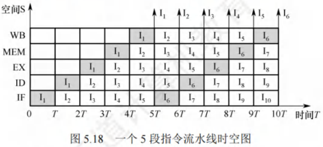
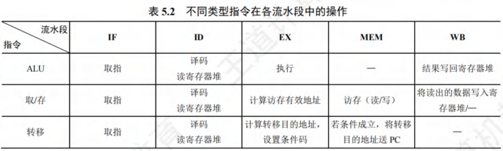
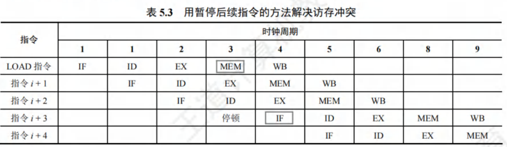
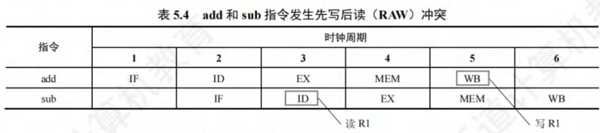
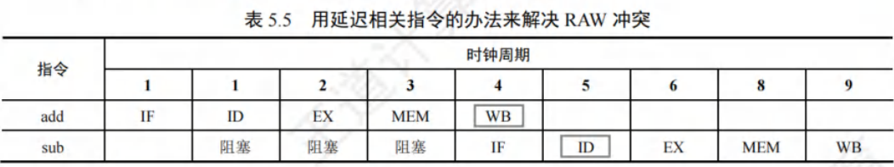
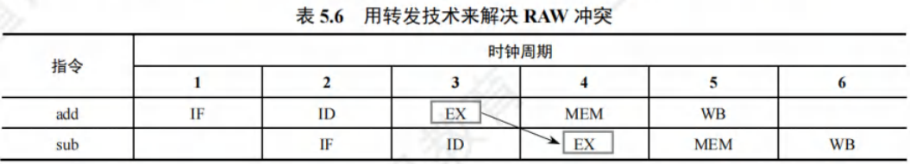
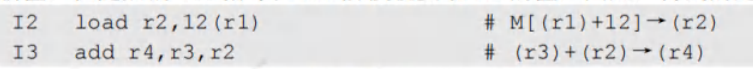
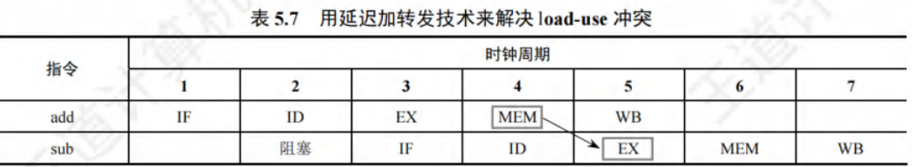

# 指令流水线

[toc]

指令在单周期处理机中以串行方式执行，同一时刻CPU中仅有一条指令在执行，导致各功能部件的使用率较低。

现代计算机普遍采用指令流水线技术，使同一时刻有多条指令在CPU的不同功能部件中并发执行，显著提高了功能部件的并行性和程序的执行效率。

## 指令流水线的基本概念
- 提高处理机并行性的方法主要有两种：

  1. **时间上的并行技术（流水线技术）**：将一个任务分解为多个不同的子阶段，每个子阶段在不同的功能部件上并行执行，以便在同一时刻能同时执行多个任务，从而提升系统性能。
  2. **空间上的并行技术**：在处理机内设置多个执行相同任务的功能部件，并使这些功能部件并行工作，这类处理机被称为超标量处理机。

- 一条指令的执行过程可分解为若干阶段，每个阶段由相应的功能部件完成。若将各阶段视为流水段，则指令的执行过程便构成了一条指令流水线。假设一条指令的执行过程分为以下5个阶段：

  1. **取指（IF）**：从指令存储器或Cache中获取指令。
  2. **译码/读寄存器（ID）**：操作控制器对指令进行译码，同时从寄存器堆中读取操作数。
  3. **执行/计算地址（EX）**：执行运算操作或计算地址。
  4. **访存（MEM）**：对存储器进行读、写操作。
  5. **写回（WB）**：将指令执行结果写回到寄存器堆。

- 将第$k + 1$条指令的取指阶段提前到第$k$条指令的译码阶段，使第$k + 1$条指令的译码阶段与第$k$条指令的执行阶段同时进行。理想情况下，每个时钟周期都有一条指令进入流水线，每个时钟周期都有一条指令完成，每条指令的时钟周期数（即CPI）均为1。

### 利于实现指令流水线的指令集特征
- 为便于实现指令流水线，指令集应具备以下特征：

  1. **指令长度尽量一致**：这样可简化取指令和指令译码操作，避免因取指令时间长短不一导致取指部件复杂，同时也有利于指令译码。
  2. **指令格式尽量规整**：尽量保证源寄存器的位置相同，便于在指令未知时即可读取寄存器操作数，否则需译码后才能确定指令中各寄存器编号的位置。
  3. **采用LOAD/STORE型指令**：规定其他指令不能访问存储器，可将LOAD/STORE指令的地址计算和运算指令的执行步骤规整在同一周期内，减少操作步骤。
  4. **数据和指令在存储器中“按边界对齐”存放**：可减少访存次数，使所需数据在一个流水段内就能从存储器中获取。 

## 流水线的基本实现
### 流水线设计的原则
在单周期实现中，并非所有指令都需经历完整的5个阶段，但单周期CPU的时钟频率由数据通路中的最长路径决定，即只能以执行速度最慢的指令作为设计其时钟周期的依据。

- 流水线设计的原则：
  1. 指令流水段个数以最复杂指令所用的功能段个数为准。
  1. 流水段的长度以最复杂的操作所花的时间为准。

---

假设某条指令的5个阶段所花时间分别为：

取指$200ps$；译码$100ps$；执行$150ps$；访存$200ps$；写回$100ps$，该指令总执行时间为$750ps$。

按照流水线设计原则，每个流水段长度为$200ps$，所以每条指令执行时间为$1ns$，比串行执行时增加了$250ps$。

假设某程序有$N$条指令，单周期处理机所用时间为$N×750ps$，而流水线处理机所用时间为$(N + 4)×200ps$。

由此可见，流水线方式不能缩短单条指令执行时间，但可大幅提高整个程序的执行效率。

---

### 流水线的逻辑结构



- 每个流水段后面需增加一个流水段寄存器，用于锁存本段处理完的所有数据，确保本段执行结果能在下个时钟周期供下一流水段使用。
- 各种寄存器和数据存储器均采用统一时钟$CLK$进行同步，每来一个时钟，各段处理完的数据都将锁存到段尾的流水段寄存器中，作为后段的输入，同时当前段也会接收前段通过流水段寄存器传递过来的数据。
- 一条指令会依次进入$IF$（取指）、$ID$（译码/读寄存器）、$EX$（执行/计算地址）、$MEM$（访存）、$WB$（写回）五个功能段进行处理。
- 当第一条指令进入$WB$段后，各流水段都包含一条不同的指令，流水线中将同时存在$5$条不同的指令并行执行。

**注意**：在考试中，若没有明确说明，可不考虑流水寄存器的时延。

### 流水线的时空图表示



- 通常用时空图直观描述流水线的执行情况。
  - 横坐标表示时间，分割成长度相等的时间段$T$；
  - 纵坐标为空间，表示当前指令所处的功能部件。
- 例如，第一条指令$I1$在时刻$0$进入流水线，在时刻$5T$流出流水线；第二条指令$I2$在时刻$T$进入流水线，在时刻$6T$流出流水线，以此类推，每隔一个时间$T$就有一条指令进入流水线，从时刻$5T$开始每隔一个时间$T$就有一条指令流出流水线。

- 从时空图中可看出，在时刻$10T$时，流水线上便有$6$条指令流出。若采用串行方式执行，在时刻$10T$时，只能执行$2$条指令，使用流水线方式可成倍提高计算机的速度。

- 只有大量连续任务不断输入流水线，才能充分发挥流水线的性能。
- 指令的执行是连续不断的，非常适合采用流水线技术。
- 对于其他部件级流水线，如浮点运算流水线，同样仅适合提升浮点运算密集型应用的性能，对于单个运算是无法提升性能的。 

## 流水线的冒险与处理
在指令流水线中，某些情况会使后续指令无法正确执行，进而导致流水线阻塞，这种现象被称为流水线冒险。

根据冒险产生的原因，可分为**结构冒险**、**数据冒险**和**控制冒险**三种类型。不同类型指令在各流水段的操作存在差异，表5.2中列出了几类指令在各流水段中的操作。



### 结构冒险
- 结构冒险是指不同指令在同一时刻争用同一功能部件而产生的冲突，也叫资源冲突，由硬件资源竞争引发。
  - 例如，指令和数据常存于同一存储器中，当第$i$条$LOAD$指令在第$4$个时钟周期进入$MEM$段时，第$i + 3$条指令的$IF$段也要访存取指令，此时就会出现访存冲突。
  - 为解决这一问题，可在前一条指令访存时，暂停（一个时钟周期）后一条指令的取指操作。
  - 若第$i$条指令不是$LOAD$指令，在$MEM$段不访存，则不会发生访存冲突。



- 解决结构冲突的方法有：
  1. 前一指令访存时，让后一条相关指令（及其后续指令）暂停一个时钟周期。
  2. 设置多个独立部件。如对于寄存器访问冲突，可将寄存器的读口和写口独立；对于访存冲突，单独设置数据存储器和指令存储器。现代$Cache$机制中，$L1$级$Cache$常采用数据$Cache$和指令$Cache$分离的方式，避免资源冲突。


### 数据冒险
- 数据冒险也叫数据相关，产生原因是后面指令要用到前面指令的结果时，前面指令的结果尚未产生。
  - 在非乱序执行的流水线中，所有数据冒险都是由于前面指令写结果之前，后面指令就需要读取造成的，这种冒险被称为写后读（Read After Write，RAW）冲突。
  - 在按序执行的流水线中（统考中通常采用这种方式），仅可能出现$RAW$冲突。
  
- 例如：
```
I1 add R1,R2,R3  //(R2)+(R3)→R1
I2 Sub R4,R1,R5  //(R1)-(R5)→R4
```
在写后读（$RAW$）冲突中，指令$I2$的源操作数是指令$I1$的目的操作数。正常读/写顺序是指令$I1$先写入$R1$，再由指令$I2$读取$R1$。非流水线中，这种顺序自然维持；但在流水线中，由于重叠操作，读/写顺序关系发生变化。



解决$RAW$数据冲突的方法有：

1. **延迟执行相关指令**：

   - 把遇到数据相关的指令及其后续指令暂停一至几个时钟周期，直到数据相关问题解决后再继续执行。
   - 可通过软件插入空操作“$nop$”指令或硬件阻塞（$stall$）实现。
   - 由上述示例可见，在第$5$个时钟周期，$add$指令才将运算结果写入$R1$，但后继$sub$指令在第$3$个时钟周期就要从$R1$中读数，导致先写后读顺序变为先读后写，产生$RAW$数据冲突。
   - 若不处理，按原读/写顺序会导致结果错误。可暂停$sub$指令$3$个时钟周期，直至$add$指令结果生成。
   - 另外，对于$I1$和$I2$的数据相关问题，还可将寄存器的写口和读口分别控制在前、后半个时钟周期内操作，使前半周期写入$R1$的值在后半周期马上被读出，这样$I1$的$WB$段和$I2$的$ID$段可重叠执行，只需延迟$2$个时钟周期。

   

2. **采用转发（旁路）技术**：

   - 设置相关转发通路，前一条指令未将计算结果写回寄存器时，下一条指令也不从寄存器读，而是将数据通路中生成的中间数据直接转发到$ALU$的输入端。
   - 如指令$I1$在$EX$段结束时得到$R1$的新值，存于$EX/MEM$流水段寄存器中，可直接从该寄存器中取出数据返送到$ALU$输入端，使指令$I2$执行时$ALU$使用$R1$的新值。
   - 
   - 增加转发通路后，相邻两条运算类指令之间、相隔一条的两个运算类指令之间的数据相关带来的数据冒险问题可得到解决。

3. **$load-use$数据冒险的处理**：

   - 若$load$指令与其后紧邻的运算类指令存在数据相关问题，无法通过转发技术解决，这种情况称为$load-use$数据冒险。例如：
   - 
   - 
   - 由表5.2可知，$load$指令在$MEM$段结束时才能得到主存中的结果，送$MEM/WB$流水段寄存器，在$WB$段的前半周期才能存入$R2$的新值，但随后的$add$指令在$EX$阶段就要取$R2$的值，得到的是旧值。
   - 对于$load-use$数据冒险，最简单的做法是由编译器在$add$指令之前插入一条$nop$指令，使$add$指令的$EX$段能从$MEM/WB$流水段寄存器中取出$load$指令的最新结果。
   - 最好的办法是在程序编译时进行优化，调整指令顺序以避免出现$load-use$现象。

### 控制冒险
指令一般顺序执行，但遇到改变指令执行顺序的情况，如执行转移或返回指令、发生中断或异常时，会改变$PC$值，造成断流，这就是控制冲突。

对于由转移指令引起的冲突，最简单的处理方法是推迟后续指令的执行。通常把因流水线阻塞带来的延迟时钟周期数称为延迟损失时间片$C$。例如：
```
loop:add R1,R1,1  //(R1)+1→R1
I2 bne R1,R2, loop  //if(R1)!=(R2) goto loop
```
假设$R2$存放常数$N$，$R1$初值为$1$，$bne$指令在$EX$段通过计算设置条件码，并在$MEM$段确定是否将$PC$值更新为转移目的地址，所以仅当$bne$指令执行到第$5$个时钟结束时才能将转移目标地址送$PC$。为解决此问题，在数据通路检测到分支指令后，可在分支指令后插入$C$（此处$C = 3$）条$nop$指令。

解决控制冲突的方法有：
1. 对于由转移指令引起的冲突，可采用和解决数据冲突相同的软件插入“$nop$”指令和硬件阻塞（$stall$）的方法，即延迟损失多少时间片，就插入多少条$nop$指令。
2. 对转移指令进行分支预测，尽早生成转移目标地址。分支预测分为简单（静态）预测和动态预测。若静态预测的条件总是不满足，则按序继续执行分支指令的后续指令。动态预测根据程序转移的历史情况进行动态预测调整，有较高的预测准确率。

**注意**：$Cache$缺失的处理过程也会引起流水线阻塞。 

## 流水线的性能指标
### 流水线的吞吐率
- 流水线的吞吐率指单位时间内流水线完成的任务数量或输出结果的数量。

  - 其最基本公式为：$TP = \frac{n}{T_{k}}$

  - 其中$n$是任务数，$T_{k}$是处理完$n$个任务所用的总时间。

- 设$k$为流水段的段数，$\Delta t$为时钟周期。在输入流水线的任务连续的理想情况下，一条$k$段流水线能在$k + n - 1$个时钟周期内完成$n$个任务，则此时流水线的吞吐率为：$TP = \frac{n}{(k + n - 1)\Delta t}$。

- 当连续输入的任务数$n \to \infty$时，可得到最大吞吐率为$TP_{max} = \frac{1}{\Delta t}$。

### 流水线的加速比
- 完成同样一批任务，不使用流水线与使用流水线所用的时间之比。
  - 其基本公式为：$S = \frac{T_{0}}{T_{k}}$
  - 其中$T_{0}$表示不使用流水线的总时间，$T_{k}$表示使用流水线的总时间。
- 一条$k$段流水线完成$n$个任务所需的时间为$T_{k} = (k + n - 1)\Delta t$
- 顺序执行$n$个任务时，所需的总时间为$T_{0} = kn\Delta t$
- 将$T_{0}$和$T_{k}$值代入上式，可得流水线的加速比为：$S = \frac{kn\Delta t}{(k + n - 1)\Delta t} = \frac{kn}{k + n - 1}$。
- 当连续输入的任务数$n \to \infty$时，可得最大加速比为$S_{max} = k$。

## 高级流水线技术
- 增加指令级并行的策略有两种：
  - 一是多发射技术，采用多个内部功能部件，使流水线功能段能同时处理多条指令，处理机一次可发射多条指令进入流水线执行；
  - 二是超流水线技术，通过增加流水线级数让更多指令同时在流水线中重叠执行。

### 超标量流水线技术
- 也叫动态多发射技术，每个时钟周期内可并发多条独立指令，以并行操作方式将两条或多条指令编译并执行，需配置多个功能部件。
- 在简单的超标量CPU中，指令按顺序发射执行。
- 为提高并行性能，多数超标量CPU结合动态流水线调度技术，通过动态分支预测等手段，指令可不按顺序执行，即乱序执行。

### 超长指令字技术
- 也叫静态多发射技术，由编译程序挖掘指令间潜在的并行性，将多条能并行操作的指令组合成一条具有多个操作码字段的超长指令字（可达几百位），需采用多个处理部件。

### 超流水线技术
- 流水线功能段划分越多，时钟周期越短，指令吞吐率越高，超流水线技术通过提高流水线主频提升性能。
- 但流水线级数越多，流水寄存器开销越大，流水线级数有限制。
- 超流水线CPU在流水线充满后，每个时钟周期执行一条指令，$CPI = 1$，但主频更高；
- 多发射流水线CPU每个时钟周期可处理多条指令，$CPI < 1$，不过成本更高、控制更复杂。 
