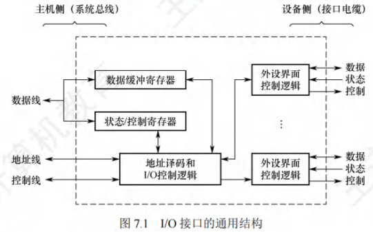

# I/O接口

[toc]

**I/O接口**（也称I/O控制器）是主机与外设之间的交接界面，通过接口可实现主机与外设之间的信息交换。由于外设种类繁多，在工作方式、数据格式和工作速度等方面存在显著差异，接口的作用正是解决这些差异带来的适配问题。

## I/O接口的功能

I/O接口的主要功能如下：
1. **地址译码与设备选择**：CPU发送外设选择地址码后，接口对地址进行译码并产生设备选择信号，确保主机能与指定外设进行信息交换。
2. **通信联络控制**：协调主机与外设的时序配合，解决不同工作速度的设备间的数据交换问题，保证计算机系统统一协调工作。
3. **数据缓冲**：因CPU与外设速度往往不匹配，接口需设置数据缓冲寄存器暂存数据，避免因速度差异导致数据丢失。
4. **信号格式转换**：处理主机与外设间可能存在的电平、数据格式差异，提供电平转换、并/串或串/并转换、模/数或数/模转换等功能。
5. **控制命令与状态信息传送**：
   - CPU通过接口中的命令寄存器向外设发送启动等控制命令
   - 外设准备就绪时，将"准备好"状态信息存入接口状态寄存器并反馈给CPU
   - 外设提出中断请求时，CPU通过接口向其反馈响应信号

## I/O接口的基本结构

图7.1展示了I/O接口的通用结构，接口在主机侧通过I/O总线与内存、CPU相连。其核心组成包括：
- **数据缓冲寄存器**：暂存与CPU或内存之间传送的数据信息
- **状态寄存器**：记录接口和设备的状态信息
- **控制寄存器**：保存CPU对外设的控制信息

（注：状态寄存器和控制寄存器因传送方向相反且访问时间错开，可合并设计）

### 接口中的信号线路功能

- **数据线**：传送读/写数据、状态信息、控制信息和中断类型号
- **地址线**：传送要访问的接口寄存器地址
- **控制线**：传送读/写控制信号（区分读写操作）、中断请求与响应信号、仲裁信号和握手信号

### I/O控制逻辑的主要作用

- 对控制寄存器中的命令字进行译码
- 将译码后的控制信号通过外设界面控制逻辑发送到外设
- 控制数据在数据缓冲寄存器与外设之间的双向传输
- 收集外设状态并更新到状态寄存器

对上述寄存器的访问需通过专门的**I/O指令**完成，这类指令属于特权指令，仅在操作系统内核的底层I/O软件中使用。

## I/O接口的类型

从不同角度可将I/O接口分为以下类型：
1. **按数据传送方式（外设与接口侧）**：
   - 并行接口：一字节或一个字的所有位同时传送
   - 串行接口：数据位一位一位有序传送（需完成数据格式转换）

2. **按主机访问控制方式**：
   - 程序查询接口
   - 中断接口
   - DMA接口等

3. **按功能灵活性**：
   - 可编程接口：通过编程可改变接口功能
   - 不可编程接口：功能固定，无法通过编程修改

## I/O端口及其编址

### 端口的基本概念
I/O端口是指I/O接口电路中可被CPU直接访问的寄存器，主要包括：
- **数据端口**：CPU可进行读/写操作
- **状态端口**：仅可读取外设状态信息
- **控制端口**：仅可写入控制命令

> 注意：端口与接口是不同概念，端口特指接口电路中可进行读/写操作的寄存器。

### 端口编址方式
I/O端口需通过编址实现CPU访问，每个端口对应唯一的端口地址，主要有两种编址方式：

#### 独立编址（I/O映射方式）

- 特点：对所有I/O端口单独编址，形成与主存地址空间独立的地址空间（地址可重叠）
- 访问方式：需使用专门的I/O指令，通过地址码指定I/O端口号
- 优点：
  - 端口地址位数少，译码简单，寻址速度快
  - 专用I/O指令使程序清晰，便于理解和检查
- 缺点：
  - I/O指令功能简单，程序设计灵活性较差
  - 需要存储器读写和I/O设备读写两组控制信号，增加控制复杂性

#### 统一编址（存储器映射方式）

- 特点：从主存地址空间中划分部分地址给I/O端口，端口与主存单元位于同一地址空间的不同分段
- 访问方式：无需专用I/O指令，通过统一的访存指令访问端口（根据地址范围区分访问对象）
- 优点：
  - 访问操作灵活方便，端口编址空间较大
  - 可利用虚拟存储管理系统实现I/O访问保护
- 缺点：
  - 端口地址占用主存空间，减少了主存可用容量
  - 需全部地址线参与译码，增加电路复杂性，降低译码速度

I/O接口(也称I/O控制器)是主机和外设之间的交接界面,通过接口可以实现主机和外设
之间的信息交换。外设种类繁多,且具有不同的工作特性,它们在工作方式、数据格式和工作速
度等方面有着很大的差异,接口正是为了解决这些差异而设置的的。
