# 数据链路层的功能

[toc]

## 数据链路层的功能

**数据链路层主要任务**是实现帧在一段链路或一个网络中传输。

**数据链路层协议**的三个共同基本问题：**封装成帧**、**透明传输**和**差错检测**。

**数据链路层使用的信道**主要有以下两种：

1. **点对点信道**：采用一对一通信方式。**PPP协议**是目前使用最广泛的点对点协议。
2. **广播信道**：此信道连接主机众多，采用一对多广播通信方式。采用共享广播信道的有线局域网普遍使用**CSMA/CD协议**，无线局域网则使用**CSMA/CA协议**。

以下是相关概念：
1. **链路**：**从一个结点到相邻结点的一段物理线路。**数据通信时，两台计算机间通信路径常需经过多段这样的链路，链路是路径的组成部分。
2. **数据链路**：在链路上传输数据，**除链路本身，还需通信协议控制数据传输，将实现这些协议的硬件和软件加到链路上，就构成数据链路。**链路常被称作物理链路，数据链路则被称作逻辑链路。
3. **帧**：数据链路层对等实体之间进行逻辑通信的**协议数据单元(PDU)**。数据链路层将网络层下交的数据构成帧发送到链路上，并把接收到的帧中的数据取出上交给网络层。 

### 链路管理

- **定义**：数据链路层连接的建立、维持和释放过程。主要用于面向连接的服务。
- **流程**：
    - **建立连接**：链路两端结点通信前，需先确认对方已就绪，并交换必要信息（如对帧序号初始化），之后才能建立连接。
    - **维持连接**：在数据传输过程中，要维持该连接。
    - **释放连接**：传输完毕后，需释放连接。 

### 封装成帧

- **概念**：在一段数据的前后分别添加首部和尾部，构成帧，**帧是数据链路层的数据传送单元**。$帧长 = 数据部分长度 + 首部长度 + 尾部长度 $。
- **首部和尾部作用**：含有众多控制信息，重要作用之一是**帧定界**，即确定帧的界限，以便接收方从接收到的二进制比特流中区分出帧的起始与终止，实现**帧同步**。例如在HDLC协议中，用标识位 $F(01111110)$ 来标识帧的开始和结束，接收方检测到 $F$ 标识位，就认为是帧的开始，再次检测到 $F$ 标识位，则表示帧结束。（HDLC标准帧格式见[图3.4]）
- **帧长考量**：为提高帧传输效率，应使帧的数据部分长度尽可能大于首部和尾部长度。但帧长增加，传输差错概率提高，重传代价增大。所以每种链路层协议都规定了帧的数据部分长度上限，即**最大传送单元MTU**。

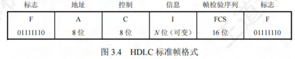

### 透明传输

- **问题**：若数据中出现与帧定界符相同的比特组合，会被误认为“传输结束”，导致后面的数据被丢弃。
- **概念**：透明传输指不论所传数据是什么样的比特组合，都能按原样无差错地在数据链路上传输。 

### 流量控制

- **产生原因**：链路两端结点工作速率与缓存空间存在差异，发送方发送能力可能大于接收方接收能力。若不限制发送方速率，接收不及的帧会被后续帧“淹没”，导致帧丢失出错。
- **定义**：流量控制本质是**限制发送方发送速率，使其不超过接收方接收能力**。
- **实现方式**：借助反馈机制，让发送方知晓何时可发送下一帧，何时需暂停发送，等待反馈信息后再继续发送。

- **不同体系结构对比**：
    - **OSI体系结构**：数据链路层具备流量控制功能，控制相邻结点间数据链路上的流量。
    - **TCP/IP体系结构**：流量控制功能移至传输层，控制的是从源端到目的端之间的流量。 

### 差错检测

由于信道噪声等因素，帧在传输过程中可能出现错误，主要分为**位错**和**帧错**：
1. **位错**：指帧中某些位出现差错，常采用**循环冗余检验（CRC）**来发现。
2. **帧错**：包括帧丢失、帧重复或帧失序等错误，均属于传输差错。**超时重传**。

关于数据链路层处理差错的方式，存在不同情况：
 - **过去OSI观点**：数据链路层需向上提供可靠传输。在CRC检错基础上，增加帧编号、确认和重传机制。接收方收到正确帧要向发送方发送确认，发送方若在一定期限内未收到确认，就认为出现差错并进行重传，直至收到确认为止。在通信质量较差的无线传输中，数据链路层依旧采用此方式，向上提供可靠传输服务。
 - **如今有线链路情况**：对于通信质量良好的有线链路，数据链路层不再使用确认和重传机制，即不要求向上提供可靠传输服务，仅进行CRC检错。目的是丢弃有差错的帧，保证上交的帧正确，而将出错帧的重传任务交由高层协议（如传输层TCP协议）完成。 

## 封装成帧(组帧)

发送方按照特定规则，将网络层递交的分组封装成帧（组帧）。数据链路层以帧为单位传输比特组合，这样在出错时只需重发出错帧，无需重发全部数据，可提高传输效率。

组帧主要解决**帧定界**、**帧同步**和**透明传输**等问题。实现组帧的方法有4种：字符计数法，字节填充法、零比特填充法、违规编码法。

### 加首部和尾部的原因

- 在网络中，信息以帧为最小传输单位。
- 接收方要准确接收帧，就必须明确该帧在比特流中的起止位置（因为接收方接收到的是连续比特流，若无首部和尾部，无法正确区分帧）。所以组帧时既要加首部，又要加尾部。 
- 而分组（即IP数据报）只是帧中包含的数据部分，因此无需加尾部来定界。

### 字符计数法

**记录该帧包含的字节数**

- **原理**：在帧首部设置一个计数字段，用于记录该帧包含的字节数（计数字段自身占用的1个字节也包含在内） ，如[图3.5]所示。接收方通过读取帧首部的字节计数值，知晓后续跟随的字节数，以此确定帧的结束位置。由于帧是连续传输的，进而也能确定下一帧的开始位置。
- **缺点**：该方法的最大问题在于，若计数字段出现错误，就会丧失帧边界划分的依据。如此一来，接收方无法判断所传输帧的结束位以及下一帧的开始位，导致收发双方失去同步，产生灾难性后果。 

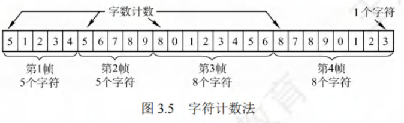

### 字节填充法

**类比转义字符**

- **帧定界方式**：采用特定字节来界定一帧的起始与结束。例如在[图3.6]的示例中，将控制字符**SOH**置于帧的开头，表示帧的起始；控制字符**EOT**表示帧的结束。
- **透明传输实现**：为防止信息位中的特殊字符被误判为帧的首尾定界符，在特殊字符前填充一个**转义字符ESC**加以区分（注意，转义字符是ASCII码中的一个控制字符，并非“ESC”三个字符的组合），以此达成数据的透明传输。接收方收到转义字符后，便知其后紧跟的是数据信息，而非控制信息。

 - 在图3.6(a)的字符帧里，若帧的数据段中出现**EOT**或**SOH**字符，发送方会在每个**EOT**或**SOH**字符前插入一个**ESC**字符[见图3.6(b)]。
 - 接收方收到数据后，自行删除插入的**ESC**字符，最终得到原始数据[见图3.6(c)]，这就是“字节填充法”名称的由来。
 - 若转义字符**ESC**也出现在数据中，解决办法同样是在该转义字符前再插入一个转义字符。 

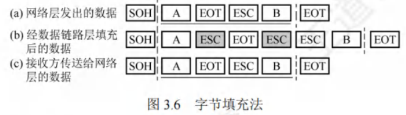

### 零比特填充法

**每遇到5个连续的“1” ，便自动在其后插入一个“0”**

- **帧定界标志**：零比特填充法允许数据帧包含任意数量的比特，采用特定比特串**01111110**来标识一帧的起始与结束，如[图3.7]所示。
- **避免误判机制**：为防止数据字段中出现的比特流**01111110**被误判为帧的首尾标志，发送方会对整个数据字段进行扫描。每遇到5个连续的“1” ，便自动在其后插入一个“0”。经过这样的比特填充，可确保数据字段中不会出现6个连续的“1”。
- **接收方处理**：接收方进行与发送方相反的操作，每收到5个连续的“1”，就自动删除紧跟其后的“0”，从而恢复原始数据。在数据链路层早期使用的HDLC协议，就是运用这种比特填充的首尾标志法来实现透明传输。 

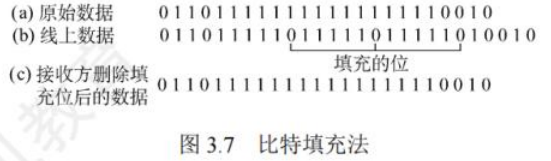

零比特填充法很容易由硬件来实现，性能优于字节填充法。

### 违规编码法

- **原理**：在物理层比特编码时运用。以曼彻斯特编码为例，它把数据比特“1”编码为“高-低”电平对，“0”编码为“低-高”电平对，而“高-高”和“低-低”电平对在数据比特编码中是违规的（未使用）。于是，可利用这些违规编码序列来界定帧的起始与终止。像局域网IEEE802标准就采用了此方法。
- **特点**：该方法无需任何填充技术就能达成数据的透明传输。然而，它仅适用于采用冗余编码的特殊编码环境。

由于字符计数法中计数字段的脆弱性，以及字节填充法在实现上存在复杂性与不兼容性，当前较常用的组帧方法为零比特填充法和违规编码法。 

## 差错控制

实际通信链路并非理想，比特传输易产生差错（1 变 0 或 0 变 1 ，即比特差错 ），常利用编码技术进行差错控制，主要分自动重传请求（ARQ）和前向纠错（FEC）：

- **ARQ（检错重发）**：接收方检测到差错，通知发送方重发，直至收到正确数据。
- **FEC（纠错）**：接收方不仅能发现差错，还可确定错误位置并纠正。

### 检错编码

检错编码采用冗余编码技术，核心逻辑为：在有效数据（信息位）发送前，按特定关系附加冗余位，组成符合规则的码字发送。数据变化时，冗余位相应改变以维持规则。接收方依据码字是否符合原规则判断差错。

#### 奇偶检验码

奇偶检验码是奇检验码与偶检验码的统称，属于最基础的检错码。它由$n-1$位数据和1位检验位构成，通过设定检验位的取值（0或1），让整个检验码中“1”的个数呈现奇数或偶数。
1. **奇检验码**：添加一个检验位后，码长为$n$的码字里“1”的个数为奇数。
2. **偶检验码**：添加一个检验位后，码长为$n$的码字里“1”的个数为偶数。

奇检验码只能检测奇数位的出错情况，但不知道哪些位错了，也不能发现偶数位的出错情况。

#### 循环冗余码

数据链路层广泛采用循环冗余码（Cyclic Redundancy Code，CRC）作为检错技术。

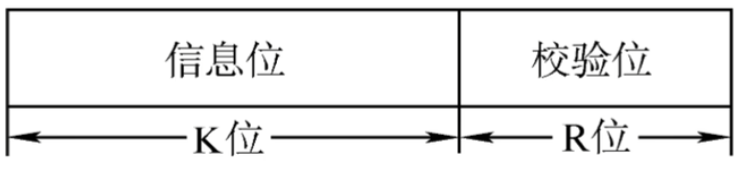

- **基本思想**：
    - **约定生成多项式**：收发双方事先约定一个生成多项式$G(x)$（其最高位和最低位必须为$1$）。$k$位的位串可看作是阶数为$k-1$的多项式的系数序列。例如，位串$1101$可用多项式$x^3 + x^2 + 1$表示。

    - **发送方计算冗余码**：发送方依据待发送的数据和$G(x)$计算出冗余码，然后将冗余码附加在数据之后一同发送。
    - **接收方差错检测**：接收方收到数据与冗余码后，借助$G(x)$来判断收到的数据和冗余码是否出现差错。

假设要传送$k$位的数据，CRC运算会产生一个$r$位的冗余码，即帧检验序列（Frame Check Sequence，FCS）。如此形成的帧由$k + r$位构成。在待发送数据后增加$r$位冗余码，虽增加了传输开销，但能够实现差错检测，这种付出通常是值得的。带有检验码的帧恰好能被预先确定的多项式$G(x)$整除。接收方用相同的多项式去除收到的帧，若余数为$0$，则认为无差错。

- **计算冗余码步骤**：
    - **加$0$**：假设$G(x)$的阶为$r$，在数据后面添加$r$个$0$，这相当于将原数据乘以$2^r$。
    - **模$2$除**：利用模$2$除法，用$G(x)$对应的二进制串去除上述添加$0$后的数据串，所得的余数就是冗余码（共$r$位，前面的$0$不可省略）。模$2$运算规则为：加法不进位，减法不借位，相当于对应位进行逻辑**异或运算**。

**冗余码计算举例**：假设数据$M = 101001$（即$k = 6$），除数$G(x)=1101$（即$r = 3$），经模$2$除法运算后，商$Q = 110101$，余数$R = 001$。所以，发送出去的数据为$101001 001$（即$2^rM + FCS$），共$k + r$位，运算过程如[图3.8]所示。

发送方生成FCS和接收方进行CRC检验都由硬件实现，处理速度极快，不会对数据传输造成影响。若传输过程无差错，经过CRC检验得出的余数$R$必定为$0$。而一旦出现误码，余数$R$仍为$0$的概率极低。所以，借助CRC检错技术，可近似认为“凡是接收方数据链路层接受的帧均无差错”。即对于接收方数据链路层接受的帧，我们能以极高概率认定这些帧在传输过程中未出差错；而接收方丢弃的帧，虽曾收到，但因存在差错最终被舍弃，即未被接受。

实际上，循环冗余码（CRC）具备纠错功能，生成多项式选择得当，且$2^r \geq k+r+1$，则CRC码可纠正1位错。

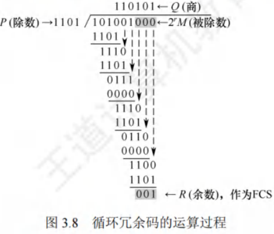

### 纠错编码

最常见的纠错编码是**海明码**，其原理是在有效信息位中加入若干检验位构成海明码，把海明码的每一位分配到多个奇偶检验组。某一位出错会改变相关检验位的值，不仅能发现错误，还能指出错误位置，为自动纠错提供依据。

以数据码1010为例，讲述海明码的编码原理与过程：
1. **确定海明码的位数**

  - 设$n$为有效信息位数，$k$为检验位位数，信息位$n$和检验位$k$需满足$2^k \geq n + k + 1$。
  - 对于$n = 4$（信息位$D_4D_3D_2D_1 = 1010$），$k = 3$（检验位$P_3P_2P_1$），此时$2^3 \geq n + k + 1= 8$成立，$n$、$k$有效。对应的海明码为$H_7H_6H_5H_4H_3H_2H_1$。
2. **确定检验位的分布**
   规定检验位$P_i$在海明位号为$2^{i-1}$的位置上，其余为信息位。所以：

   - $P_1$的海明码位号为$2^{1-1} = 2^0 = 1$，即$H_1$为$P_1$。
   - $P_2$的海明码位号为$2^{2-1} = 2^1 = 2$，即$H_2$为$P_2$。
   - $P_3$的海明码位号为$2^{3-1} = 2^2 = 4$，即$H_4$为$P_3$。
   - 将信息位按原顺序插入，海明码各位分布为：$H_7H_6H_5H_4H_3H_2H_1$对应$D_4D_3D_2P_3D_1P_2P_1$。

3. **分组以形成检验关系**

     每个数据位由多个检验位检验，需满足：被检验数据位的海明位号等于检验该数据位的各检验位海明位号之和。检验位无需再次被检验。分组形成的检验关系如下。

4. **检验位取值**

  检验位$P_i$的值为第$i$组（由该检验位检验的数据位）所有位求异或。根据上述分组有：

   1. $P_1 = D_1 \oplus D_3 \oplus D_4 = 0 \oplus 1 \oplus 1 = 0$
   2. $P_2 = D_1 \oplus D_2 \oplus D_4 = 0 \oplus 0 \oplus 1 = 1$
   3. $P_3 = D_2 \oplus D_3 \oplus D_4 = 0 \oplus 1 \oplus 1 = 0$
   4. 所以，1010对应的海明码为101**0**0**10**。
5. **海明码的检验原理**

  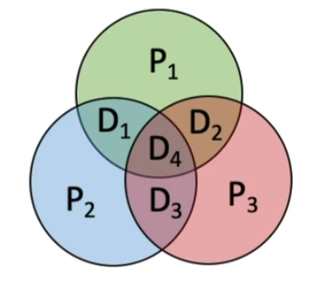

  每个检验组分别利用检验位和参与形成该检验位的信息位进行奇偶检验检查，构成$k$个检验方程：

   1. $S_1 = P_1 \oplus D_1 \oplus D_2 \oplus D_4$
   2. $S_2 = P_2 \oplus D_1 \oplus D_3 \oplus D_4$
   3. $S_3 = P_3 \oplus D_2 \oplus D_3 \oplus D_4$
   4. 若$S_3S_2S_1$的值为“000”，则说明无错；否则说明出错，且这个数就是错误位的位号。例如$S_3S_2S_1 = 001$，说明第1位出错，即$H_1$出错，直接将该位取反就可实现纠错。 

## 流量控制

流量控制指接收方对发送方发送速率进行控制，确保自身有足够缓冲空间接收每一帧。常见流量控制方法有**停止-等待协议**和**滑动窗口协议**。数据链路层与传输层都具备流量控制功能，且都运用滑动窗口协议，但二者存在区别，主要体现在：
1. **控制范围**：
    - 数据链路层控制的是**相邻结点之间**的流量。
    - 传输层控制的是**端到端**的流量。
2. **控制手段**：
    - 数据链路层：接收方若接收能力不足，就不返回确认信息。
    - 传输层：接收方通过确认报文段中的**窗口值**来调节发送方的发送窗口。 

### 滑动窗口机制

#### 停止-等待流量控制基本原理

停止-等待流量控制是最为简单的流量控制方式。其运作原理如下：
 - **发送规则**：发送方每次仅能发送一个帧。
 - **接收反馈**：接收方每接收一个帧，都需向发送方反馈一个应答信号，以此表明自身具备接收下一帧的能力。
 - **发送条件**：发送方只有在收到接收方反馈的应答信号后，才可以发送下一帧。若未收到应答信号，发送方就必须持续等待。

由于发送方每发送完一个帧，便进入等待接收方确认信息的阶段，这种方式使得传输效率较为低下。 

#### 滑动窗口流量控制基本原理

滑动窗口流量控制是一种更为高效的流量控制方式。在任何时刻：
 - **发送窗口**：发送方维护一组连续的允许发送帧的序号，此即发送窗口。它表明在尚未收到对方确认信息时，发送方最多还能发送多少个帧以及具体是哪些帧。
 - **接收窗口**：接收方同样维持一组连续的允许接收帧的序号，称作接收窗口。用于控制可接收和不可接收的帧。

[图3.9]展示了发送窗口的工作原理，[图3.10]呈现了接收窗口（$W_R = 1$）的工作原理。

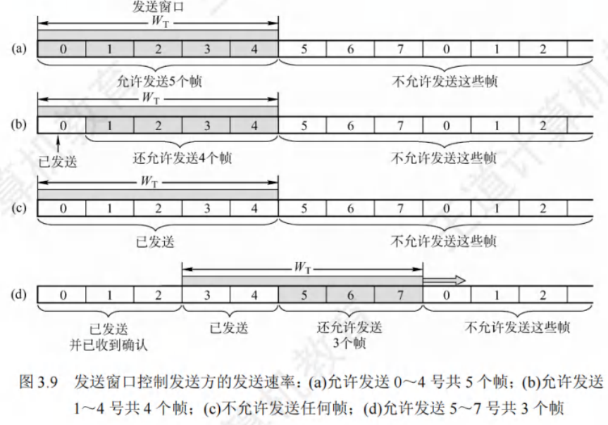

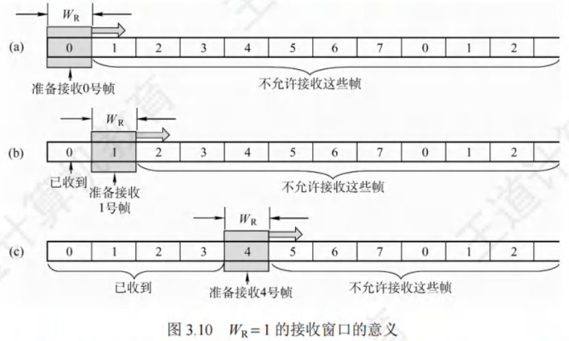

 - **发送方操作**：发送方每收到一个按序确认的确认帧，就将发送窗口向前滑动一个位置。如此一来，便有一个新的序号落入发送窗口，序号在发送窗口内的数据帧可继续发送。当窗口内不存在可发送的帧（即窗口内的帧均为已发送但未收到确认的帧）时，发送方停止发送。
 - **接收方操作**：接收方每收到一个序号落入接收窗口的数据帧，便收下该帧，然后将接收窗口向前滑动一个位置，并发送确认。这样，会有一个新的序号落入接收窗口，序号在接收窗口内的数据帧就是准备接收的帧。若收到的帧落在接收窗口之外，则直接丢弃。

滑动窗口具有以下关键特性：
1. **窗口滑动关系**：只有接收窗口向前滑动（同时接收方发送了确认）时，发送窗口才有可能向前滑动（只有发送方收到确认后才一定会滑动）。
2. **协议窗口差异**：从滑动窗口概念来看，停止-等待协议、后退N帧协议和选择重传协议的区别仅在于发送窗口大小与接收窗口大小：
    - **停止-等待协议**：发送窗口$W_T = 1$，接收窗口$W_R = 1$。
    - **后退N帧协议**：发送窗口$W_T > 1$，接收窗口$W_R = 1$。
    - **选择重传协议**：发送窗口$W_T > 1$，接收窗口$W_R > 1$。
    - 若采用$n$比特对帧编号，则后两种滑动窗口协议还需满足$W_T + W_R \leq 2^n$。
3. **有序接收保证**：当接收窗口大小为1时，能够确保帧的有序接收。
4. **窗口大小特性**：在数据链路层的滑动窗口协议中，窗口大小在传输过程中固定不变（这与传输层不同）。 

## 可靠传输机制
可靠传输旨在确保发送方发送的数据能被接收方准确无误地接收，通常借助**确认**和**超时重传**两种机制达成。
 - **确认机制**：接收方每接收到发送方发来的数据帧，都需向发送方回发一个确认帧，以此表明已正确接收该数据帧。
 - **超时重传机制**：发送方发送数据帧后启动一个计时器，若在规定时间内未收到对应数据帧的确认帧，便重发该数据帧，直至发送成功。

运用这两种机制的可靠传输协议被称为**自动重传请求（ARQ）**，即重传过程自动进行，接收方无需向发送方发出重传请求。在ARQ协议里，数据帧和确认帧都必须编号，以便区分确认帧对应的是哪个数据帧，以及哪些数据帧尚未得到确认。ARQ协议主要有以下三种：
 - **停止-等待（Stop-and-Wait）协议**
 - **后退N帧（Go-Back-N）协议**
 - **选择重传（Selective Repeat）协议**

需注意，这三种可靠传输协议的基本原理并非局限于数据链路层，也可应用于其上层各层。

在网络传输中，不同链路情况对可靠传输要求不同：
 - **有线网络**：链路误码率较低，为降低开销，不要求数据链路层向上层提供可靠传输服务，若出现误码，可靠传输问题由上层处理。
 - **无线网络**：链路易受干扰，误码率较高，因此要求数据链路层必须向上层提供可靠传输服务。 

### 单帧滑动窗口与停止-等待协议(S-W)
停止-等待协议中，发送方一次仅能发送一个帧，只有在收到接收方的确认帧后，才可以发送下一个帧。从滑动窗口视角来看，此协议的发送窗口和接收窗口大小均为1。

停止-等待协议的**信道利用率较低**。为提升传输效率，衍生出连续ARQ协议，包括后退N帧协议和选择重传协议，其核心是允许发送方连续发送多个帧，无需每发一帧就等待确认。

1. **帧编号规则**：因每发送一帧即停止等待，仅需1比特编号，数据帧交替用0和1标识，确认帧对应为ACK0和ACK1。
2. **差错与重传处理**：收到错误确认帧时，重传已发送数据帧。连续出现相同序号的数据帧，说明发送方超时重传；连续出现相同序号的确认帧，表明接收方收到重复帧。
3. **帧缓冲区设置**：发送方和接收方均需设置帧缓冲区。发送方发送数据帧后，需在发送缓存中保留副本，直至收到对应ACK确认帧方可清除，以满足超时重传和重复帧判定需求。

该协议除了可能出现数据帧丢失的情况，还存在以下两种差错情形：
1. **数据帧受损**：到达接收方的数据帧可能已遭破坏，接收方利用先前介绍的差错检测技术检出后，会直接丢弃该帧。为应对这种情况，发送方配备了计时器。在发送一帧后，发送方等待确认，若计时器超时仍未收到确认，则重发该数据帧，如此反复，直至该数据帧正确到达。
2. **确认帧受损**：数据帧正确，但确认帧被破坏。此时接收方已收到正确数据帧，然而发送方收不到确认帧，所以会重传已被接收的数据帧。接收方再次收到相同数据帧时，会丢弃该帧，并重新发送一个该帧对应的确认帧。

### 多帧滑动窗口与后退N帧协议(GBN)

1. **发送机制**：在后退N帧协议里，发送方在未收到确认帧的情况下，能够把序号处于发送窗口内的多个数据帧一次性全部发送出去。“后退N帧”指的是，发送方发送N个数据帧后，要是发现这N个帧中的前一个数据帧在计时器超时的时候，依然没有收到其确认信息，那么该帧就会被判定为出错或丢失，此时发送方必须重传这个出错帧以及随后的N个帧。这表明接收方仅允许按顺序接收帧。
    - 例如在[图3.11]中，发送方向接收方发送数据帧。发送方发完0号帧后，可接着发送后续的1号帧、2号帧等。并且发送方每发送完一个数据帧，都要为该帧设置超时计时器。
2. **确认机制**：由于连续发送了许多帧，确认帧必须明确是对哪个帧的确认。**GBN协议允许接收方进行累积确认**。即接收方无需每收到一个正确的数据帧就马上发回一个确认帧，而是可以在连续收到多个正确的数据帧后，**针对最后一个数据帧发回确认信息**。也就是说，对某个数据帧的确认，就代表该数据帧以及它之前的所有帧都已被正确无误地接收。其中，ACK n表示对n号帧的确认，意味着接收方已正确收到n号帧及之前的所有帧，下次期望收到n + 1号帧（也可能是0号帧）。
3. **接收机制**：**接收方只按序接收数据帧**。在图中，即便在有差错的2号帧之后紧接着收到了正确的6个数据帧，接收方也必须将这些帧丢弃。不过，接收方虽丢弃了这些未按序出现的无差错帧，但应重发已发送的最后一个确认帧ACK1（此举是为了防止已发送的确认帧ACK1丢失）。
4. **窗口大小限制**：若采用n比特对帧编号，其发送窗口$W_T$需满足$1 < W_T \leq 2^n-1$ 。要是$W_T$大于$2^n-1$，就会致使接收方无法区分新数据帧和旧数据帧（参考本章末的疑难点(1)）。同时，后退N帧协议的接收窗口$W_R = 1$，这样能够保证按序接收数据帧。
5. **协议特点**：后退N帧协议一方面凭借连续发送数据帧提高了信道利用率；另一方面，在重传时，即便有些帧原本已正确到达，仅因为其前面有一帧出错，就必须重传这些帧，所以这种方式会降低传送效率。当信道误码率较高时，后退N帧协议未必比停止-等待协议更具优势。 

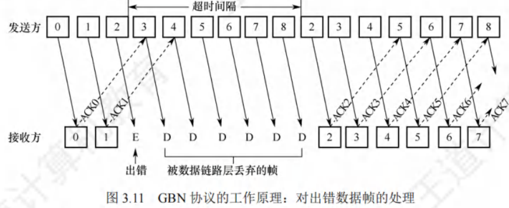

### 多帧滑动窗口与选择重传协议(SR)

1. **协议核心思想**：为进一步提升信道利用率，选择重传协议致力于仅重传出现差错和计时器超时的数据帧。为此，必须增大接收窗口，以便先接收那些虽顺序错乱但正确到达且序号仍处于接收窗口内的数据帧，待缺失序号的数据帧收齐后，再统一提交给上层。
2. **确认机制**：与后退N帧协议不同，为使发送方仅重传出错的帧，接收方不再采用累积确认，而是**对每个正确接收的数据帧逐个进行确认**。这种方式使得选择重传协议比后退N帧协议更为复杂。
3. **接收方处理**：接收方需要设置足够数量的帧缓冲区（**帧缓冲区的数量等于接收窗口的大小**），用于临时存储那些失序但正确到达且序号落在接收窗口内的数据帧。
4. **计时器与重传**：每个发送缓冲区对应一个计时器，当计时器超时，缓冲区中的帧就会被重传。此外，选择重传协议采用了更为有效的差错处理策略。一旦接收方检测到某个数据帧出错，就会向发送方发送一个否定帧NAK，要求发送方立即重传NAK指定的数据帧。
5. **窗口大小限制**：
    - 选择重传协议的接收窗口$W_R$和发送窗口$W_T$都大于1，一次能够发送或接收多个帧。若采用$n$比特对帧编号，需满足两个条件：
        - **条件1**：$W_R + W_T \leq 2^n$。否则，在接收方的接收窗口向前移动后，如果有一个或多个确认帧丢失，发送方就会超时重传之前的旧数据帧，接收窗口内的新序号与之前的旧序号出现重叠，接收方将无法分辨是新数据帧还是重传的旧数据帧。
        - **条件2**：$W_R \leq W_T$。否则，若接收窗口大于发送窗口，接收窗口永远不可能填满，接收窗口多出的空间就毫无意义。
    - 由这两个条件不难得出$W_R \leq 2^{n-1}$。一般情况下，$W_R$和$W_T$的大小是相同的。 

### 信道利用率的分析

**信道利用率**：信道的效率。从时间维度来看，它是针对发送方而言的，指的是发送方在一个发送周期（从开始发送分组(帧)到收到第一个确认分组所需的时间）内，有效发送数据的时间与整个发送周期的比值。

#### 停止-等待协议的信道利用率

- **优缺点**：停止-等待协议的优点在于简单，然而其缺点是信道利用率过低。

- **分析示例**：借助[图3.13]来分析此问题。假设在发送方和接收方之间存在一条直通信道用于传送分组。

- **发送时延**：发送方发送分组的发送时延为$T_D$，其计算方式为分组长度除以数据传输速率。

- **假设条件**：假设分组能正确到达接收方，且接收方处理分组的时间可忽略不计，同时会立即发回确认。接收方发送确认分组的发送时延为$T_A$（通常可忽略不计）。另外，发送方处理确认分组的时间同样可忽略不计。在这种情况下，发送方经过$T_D + RTT + T_A$的时间后，就能够再次发送下一个分组，其中$RTT$表示往返时延。

- **利用率计算**：由于只有在$T_D$时间内是用于发送数据分组的，所以停止-等待协议的信道利用率$U$的计算公式为：

$$
U = \frac{T_D}{T_D + RTT + T_A}
$$

- **具体数值示例**：

  - 假设某信道的$RTT = 20ms$，分组长度为$1200$比特，数据传输速率为$1Mb/s$。
  
  - 若忽略处理时间和$T_A$，首先计算$T_D$，$T_D = \frac{1200bit}{1\times10^6bit/s} = 1.2ms$。则信道利用率$U = \frac{1.2}{1.2 + 20} \approx 5.66\%$。
  - 若将数据传输速率提高到$10Mb/s$，此时$T_D = \frac{1200bit}{10\times10^6bit/s} = 0.12ms$，则$U = \frac{0.12}{0.12 + 20} \approx 0.596\%$。
  - 由此可见，当往返时延$RTT$大于分组发送时延$T_D$时，信道利用率会非常低。 

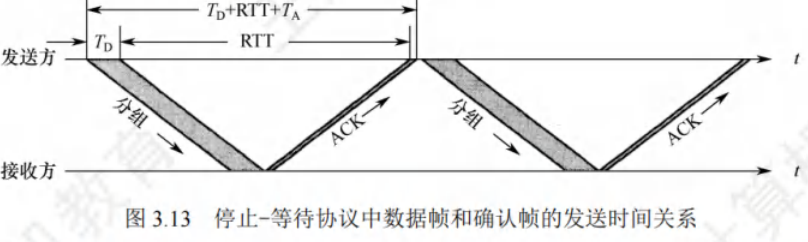

#### 连续ARQ协议的信道利用率
连续ARQ协议运用流水线传输方式（见[图3.14]），这使得发送方能够连续发送多个分组。如此一来，只要发送窗口足够大，就能保证信道上始终有数据在传输，进而显著提高信道利用率。

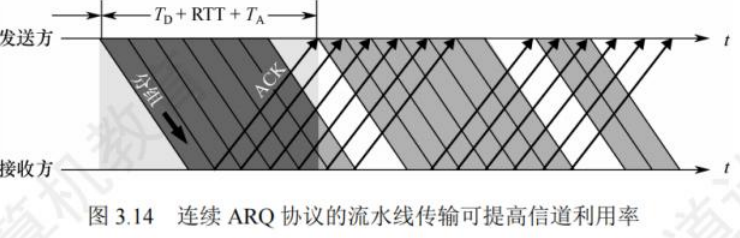

假设连续ARQ协议的发送窗口大小为$n$，意味着发送方能够连续发送$n$个分组，具体存在以下两种情况：
1. **情况一：$nT_D < T_D + RTT + T_A$**
即在一个发送周期内可以发送完$n$个分组。此时，信道利用率的计算方式为：
$$
\frac{nT_D}{T_D + RTT + T_A}
$$
​	这里的分子$nT_D$表示在一个发送周期内实际用于发送数据分组的总时间，分母$T_D + RTT + T_A$代表整个发送周期的时长。
2. **情况二：$nT_D \geq T_D + RTT + T_A$**
即在一个发送周期内发不完（或刚好发完）$n$个分组。在这种情况下，只要不出现差错，发送方就能够不间断地发送分组，此时信道利用率为$1$，也就是$100\%$。这是因为在该条件下，发送方始终处于忙碌状态，信道被充分利用。

- 此外，还存在两个重要的公式用于计算信道相关参数：

   - $信道平均（实际）数据传输速率 = 信道利用率×信道带宽（最大数据传输速率）$。这个公式表明，实际的数据传输速率与信道利用率以及信道本身的最大传输能力相关。信道利用率越高，在给定带宽下实际能够传输的数据速率就越高。

   - $信道平均（实际）数据传输速率 = 发送周期内发送的数据量 / 发送周期$。此公式从另一个角度，通过发送的数据量和发送周期来计算平均数据传输速率，与前一个公式本质上是一致的，只是计算的出发点不同。它更直观地反映了在一个完整的发送周期内，平均每秒能够传输的数据量。 