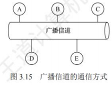
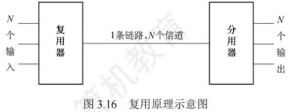
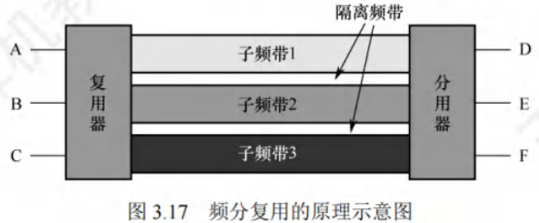
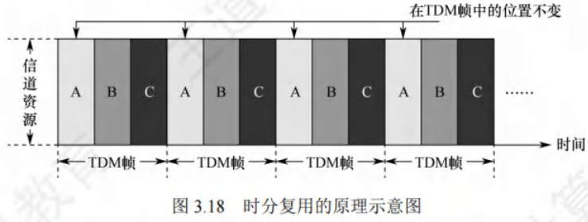
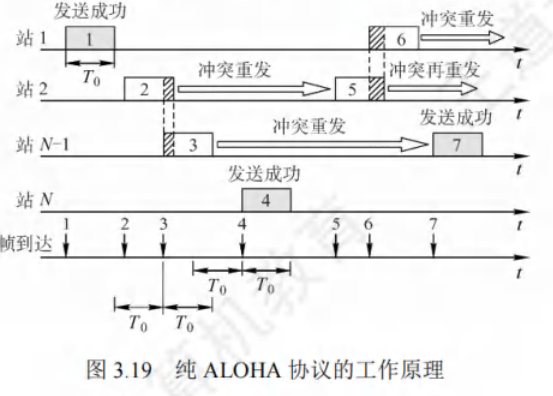
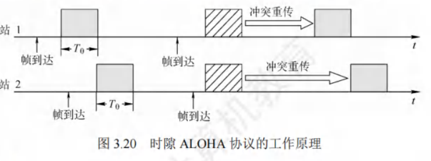
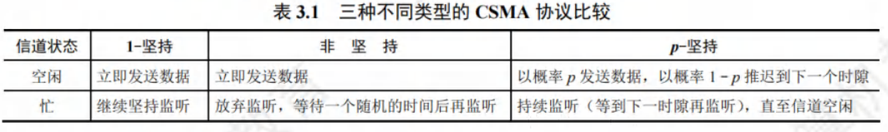
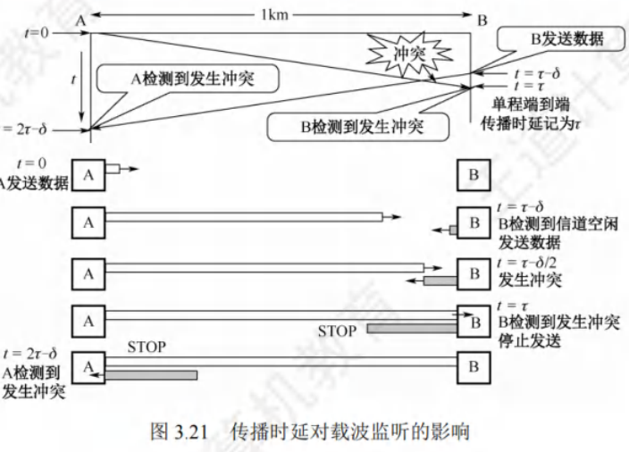
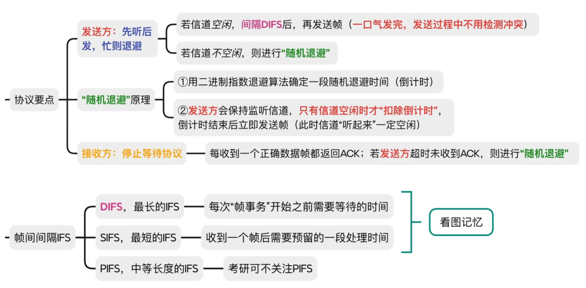
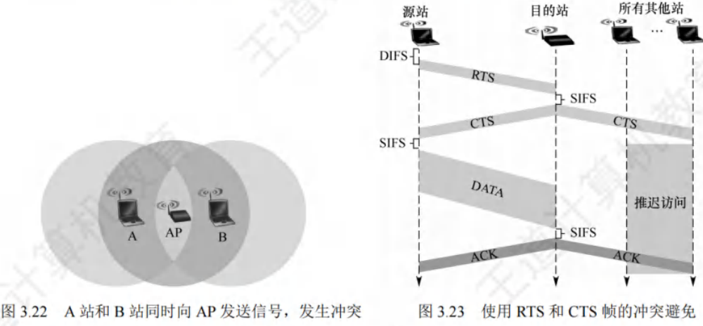

# 介质访问控制

[toc]

**介质访问控制的核心任务**：让使用介质的每个结点能够隔离同一信道上其他结点传送的信号，从而协调各活动结点的传输。

如[图3.15]展示的广播信道通信方式，结点A、B、C、D、E共同使用该广播信道。假设A要与C通信，B要与D通信，由于信道共享，如果缺乏控制，这两对结点间的通信可能因相互干扰而无法成功。

决定广播信道中信道分配的协议，属于数据链路层的一个子层，即介质访问控制（Medium Access Control，MAC）子层。

常见的介质访问控制方法主要分为以下几类：
 - **信道划分介质访问控制**：这是一种静态划分信道的方法，预先将信道划分给不同的结点或用户，各结点在自己被分配的信道上进行通信，彼此之间不会产生干扰。
 - **随机访问介质访问控制**：该方法属于动态分配信道方式，各结点随机地尝试访问信道，可能会出现冲突，但通过特定的机制来解决冲突，使各结点最终能成功传输数据。
 - **轮询访问介质访问控制**：同样是动态分配信道的方法，通过轮询的方式，依次询问各个结点是否有数据要发送，从而决定信道的分配。 

## 信道划分介质访问控制

**信道划分介质访问控制的核心目标**：将使用同一传输介质的多个设备的通信隔离开，通过合理分配时域和频域资源，实现各设备间互不干扰的通信。

其实现依赖于**复用技术**——在发送端将多个发送方的信号整合到一条物理信道上传输，在接收端再将复用信号分离并传送给对应接收方（如[图3.16]所示）。 

当传输介质的带宽超过单个信号的传输需求时，通过在一条介质上传输多个信号，可显著提升传输系统的利用率。 

### 信道划分的本质
本质是运用**分时、分频、分码**等手段，将原本的一个广播信道从逻辑上划分为多个子信道。每个子信道用于两个结点间的专属通信且互不干扰，即实现了“广播信道向若干个点对点信道的转变”。 

### 信道划分介质访问控制的主要类型
信道划分介质访问控制主要分为以下4种类型：  
1. 频分复用（Frequency Division Multiplexing, FDM）  
2. 时分复用（Time Division Multiplexing, TDM）  
3. 波分复用（Wavelength Division Multiplexing, WDM）  
4. 码分复用（Code Division Multiplexing, CDM）  

### 频分复用(FDM)

频分复用的核心原理是将信道的总频带划分成多个独立的子频带，每个子频带作为一个专属子信道，每对用户通过特定子信道进行通信。在这种复用方式下，**所有用户在同一时间占用不同的频带资源**。  

每个子信道分配的频带大小可不同，但所有子信道的频带总和不得超过信道的总频带。

#### 频分复用的关键技术细节
为避免子信道之间因信号叠加产生干扰，在相邻子信道的频带之间需设置**“隔离频带”**（又称保护频带），以此保证各子信道信号的独立性。

#### 频分复用的优势
- **高效利用带宽**：能够充分挖掘传输介质的带宽潜力，显著提升系统的传输效率。  
- **技术实现简单**：从工程实现角度来看，相对容易达成，成本较低。  

#### 频分复用的典型应用
频分复用在通信领域应用广泛，例如：  
- **早期电话通信系统**：通过频分复用技术，将不同电话线路的语音信号调制到不同子频带，实现多路通话在同一传输介质（如电缆）上同时传输，极大节省了线路资源。  
- 此外，在广播电视信号传输、无线电通信等场景中，频分复用也被用于同时传输多套节目或多路信号。  

通过划分独立子频带，频分复用实现了多用户在同一时间的并行通信，是传统通信系统中提升资源利用率的重要技术。

### 时分复用(TDM)

时分复用是将信道的传输时间划分为等长的时间片，这些时间片组成的整体称为**TDM帧**。每个用户在每个TDM帧中占据固定序号的时隙，且该时隙会周期性出现（周期即TDM帧的长度）。所有用户在不同时间共享相同的信道资源。  

*注：TDM帧本质是一段固定时长的时间，与数据链路层的“帧”（数据单元）概念不同。*

#### 时分复用的特点
- **时间分割**：从特定时刻看，信道上仅传输某一对用户的信号；从较长时间看，传输的是按时间分割的复用信号。  
- **固定时隙分配**：时隙按固定顺序分配给用户，若某用户无数据传输，其时隙无法被其他用户利用，导致**信道利用率较低**。  

#### 统计时分复用（Statistic TDM, STDM）
统计时分复用（又称异步时分复用）是对TDM的改进，核心是**动态分配时隙**而非固定分配：  
- 仅当用户有数据传输时，才在STDM帧中为其分配时隙，大幅提高线路利用率。  

#### 示例对比
假设线路传输速率为6000b/s，3个用户的平均速率均为2000b/s：  
- **TDM方式**：每个用户最高速率固定为2000b/s（时隙被固定占用）。  
- **STDM方式**：当某用户无数据时，其时隙可被其他用户占用，因此每个用户的最高速率可达6000b/s，资源利用更灵活。  

通过动态调整时隙分配，STDM有效克服了TDM的资源浪费问题，更适用于用户数据传输需求不均匀的场景。 

### 波分复用(WDM)

波分复用本质是**光领域的频分复用**，其核心原理是在光纤通信中，利用一根光纤同时传输多种不同波长（对应不同频率）的光信号。由于不同波长的光信号在传输时互不干扰，接收端可通过光分用器将其准确分解，实现分别处理与接收。

#### 波分复用的技术基础与优势

- **频谱特性**：光波处于高频段，拥有极为丰富的带宽资源。这一特性为在单根光纤上实现多路光信号复用提供了可能，显著提升了光纤的传输能力与效率。  
- **核心优势**：无需铺设更多光纤，即可大幅增加单根光纤的传输容量，降低通信网络的建设和维护成本，同时满足海量数据传输需求。

#### 波分复用的典型应用场景
在现代通信网络的**骨干传输链路**中，波分复用技术应用广泛。例如：
- 可在一根光纤上同时承载几十路甚至上百路不同波长的光信号；  
- 每一路信号都能独立传输数据、语音、视频等各类信息，有效应对了互联网时代日益增长的海量数据传输需求（如高清视频流、云计算数据交互、大规模物联网通信等）。  

通过波分复用技术，光纤通信的容量得到了质的飞跃，成为支撑全球信息基础设施的关键技术之一。

### 码分复用（CDM）
码分复用是一种借助不同编码来区分各路原始信号的复用技术。它在信道使用上**既共享频率资源，又共享时间资源**。在实际应用中，更为常见的术语是**码分多址（Code Division Multiple Access, CDMA）**。

#### 码分复用的原理
1. **码片（Chip）的定义** 

   将每个比特时间进一步细分为$m$个短的时间槽，这些时间槽被称为码片。一般情况下，$m$的值通常设定为64或者128，以下示例中假定$m = 8$。

2. **码片序列的特性**  
   - 每个站点会被分配一个独一无二的$m$位码片序列。  
   - 发送比特“1”时，发送该码片序列；发送比特“0”时，发送此码片序列的反码。  
   - 当多个站点同时发送时，各路数据在信道中线性相加。  
   - 为准确分离信号，要求各个站点的码片序列必须**相互正交**。

3. **向量表示与正交性**  
   - 码片中的“0”记为$-1$，“1”记为$+1$，因此码片序列可表示为向量（如A站的码片序列$00011011$可表示为$(-1, -1, -1, +1, +1, -1, +1, +1)$）。  
   - 正交性体现为：不同站的码片向量的规格化内积为$0$（如向量$S$和$T$满足$S \cdot T = 0$）。  
   - 自身特性：  
     - 任何站的码片向量与自身的规格化内积为$1$（即$S \cdot S = \sum_{i = 1}^{m}(\pm1)^2 \div m = 1$，$m = 8$时成立）。  
     - 任何站的码片向量与自身反码向量的规格化内积为$-1$。

#### CDMA原理的具体示例
- **设定**：  
  - A站码片向量$S = (-1, -1, -1, +1, +1, -1, +1, +1)$  
  - B站码片向量$T = (-1, -1, +1, -1, +1, +1, +1, -1)$  

- **发送信号**：  
  - A站发送“1”，发送向量为$S = (-1, -1, -1, +1, +1, -1, +1, +1)$。  
  - B站发送“0”，发送向量为$T$的反码：$(+1, +1, -1, +1, -1, -1, -1, +1)$。  

- **信号叠加**： 
  公共信道上的叠加结果为$S + T = (0, 0, -2, 2, 0, -2, 0, 2)$。  

- **信号分离**：  
  - 提取A站数据：计算$S$与$S + T$的规格化内积，结果为$1$，故A站发送“1”。  
  - 提取B站数据：计算$T$与$S + T$的规格化内积，结果为$-1$，故B站发送“0”。  
  *（规格化内积：先求两个向量的内积，再除以向量分量个数$m$）*

#### 码分复用的优势与应用

- **优势**：频谱利用率高、抗干扰能力强、保密性良好、语音质量佳，且能减少投资和运行成本。  
- **应用**：主要用于无线通信系统，特别是移动通信系统。

### 频分复用、时分复用与码分复用的对比
假设A站运输黄豆、B站运输绿豆，公共道路类比为广播信道：
- **频分复用**：道路划分为两个车道，两车同时通行但各占一半空间，即**共享时间、不共享空间**。  
- **时分复用**：两车交替使用道路，即**共享空间、不共享时间**。  
- **码分复用**：黄豆和绿豆混装在同一辆车运输，到达后再分离，即**既共享空间，又共享时间**。

## 随机访问介质访问控制

在随机访问协议体系中，**不依靠集中控制**来确定信息发送的先后顺序。所有用户可依据自身意愿随机向信道发送信息，且每个用户都能占用信道的全部传输速率。 

### 冲突问题与解决机制
以总线形网络为例： 
- 当两个或更多用户同时发送信息时，会引发**帧冲突（碰撞）**，导致所有参与冲突的用户发送失败。 
- 为应对冲突，每个用户需遵循特定规则，**反复重传自身的帧**，直至帧无冲突地通过信道。这些规则即构成**随机访问介质访问控制协议**。 

其核心是：用户通过**竞争**获取信道使用权，进而获得信息发送权，因此该协议也被称为**争用型协议**。 

### 与信道划分机制的对比

| 机制类型       | 共享特性                                                                 | 本质                                                                 |
|----------------|--------------------------------------------------------------------------|----------------------------------------------------------------------|
| 信道划分机制   | 要么共享空间（如频分复用），要么共享时间（如时分复用），或既共享空间又共享时间（如码分复用） | 将广播信道逻辑划分为多个互不干扰的点对点子信道                         |
| 随机访问控制机制 | 结点间的通信在**时间和空间上都不存在共享**                               | 通过竞争将广播信道转化为点对点信道，解决多用户同时发送的冲突问题，确保每个用户有机会传输信息 | 

随机访问协议通过竞争机制动态分配信道资源，无需预先划分固定资源，适用于用户发送需求随机且不均匀的场景。

### ALOHA协议

ALOHA协议包含纯ALOHA协议和时隙ALOHA协议这两种类型，以下为您详细介绍：
1. **纯ALOHA协议**
    - **基本思想**：
      - 在总线形网络里，任何站点只要有数据需要发送，无需进行任何检测，就可直接发送。
      - 若在一段时间内未收到确认信息，该站点便认定在传输过程中发生了冲突。
      - 之后，发送站点需等待一段时间，再重新发送数据，直至成功发送。
    - **工作原理示例**：参考[图3.19]，它展示了纯ALOHA协议的工作过程。
      - 每个站点都能自由发送数据帧，假设所有帧长度固定，这里用发送该帧所需的时间来表示帧长，图中以$T_0$表示这段时间。
      - 例如，当站1发送帧1时，由于其他站点此时都未发送数据，所以站1的发送操作必定成功。
      - 但随后站2发送的帧2和站$N-1$发送的帧3在时间上出现了部分重叠，即发生了冲突。
      - 一旦发生冲突，相关站点都要进行重传。不过，不能立刻重传，因为马上重传必然会再次引发冲突。
      - 所以，各站点需等待一段随机时长，然后再尝试重传。若再次冲突，则继续等待随机时间，直到重传成功。
      - 如图中，帧4发送成功，而帧5和帧6又发生了冲突。由于纯ALOHA网络存在冲突频繁的问题，导致其吞吐量很低。
      - 为解决这一缺陷，时隙ALOHA协议应运而生。
2. **时隙ALOHA协议**
    - **改进机制**：
      - 时隙ALOHA协议对各站点的时间进行同步，将时间划分成一个个等长的时隙（Slot）。
      - 它规定站点只能在每个时隙开始的时候发送帧，并且发送一帧的时间必须小于或等于时隙的长度。
      - 这种方式避免了用户随意发送数据，有效降低了冲突产生的概率，从而提高了信道利用率。
    - **工作原理示例**：[图3.20]呈现了两个站的时隙ALOHA协议工作原理。
      - 每个帧到达后，通常要在缓存中等待一段小于时隙$T_0$的时间，才可以发送。
      - 当在一个时隙内有两个或更多帧到达时，在下一个时隙就会产生冲突。
      - 而冲突后重传的策略与纯ALOHA协议类似，即等待一段随机时间后再进行重传。 

### CSMA协议

如果每个站点在发送数据之前，先对公用信道进行监听，确认信道空闲后再发送，就能显著降低冲突发生的可能性，进而提升信道利用率。

**载波监听多路访问（Carrier Sense Multiple Access，CSMA）**协议正是基于这一理念提出的。它是在ALOHA协议基础上改进而来的协议，与ALOHA协议的主要区别在于增设了一个载波监听装置。

依据监听方式以及监听到信道忙之后的处理方式差异，CSMA协议可细分为以下三种：
1. **1-坚持CSMA**
    - **基本思想**：
      - 当站点准备发送数据时，首先对信道进行监听。
      - 若信道处于空闲状态，便立即发送数据；若信道正忙，则持续监听，直至信道变为空闲。
      - 这里“坚持”的意思是，在监听到信道忙时，站点会继续坚守监听信道；“1”则表示当监听到信道空闲时，站点立即发送帧的概率为1。
      - 例如，在一个局域网环境中，站点A有数据要发送，它开始监听信道，若此时信道空闲，站点A会毫不犹豫地马上发送数据。
2. **非坚持CSMA**
    - **基本思想**：
      - 站点要发送数据时，同样先监听信道。
      - 若信道空闲，即刻发送数据；若信道忙，站点会放弃当前监听，等待一段随机时长后，再重新开始监听。
      - 比如，站点B要发送数据，监听发现信道忙，它不会一直监听，而是随机等待一段时间，比如5秒后，再去监听信道状态。
      - 这种方式虽然降低了多个站点在等待信道空闲后同时发送数据而引发冲突的概率，但由于随机等待的存在，增加了数据在网络中的平均时延。
      - 就像在交通拥堵的路口，车辆不一直等待，而是随机选择一个时间再尝试通行，虽然减少了同时抢行的冲突，但整体通行时间变长了。
3. **p-坚持CSMA**
    - **基本思想**：
      - 该协议仅适用于时分信道。
      - 当站点有数据需发送时，先监听信道。若信道忙，就持续监听（等到下一个时隙再监听），直到信道空闲。
      - 若信道空闲，此时站点以概率$p$发送数据，以概率$1-p$推迟到下一个时隙再继续监听，直至数据成功发送。
      - 例如，假设$p = 0.6$，站点C监听信道空闲后，有60%的概率会立即发送数据，40%的概率会推迟到下一个时隙再做决定。
      - $p-坚持CSMA$检测到信道空闲后，通过设置以概率$p$发送数据和以概率$1-p$推迟监听，旨在降低$1-坚持CSMA$中多个站点检测到信道空闲时同时发送帧的冲突概率；同时采用“坚持”监听的方式，是为了克服非坚持CSMA中因随机等待导致延迟时间较长的缺点。
      - $p-坚持CSMA$协议可看作是非坚持CSMA协议和$1-坚持CSMA$协议的一种折中方案。

### CSMA/CD协议
**载波监听多路访问/冲突检测（CSMA/CD）协议**是对CSMA协议的进一步优化，主要适用于**总线形网络**或者**半双工网络**环境。

而在全双工网络中，由于采用两条独立信道，分别用于发送和接收，在任何时刻，通信双方都能同时进行发送或接收数据的操作，不会产生冲突，所以无需CSMA/CD协议。

1. **载波监听与冲突检测机制**
    - **载波监听**：每个站点在发送数据之前以及发送过程中，都要持续检测信道状态。发送前监听信道，目的是获取发送数据的权限；而在发送过程中监听信道，则是为了能及时察觉所发送的数据是否发生冲突。站点只有在检测到信道空闲时，才可以开始发送数据。
    - **冲突检测**：站点在发送数据的同时进行监听，一旦监听到冲突，会立刻停止数据发送，然后等待一段随机时长，之后重新尝试发送数据。
    
2. **工作流程**

    - CSMA/CD的工作流程可以简洁地归纳为**先听后发，边听边发，冲突停发，随机重发**。

    - 站点在发送数据前先监听信道，若信道空闲则发送数据；在发送过程中持续监听，若检测到冲突，马上停止发送；停止发送后，等待一段随机时间，再次尝试发送。

3. **传播时延与半双工通信**

     - 由于电磁波在总线上的传播速度是有限的，所以存在这样一种情况：当某个时刻发送站检测到信道空闲时，实际上信道可能并非真的空闲。

     - 例如在[图3.21]中，设$\tau$为单程传播时延。在$t = 0$时，A站开始发送数据。到$t = \tau-\delta$时，A站发送的数据还未抵达B站，此时B站检测到信道空闲，进而也开始发送数据。

     - 经过$\delta / 2$时间后，即$t = \tau-\delta / 2$时，A站和B站发送的数据发生冲突，但此时A站和B站都还未察觉到冲突。直到$t = \tau$时，B站检测到冲突，随即停止发送数据。当$t = 2\tau-\delta$时，A站才检测到冲突并停止发送。

     - 在CSMA/CD协议下，站点无法同时进行发送和接收操作，这就导致采用CSMA/CD协议的以太网只能实现半双工通信。 

1. **争用期与最短帧长**
    - **争用期定义**：
      - 从图3.21可知，A站开始发送数据后，最多经过$2\tau$（最大单向传播时延的2倍）就能知晓是否发生冲突。
      - 以太网将端到端往返时间$2\tau$称作争用期（也叫冲突窗口）。
      - 每个站在发送数据后的争用期内，存在发生冲突的可能性，只有经过争用期未检测到冲突，才能确定此次发送不会冲突。
    - **最短帧长的必要性**：
      - 假设某站发送短帧，在发送完前未检测出冲突，但在到达目的站之前与其他站的帧冲突，目的站会丢弃该差错帧，而发送站不知冲突，不会重传。
      - 为避免这种情况，以太网规定了最短帧长（争用期内可发送的数据长度）。
      - 若争用期内检测到冲突，站停止发送，此时已发送数据小于最短帧长，所以长度小于最短帧长的帧是因冲突异常中止的无效帧。
    - **最短帧长计算**：
      - $最短帧长 = 2×最大单向传播时延×信道带宽$
      - 例如，以太网争用期长度为$51.2\ \mu s$，对于$10\ Mb/s$的以太网，争用期内可发送$512\ bit$，即$64\ B$。
      - 以太网发送数据时，若前$64\ B$未冲突，后续也不会冲突（表示成功抢占信道）；若冲突，一定在前$64\ B$。所以以太网规定最短帧长为$64\ B$，小于此长度的帧为无效帧，应立即丢弃。
      - 若要发送小于$64\ B$的帧，如$40\ B$的帧，需在MAC子层数据字段后加填充字段，保证MAC帧长度不小于$64\ B$。
    - **以太网规定**：$最长帧长=1518B$ $最短帧长=64B$
2. **截断二进制指数退避算法**
    - **算法目的**：发生冲突后，参与冲突的站点立即再次发送无意义，会导致无休止冲突。CSMA/CD采用截断二进制指数退避算法确定重传时机，让冲突站点停止发送后，推迟随机时间再重发。
    - **算法精髓**：
        - **确定基本退避时间**：一般取$2$倍的总线端到端传播时延$2\tau$（即争用期）。
        - **随机选取重传推迟时间**：
          - 从离散整数集合$[0, 1,....(2^k-1)]$中随机取数$r$，重传推迟时间为$r$倍争用期，即$2r\tau$。
          - 重传次数k\leq10$时，$k$等于重传次数；
          - 重传次数$k>10$时，$k$恒为$10$。
        - **重传次数限制**：当重传达$16$次仍不成功，认为网络拥挤，该帧无法正确发出，抛弃该帧并向高层报告出错。
    - **示例**：适配器首次传帧检测到冲突，第1次重传时，$k = 1$，$r$从$\{0, 1\}$选，重传推迟时间为$0$或$2\tau$；若再次冲突，第2次重传，$r$从$\{0, 1, 2, 3\}$选，重传推迟时间在$0, 2\tau, 4\tau, 6\tau$中随机选一个。此算法使重传推迟平均时间随重传次数增大而增大（动态退避），降低冲突概率，利于系统稳定。
3. **CSMA/CD算法归纳**
    - **准备发送**：适配器从网络层获取分组，封装成帧放入缓存。
    - **检测信道**：信道空闲则开始发送帧；信道忙则持续检测直至空闲。
    - **发送过程检测**：
        - **发送成功**：争用期内未检测到冲突，帧发送成功。
        - **发送失败**：争用期内检测到冲突，立即停止发送，执行指数退避算法，等待随机时间后返回检测信道步骤。若重传$16$次仍不成功，停止重传并向上报错。
4. **CSMA/CD在无线局域网的局限性与改进**
    - **局限性**：CSMA/CD协议成功用于有线连接局域网，但在无线局域网不能简单套用，特别是冲突检测部分。原因如下：
        - **信号强度问题**：无线局域网中接收信号强度远小于发送信号强度，且信号强度动态变化范围大，实现冲突检测硬件花费过大。
        - **隐蔽站问题**：无线通信中存在“隐蔽站”问题，并非所有站点都能听见对方。
    - **改进措施**：802.11标准定义了适用于无线局域网的CSMA/CA协议，将冲突检测改为**冲突避免（CA）**。“冲突避免”并非完全避免冲突，而是降低冲突发生概率。因为802.11无线局域网不使用冲突检测，一旦站点开始发送帧就会完全发送，冲突时发送长数据帧会严重降低网络效率，所以采用冲突避免技术。 

### CSMA/CA协议（IEEE802.11无线局域网：Wi-Fi）

- 802.11标准采用了链路层**确认/重传（ARQ）方案**。
  - 站点通过无线局域网每发送完一帧，必须等待接收方的确认帧，只有收到确认帧后，才能继续发送下一帧。802.11标准无线局域网所采用的停止-等待协议属于可靠传输协议。
  - 为了最大程度地避免冲突，规定：所有站在完成一次发送后，必须等待一段较短的时间（同时持续监听），才能发送下一帧。这段时间被称为帧间间隔（Inter Frame Space，IFS）。IFS的长短取决于该站即将发送的帧的类型，802.11标准使用了以下三种IFS：
    1. **SIFS（短IFS）**：这是最短的IFS，主要用于分隔属于一次对话的各帧。使用SIFS的帧类型包含ACK帧、CTS帧、分片后的数据帧，以及所有回答AP探询的帧等。
    2. **PIFS（点协调IFS）**：其长度处于中等水平，应用于PCF操作中。
    3. **DIFS（分布式协调IFS）**：是最长的IFS，用于异步帧竞争访问时的时延控制。

- 802.11标准还引入了虚拟载波监听机制。
  - 源站会将自身占用信道的持续时间（涵盖目的站发回ACK帧所需时间）及时告知所有其他站。
  - 其他站在这段时间内都会停止发送，从而极大地减少了冲突发生的可能性。
  - “虚拟载波监听”的含义是，其他站并非通过实际监听信道来决定是否发送，而是因为收到了源站的通知才选择不发送数据，这就如同所有站都对信道进行了监听一样。
  - 当信道由忙转闲时，任何一个站若要发送数据帧，不仅要等待一个DIFS的间隔，还需进入争用窗口，计算随机退避时间，以便再次尝试访问信道，如此便降低了冲突发生的概率。
  - 只有在同时满足检测到信道空闲且该数据帧是要发送的第一个数据帧的情况下，才无需使用退避算法，而在其他所有情况下都必须使用退避算法，具体情形如下：
    1. 在发送第一个帧之前检测到信道忙；
    2. 每次重传；
    3. 每次成功发送后要发送下一帧。

#### CSMA/CA协议归纳

1. 若站点最初有数据要发送（并非因发送不成功而进行重传），并且检测到信道空闲，那么在等待DIFS时间后，便发送整个数据帧。**（先听后发）**
2. 若不满足上述条件，站点则执行CSMA/CA退避算法，选取一个**随机退避值**。一旦检测到信道忙，退避计时器就保持不变；只要信道空闲，退避计时器就开始倒计时。**（忙则退避）**
3. 当退避计时器减至0时（此时信道必然是空闲的），站点就发送整个帧并等待确认。
4. 发送站若收到确认，表明已发送的帧被目的站正确接收。若要发送第二帧，需从步骤2开始，执行CSMA/CA退避算法，随机选定一段退避时间。若发送站在规定时间（由重传计时器控制）内未收到确认帧ACK，就必须重传该帧，再次运用CSMA/CA协议争用该信道，直至收到确认，或者经过若干次重传失败后放弃发送。

### 隐蔽站问题

**隐蔽站问题**：在[图3.22]所示场景中，站A和站B都处于AP的覆盖范围之内，但由于二者相距较远，彼此无法听到对方的信号。当站A和站B检测到信道空闲时，都会向AP发送数据，进而导致冲突发生。为避免此类问题，802.11标准允许发送站对信道进行**预约**，具体流程如图3.23所示：

- 源站在准备发送数据帧之前，先监听信道。若信道空闲，等待DIFS时间后，广播一个请求发送**RTS（Request To Send）控制帧**，该帧包含源地址、目的地址以及此次通信所需的持续时间。
- 若AP正确接收到RTS帧，并且此时信道空闲，那么在等待SIFS时间后，AP会向源站发送一个允许发送**CTS（Clear To Send）控制帧**，此帧包含这次通信所需的持续时间。
- 源站收到CTS帧后，再等待SIFS时间，就可以发送数据帧。
- 若AP正确收到源站发来的数据，等待SIFS时间后会向源站发送确认帧ACK。AP覆盖范围内的其他站听到CTS帧后，会在CTS帧指明的时间内抑制发送。
- CTS帧具有两个作用：
  1. 给予源站明确的发送许可
  2. 指示其他站在预约期内不要发送
- 需要注意的是，源站在RTS帧中填写的所需占用信道的持续时间，是从RTS帧发送完毕后，到目的站最后发送完ACK帧为止的时间，即“SIFS + CTS + SIFS + 数据帧 + SIFS + ACK”。
- 而AP在CTS帧中填写的所需占用信道的持续时间，是从CTS帧发送完毕，到目的站最后发送完ACK帧为止的时间，即“SIFS + 数据帧 + SIFS + ACK”。 

1. **RTS和CTS帧的权衡**
    - 使用RTS（请求发送）帧和CTS（允许发送）帧虽然会在一定程度上降低网络的通信效率，然而这两种帧的长度较短，相较于数据帧而言，所带来的开销并不大。
    - 反之，如果不采用这两种控制帧，一旦出现冲突致使数据帧需要重传，那么所浪费的时间将会更多。
    - 对于信道预约，它并非是强制性的要求，各个站点能够自行抉择是否使用。通常只有当数据帧的长度超过某个特定数值时，使用RTS帧和CTS帧才更具效益。
2. **CSMA/CD与CSMA/CA的区别**
    - **冲突处理能力**：
        - CSMA/CD具备检测冲突的能力，但无法从根本上避免冲突的发生。它是在冲突发生后及时察觉并采取相应措施。
        - CSMA/CA在发送数据的过程中不能检测信道上是否存在冲突，即便在本结点处没有检测到冲突，也不能保证在接收结点处不会发生冲突，该协议主要侧重于尽量降低冲突发生的概率。
    - **适用传输介质**：
        - CSMA/CD适用于总线形以太网，这种网络通过共享总线进行数据传输。
        - CSMA/CA则应用于无线局域网，如802.11a/b/g/n等标准所涵盖的无线网络环境。
    - **检测方式**：
        - CSMA/CD依靠电缆中的电压变化来检测冲突情况。当总线上出现多个信号叠加导致电压异常时，便可判断发生了冲突。
        - CSMA/CA采用三种检测信道空闲的方式，分别为能量检测、载波检测以及能量载波混合检测。通过这些方式来判断信道是否可用于数据发送，以减少冲突的可能性。
3. **总结**
    - CSMA/CA的工作方式是在发送数据帧之前，通过广播的形式通知其他站点，使得其他站点在特定的一段时间内不发送数据帧，以此来避免冲突的出现。
    - CSMA/CD则是在发送数据帧之前先对信道进行监听，并且在发送数据的同时持续监听信道。一旦检测到冲突，会立刻停止数据发送操作。 

这两种协议在不同的网络环境中发挥着各自的优势，CSMA/CD适用于有线的共享介质网络，而CSMA/CA则更契合无线局域网的特点，有效地应对了无线环境中的信号干扰和冲突问题。 

## 轮询访问：令牌传递协议
轮询访问这种方式下，用户不能随意随机地发送信息，而是借助一个集中控制的监控站，以循环的形式逐个询问每个结点，进而决定信道的分配。令牌传递协议是典型的轮询访问控制协议。

在令牌传递协议里，有一个特殊的控制帧——**令牌**（Token），它沿着**环形总线**在各个站点之间依次传递。

- 令牌本身不携带实际的信息内容，其主要作用是控制信道的使用，确保在同一时刻，只有一个站点能够独占信道进行数据传输。
- 当环上某个站点希望发送数据帧时，必须等待获取令牌。只有成功取得令牌，站点才可以发送数据帧，由于令牌只有一个，所以令牌环网络不会出现冲突。
- 站点完成一帧数据的发送后，需要释放令牌，方便其他站点使用。
- 因为令牌是按照固定顺序在环上依次传递，所以对于所有接入网络的计算机来说，获取访问权的机会是公平的。

### 令牌和数据的传递具体过程

1. **网络空闲状态**：当整个网络处于空闲状态时，环路中只有令牌帧在持续循环传递。
2. **站点获取令牌并发送数据**：当令牌传递到有数据需要发送的站点时，该站点会修改令牌中的一个标志位，并且在令牌中添加自己要传输的数据，将令牌转变为一个数据帧，随后把这个数据帧发送出去。
3. **数据帧转发与接收**：数据帧沿着环路进行传输，每个接收到数据帧的站点一边对数据帧进行转发，一边检查帧的目的地址。如果目的地址与自身地址一致，接收站就会复制该数据帧，以便后续进一步处理。
4. **源站点处理**：数据帧继续沿着环路传输，直至回到该帧的源站点。源站点收到自己发出的帧后便不再转发。同时，源站点会通过检验返回的帧，查看在数据传输过程中是否出现错误，如果发现错误则会进行重传。
5. **释放令牌**：源站点完成数据传送后，会重新生成一个令牌，并将其传递给下一个站点，从而交出信道的控制权。

令牌传递协议在负载很高的广播信道中表现出色，也就是在多个结点同时发送数据概率较大的信道环境下。如果在这样的信道中采用随机介质访问控制方式，发生冲突的概率会非常高，而令牌传递协议则能够很好地满足各个站点之间的通信需求。令牌传递协议在时间和空间上都不进行共享，它实际上是在随机访问介质访问控制的基础上，限制了同一时刻只有一个有权发送数据的结点。

即使是广播信道，通过合适的介质访问控制机制，也能够使其在逻辑上转变为点对点信道，这也说明了数据链路层主要研究的是“点到点”之间的通信。 