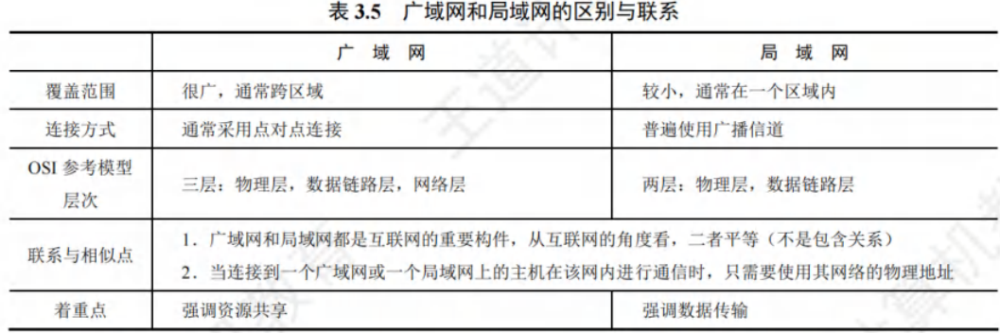
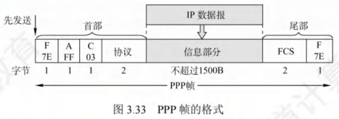
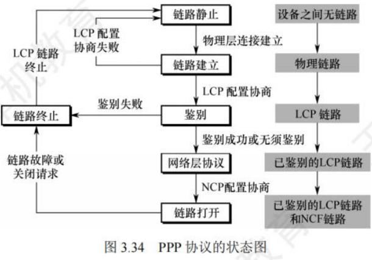
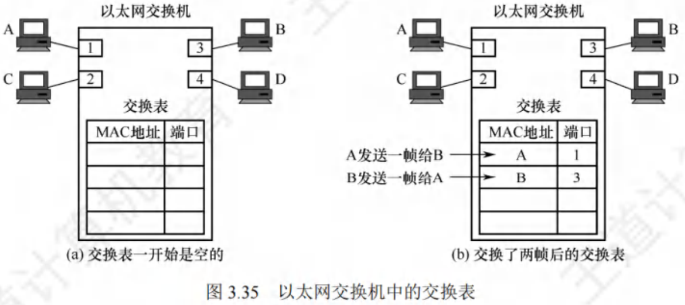

# 广域网与数据链路层设备

[toc]

## 广域网的基本概念
- **广域网定义与任务**：广域网（Wide Area Network，WAN）一般指覆盖范围极广（远超城市范围）的长距离网络 ，其主要任务是长距离传输主机发送的数据。连接广域网各结点交换机的链路为高速链路，广域网首要关注点是具备足够大的通信容量，以支撑不断增长的通信量。
- **广域网与互联网区别**：广域网并不等同于互联网。互联网可连接不同类型网络，常用路由器连接。如图 3.32 所示，相距较远的局域网通过路由器与广域网相连构成大范围互联网，实现局域网间远距离通信。

- **广域网组成与结点交换机功能**：
    - **组成**：广域网由结点交换机及连接它们的链路组成。需注意，结点交换机不同于路由器，结点交换机在单个网络中转发分组，路由器在多个网络构成的互联网中转发分组 。
    - **功能**：结点交换机功能为存储并转发分组。结点间采用点到点连接，为提高网络可靠性，通常一个结点交换机与多个结点交换机相连。
- **广域网与局域网层次协议区别**：从层次看，局域网使用的协议主要在数据链路层（少量在物理层），广域网使用的协议主要在网络层。当网络中两结点进行数据交换时，需给数据添加一层控制信息以实现传输控制等功能。若此控制信息属于数据链路层协议，则使用的是数据链路层协议；若属于网络层，则使用的是网络层协议。
- **广域网数据链路层协议**：
    - 在通信线路质量差的时期，能实现可靠传输的高级数据链路控制（HDLC）是较流行的数据链路层协议。
    - 如今，对于误码率很低的点对点有线链路，更简单的点对点协议（PPP）是使用最广泛的数据链路层协议。由于 HDLC 已从最新大纲删除，本书不再介绍。 

## 点对点协议
**点对点协议（Point-to-Point Protocol，PPP）**是当下最为流行的点对点链路控制协议，主要应用于以下两个方面：

1. 用户通常需连接到某个 ISP 以接入互联网，此时 PPP 协议便是用户计算机与 ISP 通信时所采用的数据链路层协议。
2. 广泛应用于广域网路由器之间的专用线路。

### PPP 协议的组成部分
1. **链路控制协议（LCP）**：用于建立、配置、测试数据链路连接，并协商相关选项。
2. **网络控制协议（NCP）**：PPP 协议允许采用多种网络层协议，每种不同的网络层协议都需一个对应的 NCP 来配置，为网络层协议建立和配置逻辑连接。
3. **IP 数据报封装方法**：将 IP 数据报封装到串行链路。IP 数据报在 PPP 帧中作为信息部分，该信息部分长度受最大传送单元（MTU）限制。

### PPP 帧格式
PPP 帧的格式如图 3.33 所示，首部包含 4 个字段，尾部包含 2 个字段。

- **标志字段（F）**：首部和尾部各有一个标志字段，值规定为 0x7E（01111110），作为 PPP 帧的定界符，表示一个帧的开始和结束。当标志字段出现在信息段中时，需采取措施避免其与真正的定界符混淆。异步传输时采用字节填充法，转义字符为 0x7D（01111101）；同步传输时采用零比特填充法实现透明传输。
- **地址字段（A）**：占 1 字节，值规定为 0xFF 。
- **控制字段（C）**：占 1 字节，值规定为 0x03 。这两个字段意义暂未定义。由于 PPP 是面向字节的，所有 PPP 帧长度均为整数个字节。
- **协议字段**：占 2 字节，用于表明信息段运载的分组类型。例如，0x0021 表示信息字段是 IP 数据报；0xC021 表示信息字段是 PPP 链路控制协议（LCP）的数据。
- **信息字段**：长度可变，范围为 0-1500 字节。
- **帧检验序列（FCS）**：占 2 字节，采用 CRC 检验生成冗余码。

### PPP 协议状态图
图 3.34 展示了 PPP 协议的状态图，具体状态转换如下：

1. **链路静止状态**：通信双方无物理层连接。
2. **链路建立状态**：链路一方检测到载波信号，建立物理连接后进入此状态。此时，链路控制协议（LCP）开始协商配置选项（如最大帧长、鉴别协议等）。协商成功进入鉴别状态，协商失败退回链路静止状态。
3. **鉴别状态**：协商成功建立 LCP 链路后进入此状态。若双方无需鉴别或鉴别身份成功，进入网络层协议状态；若鉴别失败，进入链路终止状态。
4. **网络层协议状态**：进入此状态后，双方采用 NCP 配置网络层。配置协商成功后，进入链路打开状态。
5. **链路打开状态**：链路处于此状态时，双方可进行数据通信。
6. **链路终止状态**：数据传输结束，链路一方发出终止请求并收到对方终止确认，或链路出现故障时进入此状态。载波停止后，回到链路静止状态。

### PPP 协议的特点
1. **可靠性**：PPP 不使用序号和确认机制，仅通过 CRC 检验保证无差错接收，提供不可靠服务。
2. **连接方式**：只支持全双工的点对点链路，不支持多点线路。
3. **协议兼容性**：PPP 的两端可运行不同的网络层协议，但仍能通过同一个 PPP 进行通信。
4. **数据格式**：PPP 是面向字节的，所有 PPP 帧的长度均为整数个字节。 

## 数据链路层设备

### 以太网交换机

#### 交换机的原理和特点
以太网交换机又称二层交换机，因其工作在数据链路层。它本质是多接口网桥，可将网络划分为较小的冲突域，为各用户提供更大带宽。

对于传统使用集线器的共享式 10Mb/s 以太网，若有$N$个用户，每个用户平均带宽为总带宽（10Mb/s）的$\frac{1}{N}$ 。而使用以太网交换机（全双工方式）连接主机时，虽每个接口到主机带宽仍为 10Mb/s，但用户通信时独占带宽，拥有$N$个接口的交换机总容量可达 $N×10Mb/s$，这是交换机最大优势。

**以太网交换机的特点**：
1. **全双工与无冲突传输**：当交换机接口直接连接主机或其他交换机时，可工作在全双工模式，能同时连通多对接口，使通信主机如同独占通信介质，无冲突传输数据，无需使用 CSMA/CD 协议。
2. **连接集线器的工作模式**：当交换机接口连接集线器时，只能使用 CSMA/CD 协议，且仅能工作在半双工方式。当前交换机和计算机网卡能自动识别这两种连接情况。
3. **即插即用与自学习**：交换机属于即插即用设备，其内部帧转发表通过自学习算法，依据网络中主机间通信情况自动逐步建立。
4. **高速交换**：交换机采用专用交换结构芯片，交换速率较高。
5. **带宽独占**：交换机独占传输介质的带宽。

**以太网交换机的交换模式**：
1. **直通交换方式**：
    - **工作原理**：仅检查帧的目的 MAC 地址，据此决定帧的转发接口。
    - **优缺点**：交换时延极小，但不检查差错就直接转发，可能将无效帧转发给其他站点，不适用于需速率匹配、协议转换或差错检测的线路。
2. **存储转发交换方式**：
    - **工作原理**：先把接收到的帧缓存到高速缓存器，检查数据正确性，确认无误后通过查找表转换到输出接口再发送。若发现帧有错，则丢弃。
    - **优缺点**：可靠性高，能支持不同速率接口间转换，但时延较大。

此外，交换机一般配备多种速率接口，如 10Mb/s、100Mb/s 接口，以及多速率自适应接口。 

#### 交换机的自学习功能
在交换机的工作过程中，“过滤”指决定一个帧是转发到某个接口还是丢弃，“转发”则是决定一个帧应被移至哪个接口，而这些操作借助交换表（switch table）来完成。

- 交换表中的一个表项至少包含：
  1. 一个MAC地址；
  2. 连通该MAC地址的接口。

以图3.35为例，以太网交换机有4个接口，分别连接MAC地址为A、B、C和D的计算机，初始时交换机的交换表为空。

 - **A向B发送帧**：帧从接口1进入交换机，交换机查找交换表，未找到MAC地址为B的表项。于是，交换机将该帧的源地址A和接口1写入交换表，并向除接口1外的所有接口广播此帧（因帧从接口1进入，不能再从该接口转发）。C和D因目的地址不符丢弃该帧，只有B收下目的地址正确的帧。此时交换表写入(A, 1)，意味着之后从任何接口收到目的地址为A的帧，都应从接口1转发出去，因为A发出的帧从接口1进入交换机，从接口1转发的帧也应能到达A。
 - **B向A发送帧**：B通过接口3向A发送一帧，交换机查找交换表，发现表项(A, 1)，便将该帧从接口1转发给A。此时无需再广播收到的帧，同时将该帧的源地址B和接口3写入交换表，表明以后发送给B的帧应从接口3转发。

经过一段时间，只要C和D也向其他主机发送帧，交换机就会把C、D及对应的接口号写入交换表。如此一来，转发给任何主机的帧，都能迅速在交换表中找到相应的转发接口。

由于交换机所连主机会随时变化，所以需要更新交换表中的表项。为此，交换表中的每个表项都设有一定的有效时间，过期表项将自动删除，以保证交换表数据符合当前网络实际状况。这种自学习算法让交换机能即插即用，无需手工配置，极为方便。 

#### 共享式以太网和交换式以太网的对比
假设交换机已通过自学习算法逐步建立了完整的转发表，以下通过实例说明使用集线器的共享式以太网与全部使用交换机的交换式以太网的区别：

1. **主机发送普通帧**
    - **共享式以太网**：集线器会将主机发送的帧转发到其他所有接口。此时，其他各主机中的网卡需依据帧的目的MAC地址来判断是接收还是丢弃该帧。这是因为集线器工作在物理层，它只是简单地将接收到的信号广播到所有端口，不具备对数据帧进行智能分析和转发的能力。
    - **交换式以太网**：交换机在收到帧后，会依据帧的目的MAC地址以及自身已建立的交换表，将帧精准地转发给目的主机。交换机工作在数据链路层，能够学习网络中各主机的MAC地址，并记录在交换表中，从而实现根据目的MAC地址进行准确转发。

2. **主机发送广播帧**
    - **共享式以太网**：集线器同样将帧转发到其他所有接口。当其他各主机中的网卡检测到帧的目的MAC地址是广播地址时，就会接收该帧。因为广播帧的目的是网络中的所有主机，集线器的广播特性使得所有连接到它的主机都能接收到该帧。
    - **交换式以太网**：交换机检测到帧的目的MAC地址是广播地址后，会从其他所有接口转发该帧。其他各主机收到该广播帧后就接收它。虽然两种网络在这种情况下最终效果相同，即所有主机都能收到广播帧，但原理不同。共享式以太网是基于集线器的物理层广播特性，而交换式以太网是交换机根据广播地址的特殊性质，按照其转发规则将广播帧从除接收端口外的所有端口转发出去。

3. **多对主机同时通信**
    - **共享式以太网**：由于共享式以太网采用的是共享传输介质的方式，当多对主机同时通信时，信号会在传输介质上相互干扰，必然产生冲突。这会导致数据传输的错误和效率降低。
    - **交换式以太网**：交换机内部具有高速的交换结构，能实现多对接口的高速并行交换。每对通信的主机都有独立的传输通道，因此不会产生冲突，大大提高了网络的通信效率。

**总结**：集线器既不隔离广播域，又不隔离冲突域，这意味着网络中的广播帧会传播到所有连接的主机，且多主机同时通信易产生冲突；而交换机不隔离广播域，但能隔离冲突域，广播帧仍会在整个网络传播，但能避免多对主机同时通信时的冲突问题。 