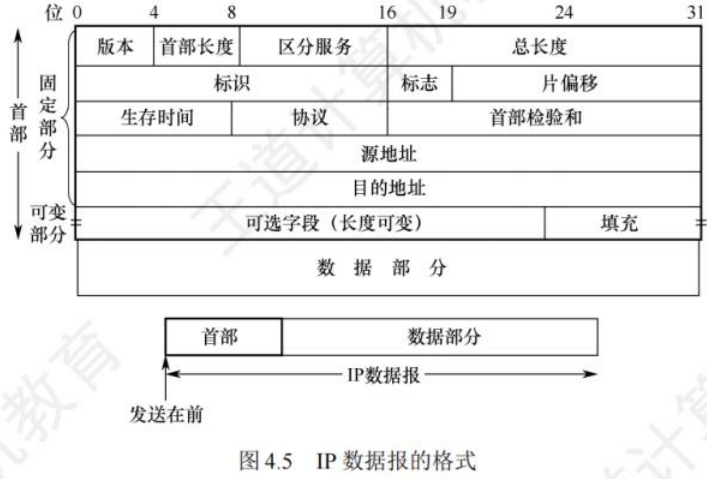
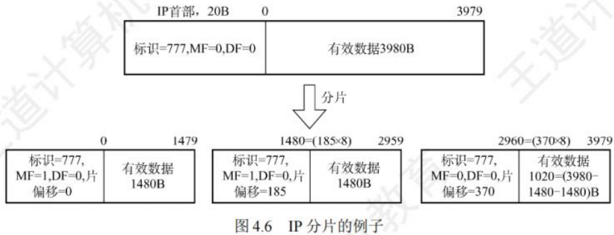
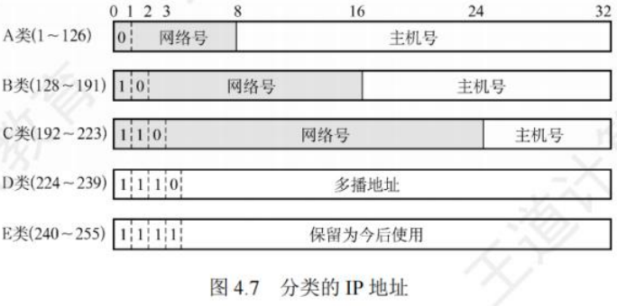
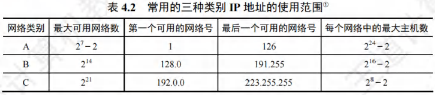
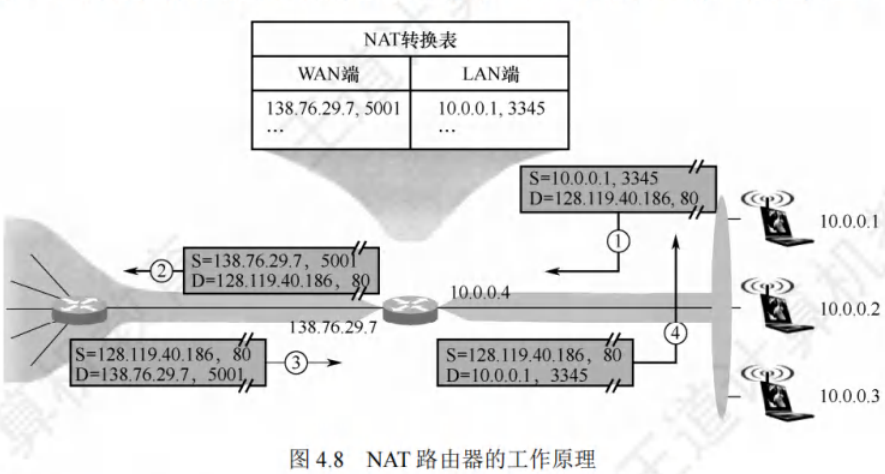
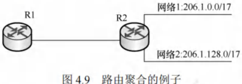
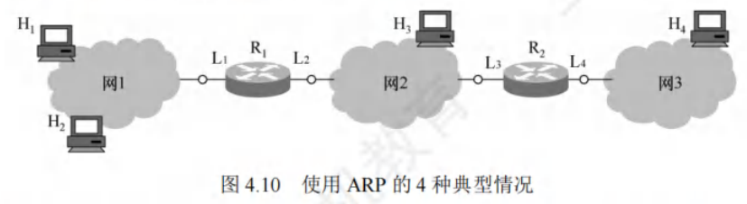

# IPv4

[toc]

## IPv4分组
IPv4（版本4）是当前广泛使用的网际协议（Internet Protocol, IP）。IP定义了**数据传送的基本单元-IP分组及其确切数据格式**，还包含一套处理分组、控制错误的规则，特别是非可靠投递及路由选择的思想。

### IPv4分组的格式
一个IP分组（IP数据报）由**首部和数据部分**组成。首部**前一部分长度固定**，为**20B**，是所有IP分组必备的。首部固定部分之后是可选字段，长度可变，用于错误检测及安全等机制。

IPv4首部部分重要字段含义：
1. **版本**：占4位，指IP的版本，IPv4数据报中该字段值为4。
2. **首部长度**：占4位，**以4B为单位**，最大可表示首部长度为60B（15×4B）。最常用首部长度是20B（5×4B），此时该字段值为5，不使用可选字段，IP首部前两个字节常以0x45开头，可用于定位IP数据报起始位置。
3. **总长度**：占16位，指首部和数据之和的长度，单位为字节，**数据报最大长度为$2^{16}-1 = 65535B$**。**以太网帧的最大传送单元（MTU）为1500B**，IP数据报封装成帧时，总长度（首部加数据）不能超过数据链路层的MTU值。
4. **标识**：占16位，是一个计数器，每产生一个数据报就加1并赋值给该字段，但它不是“序号”（因IP是无连接服务）。当数据报长度超过网络MTU时需分片，每个数据报片都复制标识号，以便正确重装成原数据报。
5. **标志（Flag）**：占3位。标志字段最低位为MF，MF = 1表示后面还有分片，MF = 0表示最后一个分片。中间一位是DF，只有DF = 0时才允许分片。
6. **片偏移**：占13位，指出较长数据报分片后，某片在原数据报中的相对位置，**片偏移以8B为偏移单位**。除最后一个分片外，每个分片长度一定是8B的整数倍。
7. **生存时间（TTL）**：占8位，是数据报在网络中可通过路由器数的最大值，标识数据报在网络中的寿命，确保数据报不会永远在网络中循环。路由器转发数据报前，先将TTL减1，若TTL减为0，则丢弃该数据报。
8. **协议**：占8位，指出此数据报携带的数据使用何种协议，即数据报的数据部分应上交给哪个协议处理，如TCP、UDP等。**值为6表示TCP，值为17表示UDP**。
9. **首部检验和**：占16位，**只检验数据报首部，不包括数据部分**。因为数据报每经过一个路由器，部分字段（如生存时间、总长度、标志、片偏移、源/目的地址）可能变化，需重新计算首部检验和，不检验数据部分可减少计算量。
10. **源地址字段**：占4B，标识发送方的IP地址。
11. **目的地址字段**：占4B，标识接收方的IP地址。

**注意**：IP数据报首部中有三个关于长度的标记，即首部长度、总长度、片偏移，基本单位分别为4B、1B、8B。需熟悉IP数据报首部各字段意义和功能，但无需记忆首部，题目一般会给出。分析IP首部时，IP地址常以十六进制表示，要注意与十进制的转换。

### IP数据报分片
**链路层数据帧能承载的最大数据量称为最大传送单元（MTU）**。IP数据报封装在链路层帧中，链路层的MTU严格限制IP数据报长度，且源与目的地路径上各段链路可能使用不同链路层协议，MTU不同。例如，**以太网MTU为1500B**，许多广域网MTU不超过576B。当IP数据报总长度大于链路MTU时，需将数据分装在多个较小IP数据报中，这些小数据报称为片。

- 片在目的地网络层重新组装。目的主机使用IP首部中的**标识、标志和片偏移字段完成片的重组**。
  - 创建IP数据报时，源主机为其加上标识号。路由器分片时，每个数据报片都具有原始数据报的标识号。目的主机收到同一发送主机的一批数据报，通过检查标识号确定哪些数据报属于同一个原始数据报的片。
  - IP首部标志位占3位，后2位有意义（分别是DF（Don't Fragment）位和MF（More Fragment）位）。
  - 只有DF = 0时，IP数据报才可被分片。MF用于告知目的主机该IP数据报是否为原始数据报的最后一个片，MF = 1表示还有后续片，MF = 0表示是最后一个片。
  - 目的主机重组片时，使用片偏移字段确定片在原始IP数据报中的位置。

- IP分片涉及计算。
  - 例如，一个长4000B的IP数据报（首部20B，数据部分3980B）到达路由器，需转发到MTU为1500B的链路上。
  - 意味着3980B数据需分配到3个独立片中（每片也是一个IP数据报），每片数据部分依次为1480B、1480B和1020B。
  - 假定原始数据报标识号为777，则分成的3片如图4.6所示。可见，除最后一个片外，其他片数据部分都为8B的倍数。 

## IPv4地址与NAT

### IPv4地址

IP地址是为互联网上每台主机（或路由器）的每个接口分配的全球唯一**32位标识符**，由互联网名字和数字分配机构ICANN负责分配。

所有IP地址都由**网络号**和**主机号**两部分构成，即$IP地址::={<网络号>,<主机号>}$。网络号标识主机（或路由器）所连网络，在整个互联网范围内唯一；主机号标识主机（或路由器），在其网络号所指网络范围内唯一，因此IP地址在整个互联网范围唯一。

各类IP地址中，部分IP地址有特殊用途，不作为主机IP地址：
 - 主机号全为0表示本网络本身，如202.98.174.0。
 - 主机号全为1表示本网络的广播地址，即直接广播地址，如202.98.174.255。
 - **127.x.x.x保留为环回自检（Loopback Test）地址，代表任意主机本身，目的地址为环回地址的IP数据报不会出现在任何网络上。**
 - **32位全为0，即0.0.0.0表示本网络上的本主机。**
 - **32位全为1，即255.255.255.255表示整个TCP/IP网络的广播地址，即受限广播地址。**实际使用中，因路由器隔离广播域，255.255.255.255等效为本网络广播地址。

以A类地址为例，可用网络数为$2^7 - 2$，减2原因如下：
 - 网络号字段全为0的IP地址是保留地址，意为“本网络”。
 - 网络号为127的IP地址是环回自检地址。

IP地址具有以下重要特点：
 - **分等级结构**：每个IP地址由网络号和主机号组成，是分等级的地址结构。好处在于：
    - IP地址管理机构只需分配网络号，主机号由单位自行分配，便于管理。
    - 路由器依据目的主机的网络号转发分组，减小路由表存储空间。
 - **标志接口**：IP地址标志一台主机（或路由器）和一条链路的接口。当主机同时连接两个网络，需有两个不同网络号的IP地址。路由器至少有两个IP地址，每个端口对应不同网络号的IP地址。
 - **同一网络特性**：用转发器或桥接器连接的若干LAN属同一网络（同一广播域），其中主机IP地址网络号相同，但主机号不同。
 - **网络平等性**：所有分配到网络号的网络（LAN或WAN）地位平等。
 - **局域网特性**：同一个局域网上的主机或路由器接口的IP地址，网络号必须相同。

近年来，无分类IP地址广泛用于路由选择，传统分类的IP地址逐渐成为历史。

### 网络地址转换(NAT)
网络地址转换（Network Address Translation, NAT）是将专用网络地址（如Intranet）转换为公用地址（如Internet），对外隐藏内部管理的IP地址。它使整个专用网仅需一个全球IP地址即可与互联网连通，因专用网本地IP地址可重用，大大节省了IP地址。同时，隐藏内部网络结构，降低内部网络受攻击风险。

为保障网络安全，划分出部分IP地址作为私有IP地址。私有IP地址仅用于LAN，不用于WAN连接（不能直接用于Internet，需通过网关利用NAT转换为合法全球IP地址才能出现在Internet上），且允许被LAN重复使用，有效缓解IP地址不足问题。私有IP地址网段如下：
 - **A类**：1个A类网段，即10.0.0.0 ~ 10.255.255.255。
 - **B类**：16个B类网段，即172.16.0.0 ~ 172.31.255.255。
 - **C类**：256个C类网段，即192.168.0.0 ~ 192.168.255.255。

互联网中的路由器对目的地址为私有地址的数据报不转发。采用私有IP地址的互联网络称为专用互联网或本地互联网，私有IP地址也叫可重用地址。

使用NAT需在专用网连接互联网的路由器上安装NAT软件，NAT路由器至少有一个有效的外部全球IP地址。当本地地址主机与外界通信时，NAT路由器利用NAT转换表进行本地IP地址和全球IP地址的转换。NAT转换表存放着{本地IP地址:端口}到{全球IP地址:端口}的映射，可实现多个私有IP地址映射到一个全球IP地址。

---

例如，某家庭办理10Mb/s电信宽带获全球IP地址（如138.76.29.7），家庭网络内3台主机使用私有地址（如10.0.0.0网段），家庭网关路由器开启NAT功能。其工作原理如下：
1. 用户主机10.0.0.1（随机端口3345）向Web服务器128.119.40.186（端口80）发送请求。
2. NAT路由器收到IP分组后，生成新端口号5001，将IP分组源地址改为138.76.29.7（NAT路由器的全球IP地址），源端口号改为5001，并在NAT转换表中增加表项。
3. Web服务器不知IP分组已被改装，响应分组目的地址是NAT路由器的全球IP地址138.76.29.7，目的端口号是5001。
4. 响应分组到达NAT路由器后，通过NAT转换表将目的IP地址改为10.0.0.1，目的端口号改为3345，实现多台主机用一个全球IP地址同时访问互联网。

---

普通路由器转发IP分组时，源IP地址和目的IP地址不变。而NAT路由器转发时，一定会更换IP地址（转换源IP地址或目的IP地址），且需查看和转换传输层端口号。

## 划分子网与路由聚合

### 划分子网
- **两级IP地址缺点**：IP地址空间利用率低；路由表因每个物理网络分配一个网络号而变得庞大，影响网络性能；灵活性不足。
- **划分子网思路**：
    - 1985年起，在IP地址中增加“子网号字段”，将两级IP地址变为三级IP地址，此做法成为互联网正式标准协议。
    - 划分子网是单位内部事务，对外仍表现为一个未划分子网的网络。方法是从主机号借用若干位作为子网号，主机号相应减少相同位数。三级IP地址结构为：IP地址::={<网络号>,<子网号>,<主机号>}。
    - 路由器先依据IP数据报的目的网络号转发，本单位路由器收到后，再按目的网络号和子网号找到目的子网，最后交付给目的主机。
    - 例如，将C类网络208.115.21.0划分为4个子网，子网号占2位，主机号剩6位，各子网网络地址分别为208.115.21.0、208.115.21.64、208.115.21.128、208.115.21.192 ，每个子网可分配IP地址数为$2^6 - 2 = 62$ 。
- **注意要点**：
    - 划分子网只对主机号部分再划分，不改变原网络号，从IP地址本身无法判断网络是否划分子网。
    - 子网中主机号全0的地址是子网网络地址，主机号全1的地址是子网广播地址，这两个地址不能指派给主机。
    - 划分子网增加灵活性，但减少了网络可连接的主机总数。

### 子网掩码和默认网关
- **子网掩码**：用于指明分类IP地址的主机号部分有多少位被借用作为子网号。它是一个32位二进制串，由一串1和跟随的一串0组成，1对应IP地址中的网络号及子网号，0对应主机号。主机或路由器将IP地址和子网掩码逐位“与”（AND运算），可得出子网的网络地址。
- **默认网关**：是子网与外部网络连接的设备，即连接本机或子网的路由器接口的IP地址。主机发送数据时，根据目的IP地址和子网掩码判断目的主机是否在子网内，若在则直接发送，若不在则发送到默认网关，由网关（路由器）转发到其他网络寻找目的主机。
- **相关规定**：
    - 互联网标准规定所有网络都必须使用子网掩码，未划分子网的网络使用默认子网掩码，A、B、C类地址的默认子网掩码分别为255.0.0.0、255.255.0.0、255.255.255.0。例如，主机IP地址192.168.5.56与子网掩码255.255.255.0逐位“与”，可得子网网络号192.168.5.0。
    - 子网掩码是网络重要属性，路由器交换路由信息时需告知对方自己所在网络的子网掩码。分组转发时，路由器将分组目标地址和某网络子网掩码按位相与，结果与该网络地址一致则路由匹配成功，分组转发至该网络。
    - 使用子网掩码时，主机设置IP地址信息必须同时设置子网掩码，同属一个子网的主机及路由器相应端口必须设置相同子网掩码，路由器路由表包含目的网络地址、子网掩码、下一跳地址。

### 无分类编址CIDR
- **基本概念**：无分类域间路由选择（Classless Inter - Domain Routing, CIDR）基于变长子网掩码，消除传统A、B、C类地址及划分子网概念。例如，单位需2000个地址，分配2048个地址的块而非完整B类地址，以更有效分配IPv4地址空间。CIDR使用网络前缀概念替代网络概念，与传统分类IP地址最大区别是网络前缀位数不固定。记法为IP地址::={<网络前缀>,<主机号>} 。
- **斜线记法**：也称CIDR记法，记为“IP地址/网络前缀所占的位数”。网络前缀所占位数对应网络号部分，等效于子网掩码中连续1的部分。例如，128.14.32.5/20，其掩码是20个连续1和后续12个连续0，通过逐位“与”可得网络前缀128.14.32.0 。斜线记法既能表示IP地址，又能表示地址块网络前缀位数。
- **CIDR地址块**：CIDR将网络前缀相同的连续IP地址组成CIDR地址块。知道其中一个地址，就能确定地址块的最小地址、最大地址及地址数。例如，128.14.32.5/20地址块，最小地址128.14.32.0 ，最大地址128.14.47.255 。主机号全0或全1的地址一般不使用，只使用两者之间的地址。
- **与子网关系**：CIDR虽不使用子网概念，但分配到CIDR地址块的单位仍可在内部按需划分子网。如单位分配到/20地址块，可从主机号借用3位继续划分为8个子网，此时每个子网网络前缀变为23位。
- **地址数特点**：CIDR地址块中地址数是2的整数次幂，实际可指派地址数通常为$2^N - 2$，N为主机号位数，主机号全0代表网络号，主机号全1为广播地址。网络前缀越短，地址块包含地址数越多；三级结构IP地址划分子网使网络前缀变长。

### 路由聚合
- **概念与作用**：由于CIDR地址块包含多个地址，在路由表中利用CIDR地址块查找目的网络，这种地址聚合称为路由聚合，也称构成超网。它使路由表一个项目可表示多个传统分类地址的路由，减少路由器间信息交换，提高网络性能。
- **示例**：如图4.9网络，若不使用路由聚合，R1路由表需分别有到网络1和网络2的路由表项。网络1和网络2网络前缀二进制表示前16位相同，第17位分别为0和1，且从R1到两者的下一跳皆为R2 。使用路由聚合，R1可将网络1和网络2构成更大地址块206.1.0.0/16，两条路由聚合成一条到206.1.0.0/16的路由。
- **最长前缀匹配**：使用CIDR时，路由表项由“网络前缀”和“下一跳地址”组成。查找路由表可能有多个匹配结果，应选择网络前缀最长的路由，因为网络前缀越长，地址块越小，路由越具体。
- **查找方法**：为有效查找最长前缀匹配，通常将无分类编址路由表存放在层次式数据结构（常采用二叉线索）中，自上而下按层次查找。
- **优点**：CIDR网络前缀长度灵活，上层网络前缀短，路由表项目少；内部可延长网络前缀灵活划分子网。

### 子网划分的应用举例
子网划分通常有两类方法：采用定长的子网掩码和采用变长的子网掩码。

(1) **采用定长的子网掩码划分子网**
当使用定长的子网掩码划分子网时，每个子网的子网掩码相同，所分配的IP地址数量也一样，这种方式易造成地址资源浪费。

假设某单位拥有CIDR地址块208.115.21.0/24 ，该单位有三个部门，各部门主机台数分别为50、20、5 。采用定长子网掩码为各部门分配IP地址。

 - 部门1需要51个IP地址（含一个路由器接口地址）；部门2需要21个IP地址；部门3需要6个IP地址。
 - 从给定地址块208.115.21.0/24的主机号部分借用2位作为子网号，可划分出$2^2 = 4$个子网 。每个子网可分配的IP地址数为$2^{8 - 2} - 2 = 62$，能满足各部门需求。各子网划分如下（为方便书写，仅将IP地址后8位用二进制展开）：
    - 208.115.21.00000000 ~ 208.115.21.00111111，地址块“208.115.21.0/26”，分配给部门1。
    - 208.115.21.01000000 ~ 208.115.21.01111111，地址“208.115.21.64/26”，分配给部门2。
    - 208.115.21.10000000 ~ 208.115.21.10111111，地址块“208.115.21.128/26”，分配给部门3。
    - 208.115.21.11000000 ~ 208.115.21.1111111，地址块“208.115.21.192/26”，留作以后用。
 - 子网掩码：255.255.255.11000000，即255.255.255.192。

(2) **采用变长的子网掩码划分子网**
采用变长的子网掩码划分子网时，每个子网可使用不同的子网掩码，所分配的IP地址数量也能不同，可最大程度减少地址资源浪费。

假设条件与上例相同，下面采用变长的子网掩码为该单位分配IP地址。
 - 部门1的主机号需6位，剩余$26 (32 - 6 = 26)$位作为网络前缀；部门2的主机号需5位，剩余$27 (32 - 5 = 27)$位作为网络前缀；部门3的主机号需3位，剩余$29 (32 - 3 = 29)$位作为网络前缀。
 - 从地址块208.115.21.0/24中划分出3个子网（1个“/26”地址块，1个“/27”地址块，1个“/29”地址块），并按需分配给三个部门。每个子网的最小地址选取主机号全0的地址。划分方案不唯一，建议从大的子网开始划分。以下是一种划分方案：
    - 208.115.21.00000000 - 208.115.21.00111111，地址块208.115.21.0/26，子网掩码255.255.255.192，可分配地址62个，分配给部门1。
    - 208.115.21.01000000 - 208.115.21.01011111，地址块208.115.21.64/27，子网掩码255.255.255.224，可分配地址30个，分配给部门2。
    - 208.115.21.01100000 - 208.115.21.01100111，地址块208.115.21.96/29，子网掩码255.255.255.248，可分配地址6个，分配给部门3。
 - 剩余$256 - 64 - 32 - 8 = 152$个地址，留作以后划分。

再次强调，子网主机号全0或全1的地址不能分配。对于连接两个路由器的链路，可分配一个“/30”地址块，这样可分配地址为2个，刚好能分给链路两端的路由器接口。 

### 网络层转发分组的过程
分组转发基于目的主机所在网络，因为互联网上网络数远少于主机数，这样能极大压缩转发表大小。分组到达路由器后，路由器依据目的IP地址的网络前缀查找转发表，确定下一跳路由器。所以转发表中每条路由需包含**(目的网络地址, 下一跳地址)** 两条信息。

IP数据报最终能找到目的主机所在网络的路由器（可能需多次间接交付），到达最后一个路由器时才尝试向目的主机直接交付。

采用CIDR编址时，若分组在转发表中有多个匹配前缀，应使用**最长前缀匹配**。为加快查找，可按前缀长度降序排列转发表，从最长前缀开始查找，找到匹配项则停止。

路由表中还可增加两种特殊路由：
1. **特定主机路由**：为特定目的主机的IP地址专门指定一条路由，方便网络管理员控制和测试网络。若特定主机IP地址是a.b.c.d，转发表中对应项的目的网络是a.b.c.d/32 ，/32表示的子网掩码虽无意义，但可用于转发表。
2. **默认路由**：用特殊前缀0.0.0.0/0表示，全0掩码与任何目的地址按位与运算结果为全0，必然与该前缀匹配。只要目的网络不在转发表中，就选择默认路由。默认路由常用于路由器到互联网的路由，因互联网网络众多，无法在路由表中一一列出。

路由器执行的分组转发算法如下：
1. 从收到的IP分组首部提取目的主机的IP地址D（目的地地址）。
2. 若查找到特定主机路由（目的地址为D），按该路由的下一跳转发分组；否则从转发表下一条（按前缀长度顺序）开始检查，执行步骤3。
3. 将该行的子网掩码与目的地址D逐位“与”（AND操作）。若运算结果与本行前缀匹配，查找结束，按“下一跳”指示处理（直接交付本网络目的主机或通过指定接口发送到下一跳路由器）。否则，若转发表还有下一行，对下一行检查，重新执行步骤3；否则，执行步骤4。
4. 若转发表中有默认路由，将分组传送给默认路由；否则，报告转发分组出错。

需注意，转发表（或路由表）未指明分组到某个网络的完整路径，仅指出到某个网络应先到哪个路由器（下一跳路由器），到达后再查其转发表确定下一步走向，直至到达目的网络。

得到下一跳路由器的IP地址后，不直接填入待发送数据报，而是通过ARP将其转换为MAC地址，填入MAC帧首部，再据此MAC地址找到下一跳路由器。在不同网络传送时，MAC帧的原地址和目的地址会变化。 

## 地址解析协议ARP

### IP地址与硬件地址
- **地址层次与位置**：IP地址用于网络层及以上，是分层式的，放在IP数据报首部；硬件地址（MAC地址）用于数据链路层，是平面式的，放在MAC帧首部。IP数据报封装成MAC帧后，数据链路层无法看到其中的IP地址。
- **寻址方式**：因路由器隔离，IP网络无法通过广播MAC地址跨网络寻址，网络层使用IP地址寻址。寻址时，路由器依据路由表（由路由协议生成）选择到目标网络（主机号全为0的网络地址）的下一跳（路由器物理端口号或下一网络地址）。IP数据报经多次路由转发到达目标网络后，在目标局域网通过数据链路层MAC地址广播寻址，可提高路由选择效率。
- **网络特性强调**：
    1. 在IP层抽象的互联网上只能看到IP数据报。
    2. 路由器只根据IP数据报首部的目的IP地址进行转发，不考虑源IP地址。
    3. 局域网链路层只能看见MAC帧，IP数据报被封装在MAC帧中。通过路由器转发时，IP数据报在每个网络都被解封装和重新封装，MAC帧首部的源地址和目的地址不断改变，因此无法用MAC地址跨网络通信。
    4. IP层抽象的互联网屏蔽了下层硬件地址体系的复杂细节，在网络层讨论问题时，可使用统一的、抽象的IP地址研究主机与主机或路由器间的通信。
- **路由器地址特点**：路由器互连多个网络，有多个IP地址和多个硬件地址。

### 地址解析协议
- **协议作用**：实际网络链路传送数据帧需使用硬件地址，地址解析协议（Address Resolution Protocol, ARP）用于完成IP地址到MAC地址的映射。每台主机有ARP高速缓存，存放本局域网上主机和路由器的IP地址到MAC地址的映射表（ARP表），并通过ARP动态维护。
- **工作原理**：ARP工作在网络层。主机A向本局域网上的主机B发送IP数据报时，先查ARP高速缓存，若有主机B的IP地址映射，则查出对应的硬件地址写入MAC帧并发送；若没有，则用目的MAC地址为FF - FF - FF - FF - FF - FF的帧封装并广播ARP请求分组。主机B收到请求后，向主机A单播发送包含其IP地址与MAC地址映射关系的ARP响应分组，主机A将映射写入ARP缓存后按硬件地址发送MAC帧。
- **应用场景**：ARP用于解决同一局域网上主机或路由器的IP地址和硬件地址的映射问题。若目的主机和源主机不在同一局域网，需通过ARP找到本局域网上某个路由器的硬件地址，将分组发给该路由器，由其转发到下一个网络。ARP请求分组广播发送，响应分组单播发送。
- **具体情况分析**：
    1. 主机H1向本网络的主机H2发送IP分组，H1在网1用ARP找到H2的硬件地址。
    2. 主机H1向其他网络的主机H4发送IP分组，H1用ARP找到与网1连接的路由器R1的硬件地址（默认网关），由R1完成后续工作。开始传送时，MAC帧首部源地址是H1的MAC地址，目的地址是R1的硬件地址。R1收到MAC帧后，在数据链路层丢弃原MAC首部和尾部，更换首部源地址和目的地址，这些变化在IP层不可见。
    3. 路由器R1向与其连接的网络（网2）上的主机H3转发IP分组，R1在网2用ARP找到H3的硬件地址。
    4. 路由器R1向网3上的主机H4转发IP分组，R1在网2用ARP找到与网2连接的路由器R2的硬件地址，由R2完成后续工作。
- **自动解析**：从IP地址到硬件地址的解析自动进行，主机用户无需了解解析过程。只要主机或路由器与本网络上已知IP地址的主机或路由器通信，ARP就自动完成IP地址到硬件地址的解析。

## 动态主机配置协议DHCP
动态主机配置协议（Dynamic Host Configuration Protocol, DHCP）主要用于**动态给主机分配IP地址，提供即插即用的连网机制，允许计算机加入新网络并自动获取IP地址，无需手动配置**。**DHCP属于应用层协议，基于UDP实现。**

### 工作原理
- 采用客户/服务器模型。
  - 需要IP地址的主机启动时，会以广播方式向网络发送发现报文，此时该主机成为DHCP客户。
  - 本地网络上所有主机都能收到此广播报文，但只有DHCP服务器会响应。
  - DHCP服务器接收到报文后，先在数据库中查找该计算机的配置信息，若找到则返回对应信息；
  - 若未找到，则从IP地址池中选取一个地址分配给该计算机，并以提供报文的形式回复。

### 交换过程
1. **DHCP发现**：DHCP客户广播“DHCP发现”消息，目的是找到网络中的DHCP服务器以获取IP地址。此消息源地址为0.0.0.0，目的地址为255.255.255.255。
2. **DHCP提供**：DHCP服务器收到“DHCP发现”消息后，广播“DHCP提供”消息，其中包含准备分配给DHCP客户机的IP地址。该消息源地址为DHCP服务器地址，目的地址为255.255.255.255。
3. **DHCP请求**：DHCP客户收到“DHCP提供”消息，若接受该IP地址，则广播“DHCP请求”消息向DHCP服务器请求分配此IP地址。此消息源地址为0.0.0.0，目的地址为255.255.255.255。
4. **DHCP确认**：DHCP服务器广播“DHCP确认”消息，将IP地址正式分配给DHCP客户。消息源地址为DHCP服务器地址，目的地址为255.255.255.255。

### 相关特性
- **多服务器响应**：网络中可配置多台DHCP服务器，当DHCP客户发出“DHCP发现”消息时，可能收到多个应答。DHCP客户通常会挑选最先到达的应答。
- **租用期**：DHCP服务器分配给客户的IP地址是临时的，客户只能在有限时间内使用，这段时间称为租用期。租用期由DHCP服务器决定，客户也可在报文中提出租用期要求。
- **广播与UDP使用原因**：DHCP客户和服务器通过广播方式交互，因为在DHCP执行初期，客户机不知道服务器IP地址，执行过程中客户机也未分配到IP地址，所以只能采用广播。采用UDP而非TCP是因为TCP需要建立连接，在不知对方IP地址的情况下无法建立连接。
- **应用层协议性质**：DHCP采用客户/服务器模式，客户向服务器请求服务，这是应用层协议的工作方式，其他层次协议一般不具备。

## 网际控制报文协议ICMP
为有效转发IP数据报并提高交付成功率，网络层使用网际控制报文协议（Internet Control Message Protocol, ICMP），**用于主机或路由器报告差错和异常情况。ICMP报文封装在IP数据报中发送，但它属于网络层协议。**

### 报文类型
- **ICMP差错报告报文**：由目标主机或到目标主机路径上的路由器向源主机报告差错和异常情况，常见类型有5种：
    1. **终点不可达**：路由器或主机无法交付数据报时，向源点发送该报文。
    2. **源点抑制**：路由器或主机因拥塞丢弃数据报时，向源点发送此报文，提醒源点降低数据报发送速率。
    3. **时间超过**：路由器收到生存时间（TTL）为零的数据报，或终点在规定时间内未收到数据报的全部片时，除丢弃相关数据报外，向源点发送该报文。
    4. **参数问题**：路由器或目的主机收到的数据报首部字段值不正确时，丢弃该数据报并向源点发送此报文。
    5. **改变路由（重定向）**：路由器向主机发送该报文，告知主机下次应将数据报发送给其他路由器以获取更好路由。
- **不发送ICMP差错报告报文的情况**：
    1. 对于ICMP差错报告报文，不再发送ICMP差错报告报文。
    2. 第一个分片的数据报片的所有后续数据报片，不发送ICMP差错报告报文。
    3. 具有多播地址的数据报，不发送ICMP差错报告报文。
    4. 具有特殊地址（如127.0.0.0或0.0.0.0）的数据报，不发送ICMP差错报告报文。
- **ICMP询问报文**：有4种类型，
    - 回送请求和回答报文
    - 时间戳请求和回答报文
    - 地址掩码请求和回答报文
    - 路由器询问和通告报文
    - 其中回送请求和回答报文、时间戳请求和回答报文最常用。

### 常见应用
- **分组网间探测PING**：**用于测试两台主机之间的连通性，工作在应用层，直接使用网络层的ICMP回送请求和回答报文。**
- **Traceroute（UNIX）/Tracert（Windows）**：**用于跟踪分组经过的路由，工作在网络层，使用ICMP时间超过报文。** 