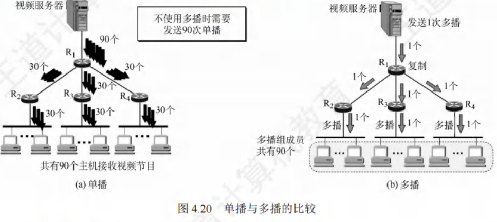
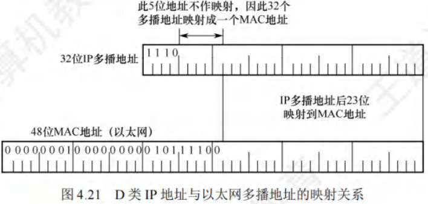

# IP多播

[toc]

## 多播的概念
- 多播是一种**一对多的通信方式**，源主机一次发送的单个分组可以抵达用一个组地址标识的若干目的主机。
  - 在互联网上进行的多播，被称为IP多播。
  - 与单播相比，在一对多的通信场景中，多播能大大节约网络资源。
  - 例如视频服务器向90台主机传送同样的视频节目，多播时仅发送一份数据且只需发送一次，只有在传送路径出现分岔时才将分组复制后继续转发，这减轻了发送者的负担和网络的负载。
  - 多播的实现需要路由器的支持，能够运行多播协议的路由器称为多播路由器。

## IP多播地址
- **地址定义**：多播数据报的源地址是**源主机**的**IP地址**，**目的地址**是**IP多播地址**，即**IPv4中的D类地址**。
    - D类地址前四位是$1110$，范围是**$224.0.0.0 - 239.255.255.255$**，每个D类IP地址标志一个多播组，一台主机可以随时加入或离开一个多播组。

- **与一般IP数据报区别**：多播数据报使用D类IP地址作为目的地址，并且**首部中的协议字段值是2**，表明**使用IGMP协议**。需要注意：
    - 多播数据报“尽最大努力交付”，不提供可靠交付。
    - 多播地址只能用于目的地址，不能用于源地址。
    - 对多播数据报不产生ICMP差错报文。
- **多播类型**：IP多播分为两种，一是只在本局域网上进行硬件多播，二是在互联网的范围内进行多播。目前大部分主机通过局域网接入互联网，所以在互联网上进行多播的最后阶段，还是要把多播数据报在局域网上用硬件多播交付给多播组的所有成员。
- **协议应用**：多播机制**仅应用于UDP**，它能将报文同时发送给多个接收者。而TCP是面向连接的协议，会一对一地发送数据。

### 在局域网上进行硬件多播
局域网支持硬件多播，将IP多播地址映射成多播MAC地址，把IP多播数据报封装在局域网的MAC帧中，MAC帧首部的目的MAC地址字段设置为由IP多播地址映射成的多播MAC地址，就能利用硬件多播实现局域网内的IP多播。

IANA拥有的以太网多播地址范围是从$01 - 00 - 5E - 00 - 00 - 00$到$01 - 00 - 5E - 7F - FF - FF$，其中只有23位可用作多播，只能和D类IP地址中的23位有一一对应关系，D类IP地址可供分配的有28位，前5位无法映射到多播MAC地址。例如，IP多播地址$224.128.64.32$（即$E0 - 80 - 40 - 20$）和$224.0.64.32$（即$E0 - 00 - 40 - 20$）转换成以太网的硬件多播地址都是$01 - 00 - 5E - 00 - 40 - 20$。由于多播IP地址与以太网MAC地址的映射关系不是唯一的，收到多播数据报的主机，还要在IP层利用软件进行过滤，丢弃不是本主机要接收的数据报。

### IGMP与多播路由协议
- **IGMP功能**：路由器要获得多播组的成员信息，需要利用**网际组管理协议（Internet Group Management Protocol, IGMP）**。IGMP让连接到本地局域网上的多播路由器知道本局域网上是否有主机参加或退出了某个多播组，但它不是在互联网范围内对所有多播组成员进行管理的协议，不知道IP多播组包含的成员数，也不知道成员分布在哪些网络上。IGMP报文被封装在IP数据报中传送，也向IP提供服务，被视为整个网际协议IP的一个组成部分。
- **IGMP工作阶段**：
    - **第一阶段**：当某台主机加入新的多播组时，向多播组的多播地址发送一个IGMP报文，声明自己要成为该组的成员。本地的多播路由器收到IGMP报文后，利用多播路由选择协议，把这种组成员关系转发给互联网上的其他多播路由器。
    - **第二阶段**：组成员关系是动态的。本地多播路由器要周期性地探询本地局域网上的主机，了解这些主机是否仍继续是组的成员。只要对某个组有一台主机响应，多播路由器就认为这个组是活跃的；若一个组经过几次探询后仍无主机响应，多播路由器就认为本网络上的主机都已离开这个组，不再把该组的成员关系转发给其他多播路由器。
- **多播路由选择**：多播路由选择要找出以源主机为根结点的多播转发树，使每个分组在每条链路上传送一次，即多播转发树上的路由器不会收到重复的多播数据报。不同的多播组对应不同的多播转发树，同一个多播组对不同的源点也会有不同的多播转发树。 

