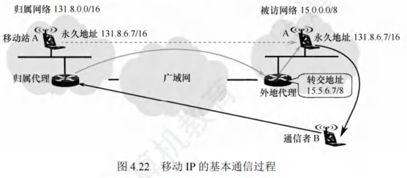

# 移动IP

[toc]

## 移动IP的概念
移动IP技术：移动站以固定的IP地址跨越不同网络进行漫游，同时保证基于IP的网络权限在漫游过程中不发生变化，其目标是将分组自动投递给移动站。

移动站是指连接点可从一个网络或子网转移到另一个网络或子网的主机。

- 移动IP定义了三种功能实体：
    1. **移动结点**：拥有永久IP地址的移动主机。
    2. **本地代理（归属代理）**：通常是连接在归属网络（移动站原始连接的网络）上的路由器。
    3. **外地代理**：一般是连接在被访网络（移动站移动到另一地点后所接入的网络）上的路由器。

需要注意的是，若用户将笔记本关机后更换地点上网，通过DHCP自动获取新IP地址，这不属于移动IP。而要使移动站在移动中保持TCP连接不中断，就需让笔记本的IP地址在移动过程中保持不变，这正是移动IP要解决的问题。

## 移动IP的通信过程
在移动IP中：
- 每个移动站有原始的永久地址（归属地址），其原始连接的网络是归属网络，永久地址和归属网络的关联保持不变。例如图4.22中，移动站A的永久地址是$131.8.6.7/16$，归属网络是$131.8.0.0/16$，归属代理通常是连接到归属网络的路由器，其代理功能在应用层完成。
- 当移动站移动到另一地点，所接入的网络是被访网络。如图4.22中，移动站A移动到被访网络$15.0.0.0/8$，被访网络中的外地代理有两个重要功能：
    - 为移动站创建临时的转交地址，移动站A的转交地址是$15.5.6.7/8$，转交地址的网络号和被访网络一致。
    - 及时把移动站的转交地址告知其归属代理。

需要注意，转交地址供移动站、归属代理及外地代理使用，各种应用程序不会使用。外地代理向连接在被访网络上的移动站发送IP分组时，直接使用移动站的MAC地址。

以图4.22中通信者B和移动站A通信为例，移动IP的基本通信流程如下：
1. 移动站A在归属网络时，按传统的TCP/IP方式进行通信。
2. 移动站A漫游到被访网络时，向外地代理登记获取临时的转交地址，外地代理向A的归属代理登记该转交地址。
3. 归属代理得知移动站A的转交地址后，构建通向转交地址的隧道，将截获的发往A的IP分组再封装，通过隧道发送给被访网络的外地代理。
4. 外地代理将收到的封装IP分组拆封，恢复成原始IP分组后发送给移动站A，使A在被访网络能收到这些分组。
5. 移动站A在被访网络对外发送IP分组时，仍用自己的永久地址作为源地址，直接通过被访网络的外部代理发送，无须归属代理转发。
6. 移动站A移动到另一个被访网络时，在新外地代理处登记，新外地代理将A的新转交地址告知其归属代理，无论A如何移动，其收到的IP分组都由归属代理转发。
7. 移动站A回到归属网络时，向归属代理注销转交地址。

为支持移动性，网络层需增加新功能：
1. 移动站到外地代理的登记协议。
2. 外地代理到归属代理的登记协议。
3. 归属代理数据报封装协议。
4. 外地代理拆封协议。

