# 传输层

[toc]

## 传输层提供的服务
### 传输层的功能

数据链路层提供链路上相邻结点之间的逻辑通信，网络层提供主机之间的逻辑通信。

传输层位于网络层之上、应用层之下，**为运行在不同主机上的进程之间提供逻辑通信**，属于面向通信部分的最高层，也是用户功能中的最低层。即便网络层协议不可靠，传输层也能为应用程序提供可靠服务。

网络边缘部分的两台主机使用网络核心部分功能进行端到端通信时，**只有主机的协议栈才有传输层**，路由器转发分组时仅用到下三层功能（通信子网中无传输层，传输层只存在于通信子网以外的主机中)。

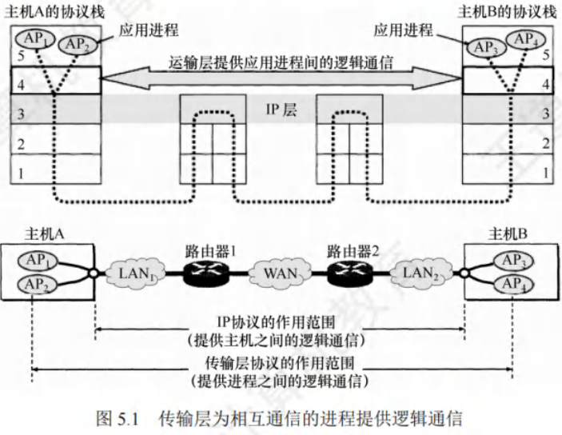

#### 应用进程之间的逻辑通信

从网络层看，通信双方是两台主机，IP数据报首部给出主机IP地址。但“两台主机之间的通信”**实质是两台主机中应用进程之间的通信**，又称**端到端的逻辑通信**。IP协议能把分组送到目的主机网络层，但未交付给主机中的进程。

从传输层看，通信**真正端点是主机中的进程**，而非主机。

#### 复用和分用

- **复用**：发送方不同应用进程可使用同一个传输层协议传送数据。
- **分用**：接收方传输层剥去报文首部后，能将数据正确交付到目的应用进程。

网络层也有复用和分用功能，但网络层复用指发送方不同协议数据可封装成IP数据报发送，分用指接收方网络层剥去首部后将数据交付给相应协议。

#### 检错检测

传输层要对收到的报文（首部和数据部分)进行差错检测。
- **TCP协议**：接收方发现报文段出错，**要求发送方重发该报文段**。
- **UDP协议**：接收方发现数据报出错，**直接丢弃**。

网络层IP数据报首部中的检验和字段只检验首部是否出错，不检查数据部分。

#### 提供面向连接和无连接的传输协议

传输层向高层用户屏蔽了低层网络核心细节，使应用进程看到两个传输层实体间好像有端到端逻辑通信信道，该信道因传输层协议不同表现不同。
- **TCP协议**：面向连接，即便下层网络不可靠，此逻辑通信信道相当于全双工可靠信道。
- **UDP协议**：无连接，此逻辑通信信道是不可靠信道。

网络层**无法同时实现两种协议**（网络层要么只提供面向连接服务，如虚电路；要么只提供无连接服务，如数据报)。 

### 传输层的寻址与端口

#### 端口的作用

端口使得应用层进程能将数据通过端口交付给传输层，也让传输层知晓应将报文段数据通过端口交付给应用层的相应进程。

端口在传输层的作用类似IP地址在网络层的作用，**IP地址标识主机，端口标识主机中的应用进程**。

#### 端口号

应用进程通过端口号标识，端口号长度16比特，可表示$65536(2^{16})$个不同端口号。端口号仅具本地意义，即只标识本计算机应用层的进程，不同计算机相同端口号无关联。按端口号范围分为两类：
1. **服务器端使用的端口号**：
    - **熟知端口号**：数值$0 - 1023$，IANA（互联网地址指派机构)将其指派给TCP/IP重要应用程序，供所有用户知晓。
    - **登记端口号**：数值$1024 - 49151$，供无熟知端口号的应用程序使用，使用需在IANA登记防重复。

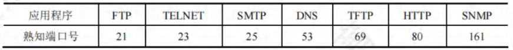

2. **客户端使用的端口号**：数值$49152 - 65535$。这类端口号在客户进程运行时动态选择，又称短暂端口号。服务器进程收到客户进程报文，知晓其端口号后可回发数据。通信结束，用过的客户端端口号可被其他客户进程使用。

#### 套接字

网络中用IP地址标识不同主机，端口号标识一台主机中的不同应用进程，**端口号拼接到IP地址构成套接字（Socket)**。

网络采用发送方和接收方的套接字识别端点，套接字即一个通信端点，公式为：**套接字(Socket)=(IP地址:端口号)**，它唯一标识网络中一台主机上的一个应用进程。

网络通信中，主机A发给主机B的报文含目的和源端口号，源端口号是“返回地址”一部分，主机B回发报文时，目的端口号是主机A发往主机B报文中的源端口号（完整返回地址是主机A的IP地址和源端口号)。

### 无连接服务与面向连接服务

TCP/IP协议族在IP层之上使用两个传输协议：
 - **面向连接的传输控制协议(TCP)**：传输层向上提供**全双工的可靠逻辑信道**。
   - TCP提供面向连接的可靠服务，通信前先建立连接，基于此进行可靠数据传输，结束后释放连接。不提供广播或多播服务。
   - 为实现可靠传输，增加确认、流量控制、计时器及连接管理等措施，导致协议数据单元首部增大，占用较多处理机资源。
   - **适用于可靠性要求高的场合**，如文件传输协议(FTP)、超文本传输协议(HTTP)、远程登录(TELNET)等。

 - **无连接的用户数据报协议(UDP)**：传输层向上提供**不可靠的逻辑信道**。
   - UDP提供无连接的不可靠服务，通信前无需建立连接，接收方收到UDP用户数据报后无需给发送方确认。
   - 在IP层之上仅提供多路复用和数据错误检查。因简单，执行速度快、实时性好。
   - **适用于实时性要求高的应用**，如小文件传送协议(TFTP)、DNS、SNMP和实时传输协议(RTP)。

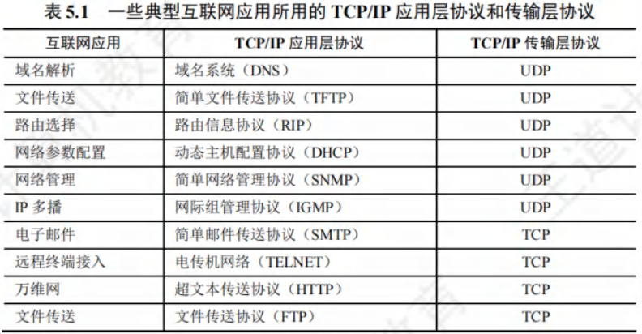

1. **IP数据报和UDP数据报的区别**：
   1. IP数据报在网络层经路由器存储转发；
   2. UDP数据报在传输层端到端逻辑信道传输，封装成IP数据报在网络层传输时，其信息对路由器不可见。

2. **TCP和网络层虚电路的区别**：
   1. TCP报文段在传输层抽象逻辑信道传输，对路由器不可见；
   2. 虚电路所经交换结点需保存虚电路状态信息。
   3. 网络层采用虚电路方式无法提供无连接服务，而传输层采用TCP不影响网络层提供无连接服务。 

## UDP

### UDP数据报

#### UDP概述

UDP仅在IP层的数据报服务之上**增加了复用、分用以及差错检测功能**。

##### UDP优点

1. **无需建立连接**：不会引入建立连接的时延。
2. **无连接状态**：TCP需在端系统维护连接状态，包括接收和发送缓存、拥塞控制参数及序号与确认号参数等。而UDP既不维护连接状态，也不跟踪这些参数，使得专用服务器使用UDP时能支持更多活动客户机。
3. **首部开销小**：TCP首部开销20B，UDP仅有8B。
4. **无拥塞控制**：网络拥塞不影响源主机发送速率。一些实时应用要求源主机稳定速率发送数据，能容忍部分数据丢失，但不容许较大时延。
5. **支持多种交互通信**：支持一对一、一对多、多对一和多对多的交互通信。

UDP常用于一次性传输较少数据的网络应用，如DNS、SNMP等，因其若采用TCP，连接创建、维护和拆除开销较大。UDP也常用于多媒体应用，如IP电话、实时视频会议、流媒体等，这些应用对可靠数据传输要求不高，但不能容忍TCP拥塞控制导致的较大延迟。

**UDP不保证可靠交付，但应用对数据可靠性要求可由用户在应用层完成**。UDP是面向报文的，发送方UDP对应用层交下来的报文添加首部后交付给IP层，一次发送一个报文，不合并、不拆分，保留报文边界；接收方UDP对IP层交上来的UDP数据报去除首部后原封不动交付给上层应用进程，一次交付一个完整报文。报文不可分割，是UDP数据报处理的最小单位，应用程序需选择合适报文大小，否则可能降低IP层效率。

#### UDP的首部格式

UDP数据报由首部字段和用户数据字段组成。UDP首部8B，由4个2B字段组成，各字段意义如下：
1. **源端口**：源端口号，需要对方回信时选用，不需要时可用全0。
2. **目的端口**：目的端口号，用于终点交付报文。
3. **长度**：UDP数据报长度（含首部和数据)，最小值为8（仅有首部)。
4. **检验和**：检测UDP数据报传输是否有错，有错丢弃。该字段可选，源主机不想计算检验和时，令该字段为全0。

传输层从IP层收到UDP数据报，根据首部目的端口，将UDP数据报通过相应端口上交应用进程。若接收方UDP发现目的端口号不正确，丢弃报文，**并由ICMP发送“端口不可达”差错报文给发送方**。

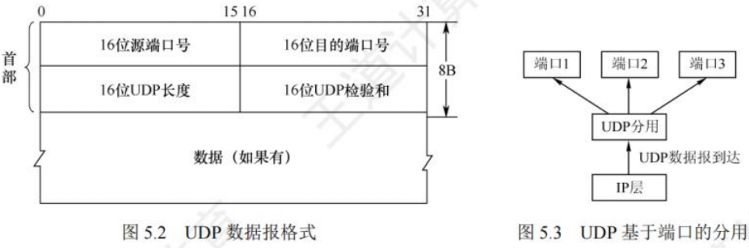

### UDP检验

计算检验和时，在UDP数据报前增加12B伪首部，伪首部并非UDP真正首部，仅用于计算检验和，不向下传送也不向上递交。

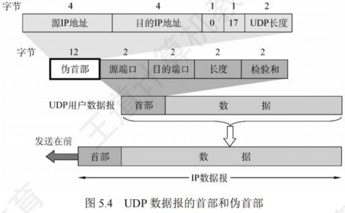

UDP计算检验和方法与IP数据报首部检验和方法相似，但IP数据报检验和只检验首部，UDP检验和需将首部和数据一起检验。具体计算方法为：
- **发送方**：先将全0放入检验和字段并添加伪首部，把UDP数据报视为16位字串接起来，若数据部分不是偶数个字节，末尾填入一个全0字节（不发送)，按二进制反码计算这些16位字的和，将和的二进制反码写入检验和字段后发送。
- **接收方**：收到UDP数据报加上伪首部（数据部分非偶数个字节时补上全0字节)，按二进制反码求这些16位字的和，无差错时结果应为全1，否则表明有差错，接收方应丢弃该UDP数据报。

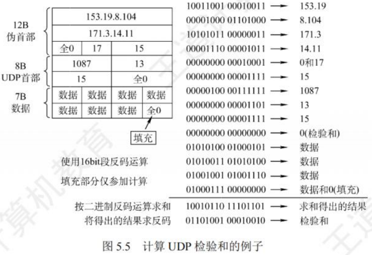

**总结**：
1. 检验时，UDP数据报部分长度非偶数字节需填全0字节，此字节和伪首部一样不发送。
2. 若UDP检验和检测出数据报错误，可丢弃或交付上层并附上错误报告。
3. 通过伪首部可检查源端口号、目的端口号、UDP用户数据报数据部分以及IP数据报的源IP地址和目的地址。此差错检验方法简单、处理速度快，但校错能力不强。 

## TCP

### TCP的特点

TCP是在不可靠的IP层之上实现可靠数据传输的协议，主要解决传输的可靠、有序、无丢失和不重复问题，是TCP/IP体系中较为复杂的协议，具有以下特点：
1. **面向连接**：TCP连接是一条逻辑连接。
2. **一对一连接**：每一条TCP连接仅有两个端点，只能是一对一的。
3. **可靠交付**：保证传送的数据无差错、不丢失、不重复且有序。
4. **全双工通信**：允许通信双方应用进程随时发送数据。为此，TCP连接两端都设有发送缓存和接收缓存，用于临时存放双向通信的数据。
    - **发送缓存**：暂存发送应用程序传送给发送方TCP准备发送的数据，以及TCP已发送但尚未收到确认的数据。
    - **接收缓存**：暂存按序到达但尚未被接收应用程序读取的数据，以及不按序到达的数据。
5. **面向字节流**：虽然应用程序与TCP交互是以数据块（大小不等)进行，但TCP将应用程序交下来的数据视为一连串无结构的字节流。

TCP和UDP发送报文方式不同，UDP报文长度由发送应用进程决定，而TCP报文长度依据接收方给出的窗口值和当前网络拥塞程度确定。若应用进程传送到TCP缓存的数据块太长，TCP会将其划分得短一些再传送；若太短，TCP会等到积累足够多字节后再构成报文段发送。

### TCP报文段

**TCP传送的数据单元为报文段**，既用于运载数据，也用于建立连接、释放连接和应答。一个TCP报文段由首部和数据两部分组成，整个TCP报文段作为IP数据报的数据部分封装在IP数据报中。其首部前20B固定，后面有4N字节根据需要增加的选项，长度为4B的整数倍。

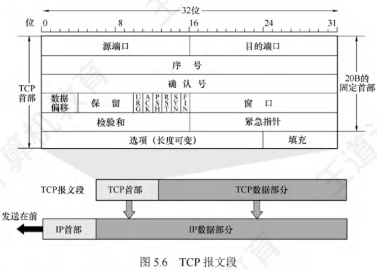

#### TCP的功能体现在首部各字段，各字段意义：

1. **源端口和目的端口**：各占2B，分别表示发送方和接收方使用的端口号。
2. **序号**：占4B，范围$0～2^{32}-1$ ，共$2^{32}$个序号。TCP连接中传送字节流的每个字节都按顺序编号，序号字段值指本报文段所发送数据的第一个字节的序号。例如，报文段序号字段值是301，携带数据100B，则该报文段数据最后一个字节序号是400，下一个报文段数据序号从401开始。
3. **确认号**：占4B，是期望收到对方下一个报文段的第一个数据字节的序号。若确认号为N，则表明到序号N - 1为止的所有数据都已正确收到。例如，B正确收到A发送的序号字段为501，数据长度200B（序号501 - 700)的报文段，表明B正确收到A发送到序号700为止的数据，B期望收到A的下一个数据序号是701，B在发送给A的确认报文段中把确认号置为701。
4. **数据偏移（首部长度)**：占4位，不是IP数据报分片的那个数据偏移，而是表示首部长度（首部中含长度不确定的选项字段)，指出TCP报文段的数据起始处距离TCP报文段起始处有多远。“数据偏移”单位是32位（以4B为计算单位)，4位二进制数能表示的最大值为15，所以TCP首部最大长度为60B。
5. **保留**：占6位，保留为今后使用，目前应置为0。
6. **紧急位URG**：当URG = 1时，表明紧急指针字段有效，告知系统此报文段中有紧急数据，应尽快传送（相当于高优先级数据)。紧急数据插入到报文段数据最前面，需与首部中的紧急指针字段配合使用。
7. **确认位ACK**：仅当ACK = 1时确认号字段才有效，ACK = 0时，确认号无效。TCP规定，连接建立后所有传送的报文段都必须把ACK置1。
8. **推送位PSH**：两个应用进程交互式通信时，希望键入命令后立即收到对方响应，此时发送方TCP把PSH置1，接收方TCP收到PSH = 1的报文段后，尽快交付给接收应用进程，而不再等整个缓存填满后再向上交付。
9. **复位位RST**：当RST = 1时，表示TCP连接出现严重差错（如主机崩溃等)，必须释放连接，然后重新建立传输连接。也可用于拒绝一个非法的报文段。
10. **同步位SYN**：当SYN = 1时表示这是一个连接请求或连接接受报文。
    1. 当SYN = 1，ACK = 0时，表明是连接请求报文，
    2. 若对方同意建立连接，则应在响应报文中使用SYN = 1，ACK = 1。

11. **终止位FIN**：用于释放一个连接。当FIN = 1时，表明此报文段的发送方数据已发送完毕，并要求释放传输连接。
12. **窗口**：占2B，范围$0～2^{16}-1$ 。窗口值告知对方，从本报文段首部中的确认号算起，接收方目前允许对方发送的数据量（以字节为单位)。接收方数据缓存空间有限，窗口值作为接收方让发送方设置其发送窗口的依据。例如，确认号是701，窗口字段是1000，表明从701号算起，发送此报文段的一方还有接收1000字节数据（字节序号为701 - 1700)的接收缓存空间。
13. **检验和**：占2B，检验范围包括首部和数据两部分。计算检验和时，和UDP一样，要在TCP报文段前面加上12B的伪首部（**只需将UDP伪首部的协议字段的17改成6，UDP长度字段改成TCP长度，其他与UDP相同**)。
    1. **紧急指针**：占2B，仅在URG = 1时有意义，指出本报文段中的紧急数据的字节数（紧急数据在报文段数据最前面)，即便窗口为零也可发送紧急数据。`

14. **选项**：长度可变，最长可达40B。不使用选项时，TCP首部长度是20B。TCP最初规定的一种选项是最大报文段长度（MSS)，MSS是TCP报文段中数据字段的最大长度（仅指数据字段)。
15. **填充**：使整个首部长度是4B的整数倍。 

### TCP连接管理

TCP是面向连接的协议，每个TCP连接有**连接建立、数据传送和连接释放**三个阶段 。TCP连接管理确保运输连接的建立和释放正常进行。

在TCP连接建立过程中，需解决以下三个问题：
1. 让每一方能确知对方的存在。
2. 允许双方协商一些参数（如最大窗口值、是否使用窗口扩大选项、时间戳选项等)。
3. 能够对运输实体资源（如缓存大小、连接表中的项目等)进行分配。

TCP将连接作为基本抽象，每条TCP连接有两个端点，端点即套接字（Socket) 。**每一条TCP连接唯一地由通信的两个端点（即两个套接字)确定**。需注意，同一个IP地址可有多个不同的TCP连接，同一个端口号也可出现在多个不同的TCP连接中。

TCP连接的建立采用客户/服务器模式。**主动发起连接建立的应用进程称为客户（Client)，被动等待连接建立的应用进程称为服务器（Server)**。

#### TCP连接的建立(三次握手过程)

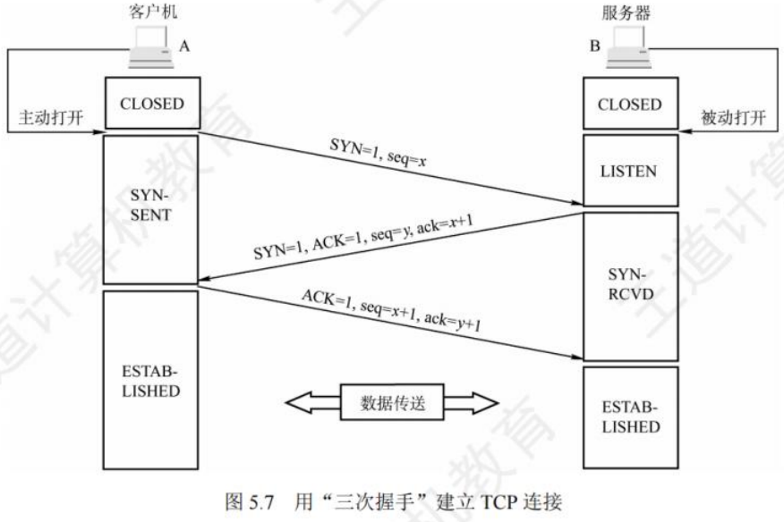

TCP连接的建立需经历三个步骤，通常称为“三次握手”，具体过程如下：  

##### 连接建立前的状态
- 服务器处于 **LISTEN（收听)** 状态，持续等待客户端的连接请求。  

##### 第一步：客户端发送连接请求
- 客户端的TCP向服务器的TCP发送**连接请求报文段**，报文段首部特性：  
  - 同步位 **SYN = 1**（表示这是一个连接请求)；  
  - 选择初始序号 **seq = x**（客户端自身的起始序号)。  
- 注意：SYN报文段**不能携带数据**，但会消耗一个序号（即x会被占用)。  
- 发送后，客户端进入 **SYN-SENT（同步已发送)** 状态。  

##### 第二步：服务器回应确认
- 服务器的TCP收到连接请求后，若同意建立连接，会向客户端发回**确认报文段**，报文段首部特性：  
  - 同步位 **SYN = 1** 且确认位 **ACK = 1**（表示同意连接并确认收到请求)；  
  - 确认号 **ack = x + 1**（对客户端初始序号x的确认，即期望下次收到x+1)；  
  - 服务器自身选择初始序号 **seq = y**。  
- 注意：该确认报文段**不能携带数据**，且会消耗一个序号（即y会被占用)。  
- 发送后，服务器进入 **SYN-RCVD（同步收到)** 状态。  

##### 第三步：客户端再次确认  
- 客户端收到服务器的确认报文段后，向服务器发送**最终确认报文段**，报文段首部特性：  
  - 确认位 **ACK = 1**；  
  - 确认号 **ack = y + 1**（对服务器初始序号y的确认，即期望下次收到y+1)；  
  - 序号 **seq = x + 1**（客户端序号递增，延续第一步的x)。  
- 注意：该报文段**可以携带数据**；若不携带数据，则不消耗序号。  
- 发送后，客户端进入 **ESTABLISHED（已建立连接)** 状态。  

##### 连接建立完成
- 服务器收到客户端的最终确认后，也进入 **ESTABLISHED（已建立连接)** 状态。  
- 至此，TCP连接成功建立，双方可开始传输应用层数据。  

##### 后续通信特性
TCP提供**全双工通信**，连接建立后，通信双方的应用进程可在任何时候向对方发送数据。

#### TCP连接的释放(四次挥手)

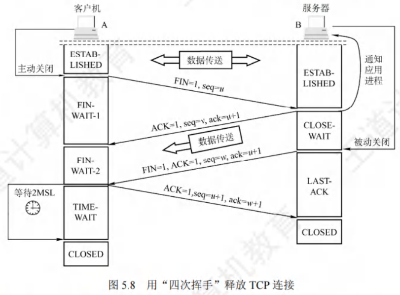

TCP连接的释放可由参与连接的任意一方发起，通常称为“四次挥手”，具体步骤如下：  

##### 第一步：客户端发起连接释放请求  
- 客户端打算关闭连接时，向其TCP发送**连接释放报文段**，并停止发送数据（主动关闭连接)。报文段特性：  
  - 终止位 **FIN = 1**（表示请求释放连接)；  
  - 序号 **seq = u**（u为客户端已传数据最后一字节序号+1)。  
- 注意：FIN报文段**即使不携带数据，也会消耗一个序号**（u被占用)。  
- 发送后，客户端进入 **FIN-WAIT-1（终止等待1)** 状态。  
- 由于TCP是全双工通信，此操作仅关闭客户端到服务器的单向数据通路，服务器仍可向客户端发送数据。  

##### 第二步：服务器确认客户端的释放请求  
- 服务器收到连接释放报文段后，立即发出**确认报文段**，特性：  
  - 确认位 **ACK = 1**；  
  - 确认号 **ack = u + 1**（对客户端序号u的确认)；  
  - 序号 **seq = v**（v为服务器已传数据最后一字节序号+1)。  
- 发送后，服务器进入 **CLOSE-WAIT（关闭等待)** 状态。  
- 此时，**客户端到服务器的连接已释放**（半关闭状态)，但服务器仍可向客户端发送数据。  
- 客户端收到确认后，进入 **FIN-WAIT-2（终止等待2)** 状态，等待服务器的连接释放请求。  

##### 第三步：服务器发起连接释放请求  
- 若服务器无更多数据发送，向客户端发送**连接释放报文段**，特性：  
  - 终止位 **FIN = 1** 且确认位 **ACK = 1**；  
  - 序号 **seq = w**（w可能包含半关闭状态下服务器新增发送的数据的最后序号+1)；  
  - 重复确认号 **ack = u + 1**（与第二步一致)。  
- 发送后，服务器进入 **LAST-ACK（最后确认)** 状态，等待客户端的最终确认。  

##### 第四步：客户端确认服务器的释放请求  
- 客户端收到服务器的释放报文段后，发出**最终确认报文段**，特性：  
  - 确认位 **ACK = 1**；  
  - 确认号 **ack = w + 1**（对服务器序号w的确认)；  
  - 序号 **seq = u + 1**（延续客户端的序号)。  
- 发送后，客户端进入 **TIME-WAIT（时间等待)** 状态，需等待 **2MSL（最长报文段寿命)** 后才进入 **CLOSED（连接关闭)** 状态。  
- 服务器收到最终确认后，立即进入 **CLOSED** 状态。  

##### 释放时间说明  
- 若服务器无额外数据发送，客户端释放连接的最短时间为 **1RTT + 2MSL**（从发出FIN开始计算)；  
- 服务器释放连接的最短时间为 **1.5RTT**。  

##### 相关计时器  
- **时间等待计时器**：用于客户端在TIME-WAIT状态等待2MSL，确保服务器能收到最终确认，避免残留报文干扰新连接。  
- **保活计时器**：若客户端意外故障，服务器可通过该计时器检测连接失效，避免长期空等。  

#### TCP连接建立与释放的核心总结  
| 过程       | 步骤 | 报文段关键标识                                                                 |
|------------|------|------------------------------------------------------------------------------|
| **建立连接（三次握手)** | 1    | SYN = 1, seq = x                                                           |
|            | 2    | SYN = 1, ACK = 1, seq = y, ack = x + 1                                      |
|            | 3    | ACK = 1, seq = x + 1, ack = y + 1                                            |
| **释放连接（四次挥手)** | 1    | FIN = 1, seq = u                                                           |
|            | 2    | ACK = 1, seq = v, ack = u + 1                                              |
|            | 3    | FIN = 1, ACK = 1, seq = w, ack = u + 1                                      |
|            | 4    | ACK = 1, seq = u + 1, ack = w + 1                                            |

### TCP可靠传输

TCP在不可靠的IP层之上构建可靠数据传输服务，确保接收方从缓存区读出的字节流与发送方发出的字节流完全一致。TCP借助**检验、序号、确认和重传等机制**达成可靠数据传输服务，其中检验机制与UDP相同。

#### 序号

TCP首部的**序号字段用于保障数据能有序**提交给应用层。TCP将数据视作无结构但有序的字节流，序号基于传送的字节流设定，而非报文段。

TCP连接传送的数据流中每个字节都有编号，序号字段值指本报文段所发送数据的第一个字节序号。例如，假设A和B建立TCP连接，A的发送缓冲区有10B，从0开始编号，第一个报文段含第0 - 2个字节，该TCP报文段序号就是0，第二个报文段序号为3。

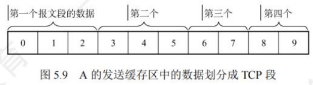

#### 确认

TCP首部的**确认号是期望收到对方下一个报文段数据的第一个字节序号**。如在上述例子中，若接收方B已收到第一个报文段数据，此时B期望收到的下一个报文段数据从第3个字节开始，那么B发送给A的报文段中确认号字段应为3。发送方缓存区会留存已发送但未确认的报文段，以备重传。

TCP**默认采用累积确认**，即TCP只确认数据流中至第一个丢失字节为止的字节。例如，接收方B收到A发送的包含字节0 - 2及字节6 - 7的报文段，因某些原因未收到字节3 - 5的报文段，此时B仍在等待字节3及其后续字节，所以B发给A的下一个报文段会将确认号字段置为3。

#### 重传

导致TCP重传报文段的事件有两种：超时和冗余ACK。
- **超时**：
  - TCP每发送一个报文段，就为其设置一个超时计时器。**若计时器设定的重传时间到期仍未收到确认，就重传该报文段。**
  - 由于TCP下层是复杂的互联网环境，IP数据报路由变化大，传输层往返时延方差也大。为计算超时计时器的重传时间，TCP采用自适应算法，记录报文段发出时间与收到相应确认的时间，二者之差即报文段的往返时间（RTT)。TCP维护RTT的加权平均往返时间RTTS，其会随新测量RTT样本值变化。
  - 超时计时器设置的超时重传时间（RTO)应略大于RTTS，但不能过大，否则报文段丢失时，TCP不能快速重传，导致数据传输时延增大。

- **冗余ACK（冗余确认)**：
  - 超时触发重传存在超时周期过长的问题。不过，发送方通常能在超时事件发生前，通过冗余ACK较好地检测丢包情况。
  - 冗余ACK是对某个报文段再次确认的ACK，而发送方此前已收到过该报文段的确认。例如，发送方A发送序号为1、2、3、4、5的TCP报文段，2号报文段在链路中丢失，未到达接收方B，3、4、5号报文段对B来说就是失序报文段。
  - TCP规定，每当比期望序号大的失序报文段到达，就发送一个冗余ACK，指明下一个期待字节的序号。
  - 在此例中，3、4、5号报文段到达B，但非B期望的下一个报文段，于是B发送3个对1号报文段的冗余ACK，表示期望接收2号报文段。
  - TCP规定，当发送方收到对同一个报文段的3个冗余ACK时，就认为跟在这个被确认报文段之后的报文段已丢失。
  - 在此例中，当A收到对1号报文段的3个冗余ACK时，可认为2号报文段已丢失，此时发送方A立即重传2号报文段，这种技术称为快速重传。

### TCP流量控制

流量控制旨在**使发送方发送速率与接收方接收速率匹配**，确保接收方来得及接收，可视为一种速度匹配服务。

TCP利用**滑动窗口机制实现流量控制**。

- TCP要求发送方维持一个接收窗口（`rwnd`)，接收方依据当前接收缓存大小动态调整接收窗口大小，该大小反映接收方容量，并将其置于TCP报文段首部的“窗口”字段通知发送方。发送方的发送窗口不能超过接收方给出的接收窗口值，以此限制发送方向网络注入报文的速率。

- 假设数据仅从A发往B，B仅向A发送确认报文段，B可通过设置确认报文段首部的窗口字段将`rwnd`通知给A。`rwnd`即接收方允许连续接收的能力，单位为字节。发送方A始终依据最新收到的`rwnd`值限制自身发送窗口大小，将未确认的数据量控制在`rwnd`范围内，防止A使B的接收缓存溢出。

- TCP为每个连接设置一个持续计时器，一旦发送方收到对方的零窗口通知，就启动该计时器。若计时器超时，发送一个零窗口探测报文段，对方在确认此探测报文段时给出当前窗口值。若窗口仍为零，发送方收到确认报文段后重新设置持续计时器。

**传输层和数据链路层流量控制的区别**在于：

- 传输层实现端到端（两个进程之间)的流量控制；
- 数据链路层实现两个相邻中间结点之间的流量控制。数据链路层滑动窗口协议的窗口大小不能动态变化，而传输层的窗口大小可动态变化。 

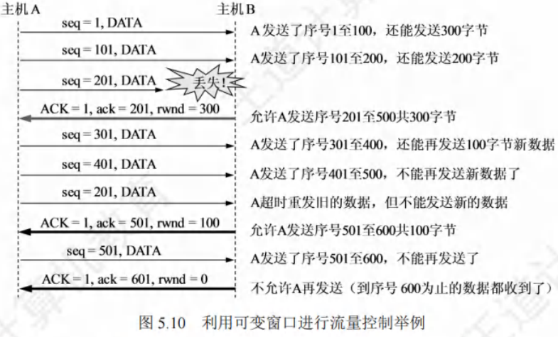

### TCP拥塞控制

拥塞控制旨在**防止过多数据注入网络**，确保网络中的路由器或链路不会过载。出现拥塞时，端点感受到的往往是通信时延增加。

**拥塞控制与流量控制的区别**：

- 拥塞控制是全局性过程，涉及所有主机、路由器及影响网络传输性能的因素，目的是让网络承受现有负荷；
- 流量控制是端到端问题，由接收端控制发送端，抑制发送端速率使接收端能及时接收。二者相似之处在于都通过控制发送方速率达到控制效果。
- 例如，大型机向PC高速传送文件，可能需流量控制；众多PC同时在链路传输文件，可能面临拥塞控制问题。

**TCP拥塞控制算法**有四种：**慢开始**、**拥塞避免**、**快重传**和**快恢复**。

- 发送方确定发送速率时，需兼顾接收方能力与网络拥塞情况。
  - 除接收窗口，TCP要求发送方维持一个**拥塞窗口（`cwnd`)**，其大小依网络拥塞程度动态变化。
  - 发送方控制拥塞窗口原则为：网络未拥塞时增大`cwnd`以提高利用率；网络拥塞时减小`cwnd`以缓解拥塞。
  - 发送窗口上限值取接收窗口`rwnd`和拥塞窗口`cwnd`中的较小值，即**发送窗口的上限值 = min[`rwnd`, `cwnd`]**。
  - 接收窗口大小由TCP报文首部窗口字段通知发送方，而拥塞窗口的维护由慢开始和拥塞避免算法实现。
  - 假设数据单向传送，对方只传确认报文，且接收方缓存足够大，发送窗口大小由网络拥塞程度决定，以下采用最大报文段长度MSS作为拥塞窗口大小单位。

#### 慢开始和拥塞避免

1. **慢开始算法**：
   - 发送方初发数据时，因不清楚网络负荷，先少量发送探测。
   - 若未拥塞，适当增大拥塞窗口（即发送窗口)，从较小值逐渐增大。例如，A向B发送数据，初始令`cwnd` = 1（1个MSS)，A发送第一个报文段，收到B确认后，`cwnd`增至2，接着发送两个报文段，收到确认后，`cwnd`增至4，以此类推。
   - 慢开始的“慢”并非指`cwnd`增长速率慢，而是初始设置`cwnd` = 1，减少初始注入网络的报文段，试探网络拥塞情况，之后逐渐增大`cwnd`，预防网络拥塞。
   - 使用慢开始算法，每经过一个传输轮次（往返时延RTT)，`cwnd`加倍，即指数增长。为防`cwnd`过大引发拥塞，设置**慢开始门限`ssthresh`**。
   - 当`cwnd`增大到`ssthresh`时，改用拥塞避免算法。
2. **拥塞避免算法**：
   - 让拥塞窗口`cwnd`缓慢增大，每经过一个往返时延RTT，`cwnd`加1，而非加倍，按线性规律增长，比慢开始算法增长速率慢。
3. **网络拥塞的处理**：
   - 无论慢开始还是拥塞避免阶段，若发送方判断网络拥塞（未按时收到确认)，先**将慢开始门限`ssthresh`设为拥塞时`cwnd`值的一半（不小于2)**，再将`cwnd`重新设为1，执行慢开始算法。
   - 目的是快速减少主机发送到网络的分组数，使拥塞路由器有时间处理积压分组。

- 慢开始和拥塞避免算法使用“乘法减小”和“加法增大”方法。
  - “乘法减小”指出现超时（可能拥塞)时，将`ssthresh`设为当前`cwnd`一半（执行慢开始算法)，网络频繁拥塞时，`ssthresh`快速下降，减少注入网络分组数；
  - “加法增大”指执行拥塞避免算法后，经过一个RTT收到所有报文段确认，`cwnd`增加一个MSS大小，使`cwnd`缓慢增大，防止网络过早拥塞。
  - 拥塞避免不能完全避免拥塞，只是在拥塞避免阶段让`cwnd`按线性规律增长，降低拥塞可能性。

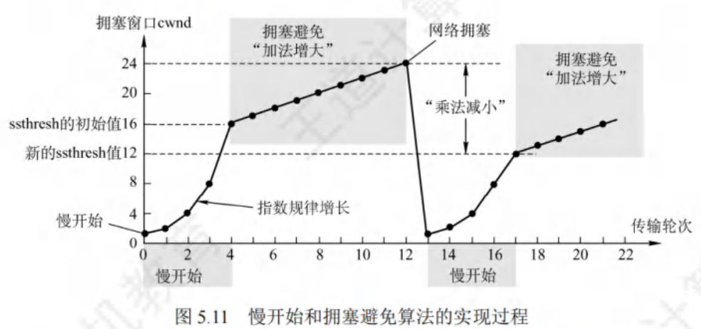

#### 快重传和快恢复

1. **快重传**：
   - 个别报文段丢失但网络未拥塞时，若发送方因未及时收到确认而超时，会误判网络拥塞启动慢开始算法，降低传输效率。
   - 快重传算法让发送方尽快重传，不等超时计时器超时。
   - 接收方不等自己发送数据时捎带确认，而是立即发送确认，收到失序报文段也立即发出对已收到报文段的重复确认。
   - 发送方连续收到3个冗余ACK（重复确认)时，立即重传相应报文段。
2. **快恢复**：
   - 发送方连续收到3个冗余ACK时，执行“乘法减小”，将**慢开始门限`ssthresh`调整为当前`cwnd`的一半**，预防网络拥塞。
   - 但此时发送方认为网络可能未严重拥塞，所以与慢开始算法不同，**将`cwnd`值也调整为当前`cwnd`的一半（等于`ssthresh`值)**，然后执行拥塞避免算法（“加法增大”)，使拥塞窗口缓慢线性增大，跳过`cwnd`从1起始的慢开始过程，因此称为快恢复。

- 四种算法同时应用于TCP拥塞控制机制。
  - TCP连接建立和网络超时时，采用慢开始和拥塞避免算法（`ssthresh` = `cwnd` / 2, `cwnd` = 1)；
  - 发送方收到3个冗余ACK时，采用快重传和快恢复算法（`ssthresh` = `cwnd` / 2, `cwnd` = `ssthresh`)。
  - 流量控制中，发送方发送量由接收方决定；
  - 拥塞控制中，由发送方检测网络状况决定。
  - 发送方发送窗口大小由流量控制和拥塞控制共同决定，当同时出现接收窗口（`rwnd`)和拥塞窗口（`cwnd`)时，发送方发送窗口实际大小取`rwnd`和`cwnd`中较小值。 

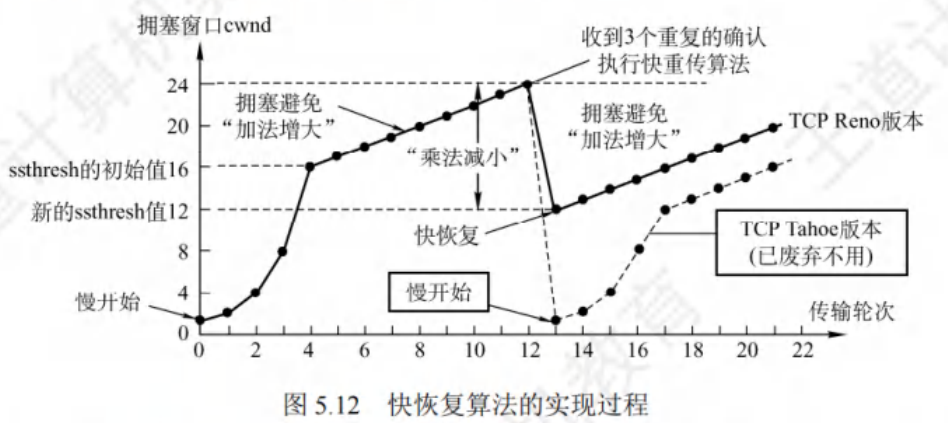

