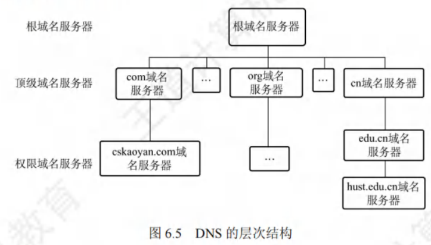
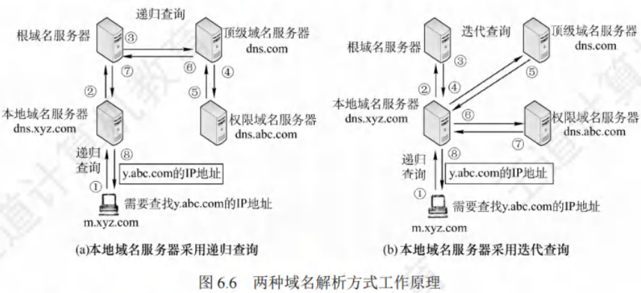

# 域名系统

[toc]

域名系统（Domain Name System, DNS）是因特网使用的命名系统，用于将便于人们记忆的、具有特定含义的主机名转换为便于机器处理的IP地址 。

相较于IP地址，人们更倾向于使用有特定含义的字符串标识因特网上的计算机。**DNS系统采用客户/服务器模型，协议运行在UDP之上，使用53号端口**。

从概念上，DNS可分为三部分：层次域名空间、域名服务器、解析器。

## 层次域名空间

因特网采用层次树状结构的命名方法。任何连接到因特网的主机或路由器，都有唯一的层次结构名称，即域名（Domain Name）。

域（Domain）是名字空间中一个可被管理的划分，域可进一步划分为子域，从而形成顶级域、二级域、三级域等。

每个域名由标号序列组成，标号之间用点（"."）隔开。例如，王道论坛（www.cskaoya.com）用于提供WWW服务的服务器域名由三个标号组成，其中标号`com`是顶级域名，标号`cskaoyan`是二级域名，标号`www`是三级域名。

关于域名中的标号，注意事项如下：
- **大小写不敏感**：标号中的英文不区分大小写。
- **标点符号限制**：标号中除连字符（-）外不能使用其他标点符号。
- **长度限制**：每个标号不超过63个字符，多标号组成的完整域名最长不超过255个字符。
- **书写顺序**：级别最低的域名写在最左边，级别最高的顶级域名写在最右边。

**顶级域名（Top Level Domain, TLD）分为三大类**：
- **国家（地区）顶级域名（nTLD）**：代表国家和某些地区的域名，如".cn"表示中国，".us"表示美国，".uk"表示英国。
- **通用顶级域名（gTLD）**：常见的有".com"（公司）、".net"（网络服务机构）、".org"（非营利性组织）、".edu"（教育机构）、".gov"（国家或政府部门）等。
- **基础结构域名（arpa）**：用于反向域名解析，即把IP地址反向解析为域名。

## 域名服务器

域名到IP地址的解析由运行在域名服务器上的程序完成。一个服务器所负责管辖（或有权限）的范围称为区（小于或等于“域”），一个区中的所有结点必须连通，每个区设置相应的权限域名服务器，保存该区中所有主机的域名到IP地址的映射。

每个域名服务器既能进行部分域名到IP地址的解析，还需具备联系其他域名服务器的信息，以便在自身无法转换时，知晓应前往何处查找其他域名服务器。

**DNS使用大量域名服务器，以层次方式组织，不存在拥有因特网上所有主机映射的单一域名服务器，该映射分布在所有域名服务器上。**

**有4种类型的域名服务器**：

1. **根域名服务器**：是最高层次的域名服务器，知晓所有顶级域名服务器的域名和IP地址，至关重要。本地域名服务器若无法解析域名，首先求助于根域名服务器。因特网上有13个根域名服务器，每个“服务器”实际是冗余服务器的集群，以保障安全性和可靠性。根域名服务器管辖顶级域（如.com），通常不直接将待查询域名转换为IP地址，而是告知本地域名服务器下一步应查找的顶级域名服务器。
2. **顶级域名服务器**：负责管理在该顶级域名服务器注册的所有二级域名。收到DNS查询请求时，给出相应回答（可能是最终结果，也可能是下一步应查找的域名服务器的IP地址）。
3. **权限域名服务器（授权域名服务器）**：每台主机都需在权限域名服务器处登记，为确保可靠工作，一台主机最好至少有两个权限域名服务器。许多域名服务器同时充当本地域名服务器和权限域名服务器，权限域名服务器总能将其管辖的主机名转换为该主机的IP地址。
4. **本地域名服务器**：对域名系统十分重要。每个因特网服务提供者（ISP）、大学，甚至大学的各个系，都可拥有一个本地域名服务器。主机发出DNS查询请求时，查询请求报文发送给该主机的本地域名服务器。例如在Windows系统中配置“本地连接”时填写的DNS地址，就是本地DNS（域名服务器）的地址。 

## 域名解析过程

域名解析，即把域名转化为IP地址的过程。当客户端需要域名解析时，通过本机的DNS客户端构造一个DNS请求报文，并以UDP数据报方式发往本地域名服务器。

域名解析存在两种方式：递归查询和迭代查询。

1. **主机向本地域名服务器的查询采用递归查询**
递归查询指，若主机所询问的本地域名服务器不知道被查询域名的IP地址，那么本地域名服务器会以DNS客户的身份，向根域名服务器继续发出查询请求报文（即代替该主机继续查询），而非让主机自行进行下一步查询。两种查询方式在此步骤是相同的。

2. **本地域名服务器向其他域名服务器采用递归查询或迭代查询**
    - **递归查询过程**：如图6.6(a)所示，本地域名服务器仅向根域名服务器查询一次，后续几次查询递归地在其他几个域名服务器之间进行（步骤3 - 6）。在步骤7中，本地域名服务器从根域名服务器获取所需的IP地址，最后在步骤8中，本地域名服务器将查询结果告知发起查询的主机。由于该方法会给根域名服务器带来过大负载，实际中几乎不被使用。
    - **迭代查询过程**：本地域名服务器向根域名服务器的查询通常采用迭代查询。当根域名服务器收到本地域名服务器发出的迭代查询请求报文时，有两种处理方式：直接给出所要查询的IP地址，告知本地域名服务器下一步应查询的顶级域名服务器。随后由本地域名服务器自行进行后续查询（而非根域名服务器代劳），顶级域名服务器收到查询报文后处理方式类似，即要么给出IP地址，要么告知下一步应查询的权限域名服务器。最终，当获取到所要解析域名的IP地址后，将结果返回给发起查询的主机。具体过程如图6.6(b)所示。

以下通过实例说明域名解析过程。假设某客户机想获取域名为 `y.abc.com` 主机的IP地址，该过程最多需使用8个UDP报文（4个查询报文和4个回答报文）：
1. **客户机发起递归查询**：客户机向其本地域名服务器发出DNS请求报文（递归查询）。
2. **本地域名服务器迭代查询**：本地域名服务器收到请求后，先查询本地缓存。若未找到该记录，则以DNS客户身份向根域名服务器发出解析请求报文（迭代查询）。
3. **根域名服务器响应**：根域名服务器收到请求后，判断该域名属于 `.com` 域，将对应的顶级域名服务器 `dns.com` 的IP地址返回给本地域名服务器。
4. **本地域名服务器向顶级域名服务器查询**：本地域名服务器向顶级域名服务器 `dns.com` 发出解析请求报文（迭代查询）。
5. **顶级域名服务器响应**：顶级域名服务器 `dns.com` 收到请求后，判断该域名属于 `abc.com` 域，因此将对应的权限域名服务器 `dns.abc.com` 的IP地址返回给本地域名服务器。
6. **本地域名服务器向权限域名服务器查询**：本地域名服务器向权限域名服务器 `dns.abc.com` 发起解析请求报文（迭代查询）。
7. **权限域名服务器响应**：权限域名服务器 `dns.abc.com` 收到请求后，将查询结果返回给本地域名服务器。
8. **本地域名服务器返回结果**：本地域名服务器将查询结果保存到本地缓存，同时返回给客户机。

为提高DNS查询效率、减少因特网上DNS查询报文数量，域名服务器广泛采用高速缓存，用于缓存近期查询过的域名相关映射信息。如此，当相同域名查询再次到达该DNS服务器时，可直接提供所需IP地址。由于主机名和IP地址的映射并非永久，DNS服务器会在一段时间后丢弃高速缓存中的信息。主机同样需要高速缓存，许多主机在启动时从本地域名服务器下载域名和地址的全部数据库，维护自身最近使用域名的高速缓存，仅在缓存中未找到域名时才使用域名服务器。