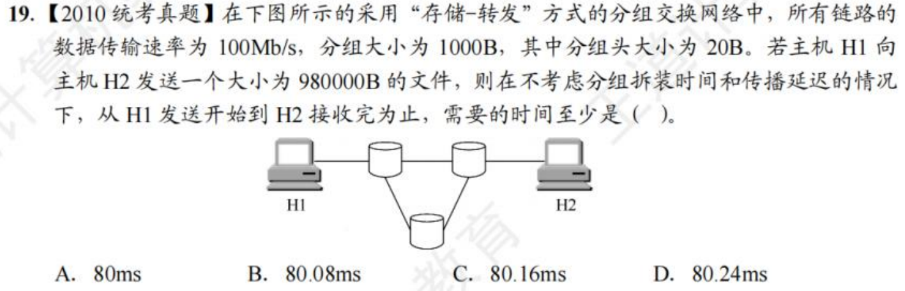
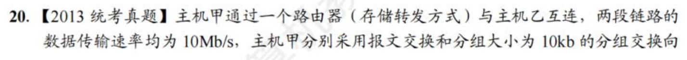
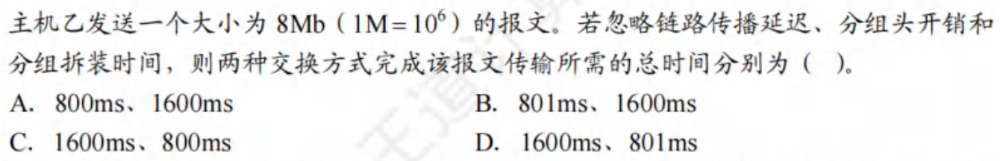
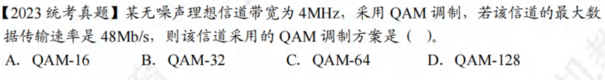

# 第一章

## 性能指标与分组转发

## 网络体系结构与网络模型

概念

# 第二章

## 信道的极限容量

## 编码与调制

# 第三章

## 差错控制

### 检错编码

### 纠错编码

## 流量控制与可靠传输机制

### 滑动窗口机制

### 可靠传输机制

## 信道利用率的分析

## 复用技术

## 随机访问控制

### CSMA/CD

## 局域网

## 广域网

# 第四章

## 虚电路

## IPv4

## IPv6

## 路由算法和路由协议

## IP多播

## 移动IP

# 第五章

## UDP

## TCP

# 第六章

## 域名解析

